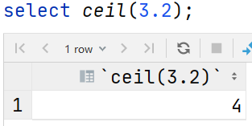
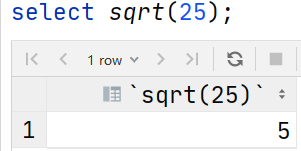

# MySQL

## 1 SQL 语句

### 概念

> SQL语句是结构化查询语言, 操作关系型数据库的语言

### 分类

- DDL: 定义语言 创建库,表,修改表结构
- DML: 操作语言 对表数据进行增删改操作
- DQL: 查询语言 计算数据(计算指标) 
- DCL: 控制语言 运维人员或主管操作  创建用户,修改用户权限
- TCL: 事务控制语言commit提交事务，rollback回滚事务。(TCL中的T是Transaction)

###  数据类型

> 规定mysql表的列数据的存储要求

> - 数值类型
>   - 整数类型
>     - tinyint 小整数  0/1 
>     - int 大整数  满足大多数的正数
>     - bigint 超大整数
>   - 浮点类型 带有小数点
>     - float
>     - double
>     - decimal(m, d): m代表数值的位数, d代表小数位数  使用较多
> - 日期时间类型  表中基本都会有日期时间字段(更新时间, 添加时间)
>   - date: 年月日
>   - time: 时分秒
>   - datetime: 年月日时分秒
>   - timestamp: 时间戳 当前时间减去1970-01-01 00:00:00的差值(到秒的差值)
> - 字符串类型  存储文本,英文
>   - char: 定长字符串, 指定数据的长度 char(3) `a__`  手机号 身份证号
>   - varchar: 变长字符串, varchar(3) `a`
>   - text: 长文本  文章内容

## 2 DDL语言

### 数据库

```mysql
-- 创建数据库
# 创建数据库时,指定字符集
# 字符集: utf8 utf-8(万国码)  gbk(中文)
create database [if not exists] 库名 [charater set utf8];

-- 切换数据库
use 数据库名;

-- 查询当前数据库
select database();

-- 查看所有数据库
show databases;

-- 删除数据库
drop database 数据库名;

-- 数据库修改
alter database 库名 修改内容
```

###  数据表

- 基本操作

```mysql
# 创建表 create table 表名(字段名1 类型 约束1 约束2 ..., 字段名2 类型 约束1 ...)
# 注意点: 一定要指定类型,类型只有一个; 约束可有(可以有多个)可无
# comment: 解释字段
-- 创建数据表
create table [if not exists] 表名 （
	字段1 类型 [约束] comment '' ,
	字段2 类型 [约束] comment '',
	字段3 类型 [约束] comment '',
	字段4 类型 [约束] comment ''
	）;

-- 查看当前数据库的所有数据表
show tables;

-- 查看表结构
desc 表名；

-- 查看表的创建语句
show create table 表名；

-- 复制表结构
create table  复制表 like 原表；

-- 删除表
drop table 表名；

-- 修改表，增加一列
alter table 表名 add 字段名 类型 大小 [约束 注释];

-- 修改表，删除一列
alter table 表名 drop 字段名;

-- 修改表，修改字段，类型，大小
-- 注意： 不是什么字段都能更改，比如varchar 改float报错，因为我们原表中已经存在数据，字符串类型无法更改为数字类型
alter table 表名 旧字段 新字段 类型 大小 [约束 注释];

-- 修改表名
alter table 旧表名 rename to 新表名;
rename table 旧表名 to 新表名;
```


## 3 DML语言

> - insert
> - update
> - delete

```mysql
-- 插入数据
insert into table 表名 values(),()···();

-- 更新表操作
update 表名 set 字段1=值1，字段2=值2，···，字段n=值n where 字段=值;

-- 删除指定数据
delete from 表名 where 条件;

-- 删除所有数据
truncate table 表名；
```

## 4 sql约束

### 主键约束

```mysql
/*
主键约束:
primary key
唯一不重复
不能包含null值
表中都会一个主键字段, 可以没有
*/
-- 定义主键有2种方式
-- 指定单个主键
create table if not exists persons2 (
    id int primary key,
    lastName varchar(25),
    firstName varchar(25),
    address varchar(25),
    city varchar(25)
);

-- 指定多个主键（联合主键）
create table if not exists persons1 (
    id int,
    lastName varchar(25),
    firstName varchar(25),
    address varchar(25),
    city varchar(25),
    constraint 主键标签 primary key(字段1，字段2)
);
-- 删除主键
alter table 表名 drop primary key；
```

### 自增约束

```mysql
/*
自增约束
auto_increment
一般都是跟着主键约束后边, 自增列的数据类型是整数类型
自增列不插入数据值,会自动维护值
如果插入实际值,以插入值为准
*/
create table person2
(
    id         int primary key auto_increment,
    last_name  varchar(20),
    first_name varchar(20),
    address    varchar(255)
);
# 主键自增列,插入null值,会自动维护值, 以表中最大的值进行递增
```

### 非空约束

> 当列中不允许出现null时,需要设置非空约束; 收集一些重要的信息时

```mysql
/*
非空约束
not null
非空列中的数据是不能插入null值,或者是不能不插入值(默认插入null值)
*/
-- 添加非空约束
create table if not exists persons4 (
    id int not null,
    lastName varchar(25) not null,
    firstName varchar(25),
    address varchar(25),
    city varchar(25)
);

-- 删除非空约束
alter table 表名 change 旧字段 新字段 类型 大小;
```

### 唯一约束

```mysql
/*
唯一约束 手机号 身份证号
unique
表中可以设置多个唯一约束
主键约束自带唯一约束, 表中只能有一个主键约束
*/
create table person4
(
    id         int primary key auto_increment,
    last_name  varchar(20) unique , -- 非空约束
    first_name varchar(20) unique , -- 非空约束
    address    varchar(255)
);
```

###  默认值

```mysql
/*
默认值约束
default
当不插入数据值时,是以默认值进行插入; 如果插入数据值时,就以实际值进行插入
*/
create table person5
(
    id         int primary key auto_increment,
    last_name  varchar(20),
    first_name varchar(20),
    address    varchar(255) default '昌平'
);
```

## 5 DQL语言

```mysql
select  查询内容                                                           
from 表                                                 
where 分组前的条件                           
group by 分组字段                              
having 分组后的条件                           
order by 排序字段                               
limit [m,]n   

# 执行顺序
from > where > group by > 函数计算 > having > select > order by > limit 
```


### 简单查询

```mysql
-- DQL基本语法:
select [distinct]|列名|计算列 from 表名 [where 条件]
-- distinct: 对指定列进行去重操作
-- where 条件: 不写是查询表中所有行的数据, 写的话是查询满足条件的行数据
-- select和from之间是查询表中的指定字段
```

### 条件查询

```mysql
# 条件查询
select 字段
from 表名
where 条件；
# where 后边写的就是条件, 对表中的行数据进行过滤

# 1.比较运算符
> < =
>= <= != <>
between ··· and ···
in （ ）
like '%想'  '_想'
is null
is not null

# 2. 逻辑运算符
and 
or 
not
```

### 排序查询

```mysql
# 排序查询
select 字段
from 表名
where 条件
order by 字段 升序asc/降序desc;
# order by 排序字段1 排序方式, 排序字段2 排序方式, ...
# 排序方式: asc 升序(默认,可以忽略不写); desc 降序
# 排序规则: 先以第一个字段进行排序, 第一个字段值相同的再以第二个字段进行排序
```

### 聚合查询

- 概念： 根据某个列做聚合操作，得到一个结果（既多行输入一行输出）

- 常用聚合函数

  | 聚合函数 | 作用                                                         |
  | -------- | ------------------------------------------------------------ |
  | count()  | 统计指定列不为NULL的记录行数；                               |
  | sum()    | 计算指定列的数值和，如果指定列类型不是数值类型，那么计算结果为0 |
  | max()    | 计算指定列的最大值，如果指定列是字符串类型，那么使用字符串排序运算； |
  | min()    | 计算指定列的最小值，如果指定列是字符串类型，那么使用字符串排序运算； |
  | avg()    | 计算指定列的平均值，如果指定列类型不是数值类型，那么计算结果为0 |

### 分组查询

```mysql
# 分组查询
select 字段,聚合函数
from 表名
where 条件
group by 字段
having 条件
order by 字段 升序asc/降序desc;

# group by 字段1,字段2,... [having 条件]
# 如果有多个分组字段,所有分组字段的值都相同时才属于同一组  1 1 2 / 1 2 3 / 1 1 2
# having 条件: 对分组之后的结果表进行过滤
/*
注意点:
select和from之间只能出现分组字段,或者对某字段进行聚合结果(分组聚合操作)
having 后边的条件是 聚合结果的值
一般情况下分组和聚合函数一起使用, 分组聚合操作
分组查询没有和聚合函数使用, 对分组字段进行去重操作
有多少个分组,计算结果就是有多少条数据
*/
/*
where和having区别:
where是对数据表先进行过滤,然后再进行分组聚合操作, 条件中是不能出现聚合函数
hving是跟着group by后边, 对分组之后的结果进行过滤, 条件中是可以出现聚合函数
*/
/*
什么时候使用分组聚合操作?
需求中出现 各组/各商品, 每天/每个班级, 不同性别/不同班级 字眼 需要使用分组聚合
一定要找到分组字段和聚合字段
*/
```

### 分页查询

```mysql
# 分页查询
select 字段,聚合函数
from 表名
where 条件
group by 字段
having 条件
order by 字段 升序asc/降序desc
limit [m,]n;
# limit [m,],n
# m: 行数据的索引值, 从0开始: 第1行数据的索引值是0, 如果m=0,可以省略  当前页的m=(当前页-1)*n
# n: 当前页的行数
```

##  6 多表操作

- 概念

  多张表之间进行关联,然后进行查询操作

- 表之间的关系

  - 一对一关系 最简单
  - 一对多关系 最常用 
    - 主表->一 主键字段(关联字段)
    - 从表->多 外键字段(关键字段)
    - 一对多就可以创建一个外键约束
      - 表之间进行关联是可以没有外键约束的
      - 通过表之间关联字段值相同进行关联
  - 多对多关系 最复杂 交叉连接

- 外键约束

  > 创建外键约束注意点:
  >
  > 创建从表时添加 constraint foreignkey (外键字段名) references 主表(主键字段名)
  >
  > 从表中的外键字段类型要和主表中的主键字段类型相同

```mysql
# 外键约束
# 创建主表 一 主键
# 创建分类表
create table category
(
    cid   varchar(32) primary key,
    cname varchar(100) #分类名称
);
# 创建从表 多 外键
# 商品表
create table products
(
    pid         varchar(32) primary key,
    pname       varchar(40),
    price       double,
    category_id varchar(32),
    # category_id 从表外键字段
    # category (cid) 主表名 (主键字段)
    constraint foreignkey (category_id) references category (cid) # 添加外键约束
);

# 在插入数据时，保证了数据的准确性。
# 向分类表中插入数据
insert into
    category (cid, cname)
values
    ('c001', '服装');
# 向商品表中插入数据, 没有类别id值
insert into
    products (pid, pname)
values
    ('p001', '商品名称');
# 向商品表中插入数据, 有类别id值, c001
insert into
    products (pid, pname, category_id)
values
    ('p002', '商品名称2', 'c001');
# 向商品表中插入数据, 有类别id值, c002
# 会发生报错 Cannot add or update a child row: a foreignkey constraint fails (`bigdata_db`.`products`, constraint `products_ibfk_1` foreignkey (`category_id`) references `category` (`cid`))
# 触发外键约束, 插入数据的类别id在category表中不存在,不允许插入
insert into
    products (pid, pname, category_id)
values
    ('p003', '商品名称3', 'c002');

# 在删除数据时，保证了数据的完整性。
# 删除category表中c001类别
# 发生报错 annot delete or update a parent row: a foreignkey constraint fails (`bigdata_db`.`products`, constraint `products_ibfk_1` foreignkey (`category_id`) references `category` (`cid`))
# 会触发外键约束, 从表中有c001的数据,是不允许删除主表中的c001数据
# 先删除从表中所有为c001的数据,再删除主表中c001的数据
# 删除从表c001数据
delete
from
    products
where
    category_id = 'c001';
# 再删除主表数据
delete
from
    category
where
    cid = 'c001';
```

## 7 多表查询

> 注意点: 
>
> - 内连接和外连接一定要有关联条件
> - 关联条件可以有多个 and or 连接
> - 关联条件是通过关联字段的值相等进行关联的, 两张表之间的关联字段名可以不同
> - 多表之间如果相同的字段名, 查询此字段名一定要通过 表名.字段名 获取

- 创建表和插入数据

```mysql
# 多表查询
# 创建hero表
create table hero
(
    hid       int primary key,
    hname     varchar(255),
    kongfu_id int
);
# 创建kongfu表
create table kongfu
(
    kid   int primary key,
    kname varchar(255)
);

# 插入hero数据
insert into
    hero
values
    (1, '鸠摩智', 9),
    (3, '乔峰', 1),
    (4, '虚竹', 4),
    (5, '段誉', 12);

# 插入kongfu数据
insert into
    kongfu
values
    (1, '降龙十八掌'),
    (2, '乾坤大挪移'),
    (3, '猴子偷桃'),
    (4, '天山折梅手');
```

- 交叉连接

```mysql
-- 交叉连接（笛卡尔积）
-- 尽可能避免这种情况

-- 显示连接
select *
from products
cross join category;
-- 隐式连接（没有出现join关键字）
select *
from products,category;
```

- 内连接

```mysql
# 内连接 (inner) join 保留两表之间共有的数据
-- 显示内连接
-- 能关联上的则显示，关联不上的不显示
select *
from products as p
[inner] join category as c on p.cid = c.cid;

-- 隐式内连接
select *
from products,category c
where products.cid = c.cid;
```

- 左连接和右连接

```mysql
# 外连接 -> 左外连接 和 右外连接
# 左表: join前边的表 右表:join后边的表
# 左连接(left [outer] join):保留左表所有数据,右表能关联上的数据保留,关联不上的用null填充
select *
from
    hero 
left join kongfu on kongfu_id = kid;

# 右连接(right [outer] join):保留右表所有数据,左表能关联上的数据保留,关联不上的用null填充
select *
from
    hero 
right join kongfu on kongfu_id = kid;
```

- 子查询

  > 一个select的查询结果作为另一个select的一部分(条件, 表)
  >
  > 一个sql语句中出现了多个select语句,就是一个子查询语句

```mysql
# 子查询
# 一个select的查询结果是作为另一个select的一部分(查询条件,表)
# 查询条件
# 查询“化妆品”分类上架商品详情
# 查询类别名称为化妆品的类别id
select
    cid
from
    category
where
    cname = '化妆品';
# 查询类别id为c003的上架商品信息
select *
from
    products
where
      flag = 1 and category_id = 'c003';
select *
from
    products
where
      flag = 1
  and category_id in (select cid
                      from category
                      where cname = '化妆品');

select *
from products
where
      flag = 1
  and category_id in (select cid
                      from category
                      where cname in ('化妆品', '服饰'));

# 表
# 查询类别名称为化妆品的信息
select *
from
    category
where
    cname = '化妆品';
# 查询类别名称为化妆品的信息 和 商品表关联
select
    p.pid,
    p.pname,
    c.cname
from
    products p
join (select *
      from category
      where cname = '化妆品') c 
on c.cid = p.category_id;
```

## 8 MySQL索引

### 概念

- 索引就是快速查询数据的数据结构 
- 类似于书中的目录, 通过目录就可以快速查找到想要查看的内容
- 分类
  - 单列索引: 表中的一个字段作为索引列
  - 组合索引: 表中的多个字段作为索引列
- 创建索引的注意点
  - 不能随意创建索引, 索引也是保存到mysql数据表中, 占存储空间
  - 插入,修改,更新数据 索引也是需要进行维护的, 如果索引太多, 维护会很复杂
  - where条件中经常使用的字段可以创建对应的索引
  - 查询过程中查询速度比较慢可以创建索引

### 索引操作

```mysql
# 创建索引
# 方式一: create (unique) index 索引名 on 表名 (列名1 排序方式, 列名2 排序方式, ...)
# 向category表中以cname字段创建对应索引
create index idx_cname on category (cname);

# 方式二: 通过修改表结构添加索引
# alter table 表名 add index 索引名 (列名1 排序方式, 列名2 排序方式, ...)
# 向products表中以price字段创建对应索引
alter table products
    add index idx_price (price desc);

# 方式三: 创建表时,创建索引
create table category2
(
    cid   varchar(20) primary key,
    cname varchar(200),
    index idx_cname (cname) -- 创建索引
);

# 删除索引
# 方式一: drop index 索引名 on 表名;
drop index idx_cname on category2;
# 方式二: alter table 表名 drop index 索引名;
alter table products
    drop index idx_price;

# 展示索引
show index from category;

# 索引信息存储在mysql库中的innodb_index_stats表中
select *
from
    mysql.innodb_index_stats
where
      database_name = 'bigdata_db'
      and table_name = 'category'
      and index_name = 'idx_cname';
```

## 9 mysql常用函数

### 字符串函数

> char_length(s)	返回字符串 s 的字符数


> concat(s1, s2...sn)	字符串 s1,s2 等多个字符串合并为一个字符串
>


> group_concat( [distinct] 要连接的字段 [order by 排序字段 asc/desc  ] [separator '分隔符'] );	分组后对组内字段进行拼接

可以使用`distinct`排除重复值；可以使用`order by`子句对结果中的值进行排序；

返回的字符串的默认分隔符从逗号(`，`)，若要改为其他分隔符，则使用`SEPARATOR`子句修改分隔符

> concat_ws(x, s1,s2...sn)	同 concat(s1,s2,...) 函数，但是每个字符串之间要加上 x，x 可以是分隔符


> format(x, n)	函数可以将数字 x 进行格式化 "#,###.##", 将 x 保留到小数点后 n 位，最后一位四舍五入。


> lower(s)	将字符串 s 的所有字母变成小写字母


> upper(s)	将字符串转换为大写


> repeat(s, n)	将字符串 s 重复 n 次


> substr(s, start, length)	从字符串 s 的 start 位置截取长度为 length 的子字符串


> replace(s,s1,s2)	将字符串 s2 替代字符串 s 中的字符串 s1


> substring_index(s, delimiter, number)	
>
> - 如果 number 是正数，返回第 number 个字符左边的字符串。
> - 如果 number 是负数，返回第(number 的绝对值(从右边数))个字符右边的字符串。


### 数字函数

> abs(x)	返回 x 的绝对值


> n div m	整除，n 为被除数，m 为除数


> ceil(x)	返回大于或等于 x 的最小整数　



> floor(x)	返回小于或等于 x 的最大整数（向下取整）


> mod(x, y)	返回 x 除以 y 以后的余数


> pow(x, y)	返回 x 的 y 次方


> round(x [,y])	返回离 x 最近的整数，可选参数 y 表示要四舍五入的小数位数，如果省略，则返回整数。


> truncate(x,y)	返回数值 x 保留到小数点后 y 位的值（与 round 最大的区别是不会进行四舍五入）


> sqrt(x)	返回x的平方根



### 日期函数

> date_add(d，interval expr type)	计算起始日期 d 加上一个时间段后的日期	等同于adddate
>
> - type 值可以是：（MySQL中精确到微妙，秒后面跟的是微妙）
>   - microsecond    微秒	1 s  =  1000ms    1ms =  1000um 
>   - second    秒
>   - minute    分钟
>   - hour    小时
>   - day     天
>   - week    周
>   - month    月
>   - quarter    季度
>   - year    年
>   - second_microsecond    几秒几毫秒
>   - minute_microsecond    几分钟几毫秒
>   - minute_second    几分钟几秒
>   - hour_microsecond    几小时几毫秒
>   - hour_second    几小时几秒
>   - hour_minute    几小时几分钟
>   - day_microsecond    几天几毫秒
>   - day_second    几天几秒
>   - day_minute    几天几分钟
>   - day_hour    几天几个小时
>   - year_month    几年几个月


> date_sub(date,intercal expr type)	函数从日期减去指定的时间间隔。	等同于subdate


> extract(type from d)	从日期 d 中获取指定的值，type 指定返回的值。


> current_date()	返回当前日期
>


> current_time()	返回当前时间
>


> current_timestamp()	返回当前日期和时间
>


> now()	返回当前日期和时间
>


> datediff(d1,d2)	计算日期 d1->d2 之间相隔的天数
>


> timestampdiff(type,expr1,expr2)	计算时间差，返回 expr2 − expr1 的时间差


> date_format(d,f)	按表达式 f的要求显示日期 d
>


> last_day(d)	返回给给定日期的那一月份的最后一天


> - year(d)	返回 d 中的年份
> - month(d)	返回 d 中的月份
> - day(d)	返回 d 中天
> - hour(d)	返回 d 中的小时值
> - minute(d)	返回 d 中的分钟值
> - second(d)	返回 d 中的秒值
> - quarter(d)	返回日期d是第几季节，返回 1 到 4
> - week(d)	计算日期 d 是本年的第几个星期，范围是 0 到 53
> - weekday(d)	日期 d 是星期几，0 表示星期一，1 表示星期二
> - dayofweek(d)	日期 d 今天是星期几，1 星期日，2 星期一，以此类推
> - dayofyear(d)	计算日期 d 是本年的第几天

### 其它函数

> if(expr,v1,v2)	如果表达式 expr 成立，返回结果 v1；否则，返回结果 v2。
>
> ifnull(v1,v2)	 如果 v1 的值不为 NULL，则返回 v1，否则返回 v2。
>
> cast(x as type)	转换数据类型

```mysql
# case when语法
select
case 
	when 条件 then 返回的值(列名)
	when 条件 then 返回的值(列名)
	...
	else 返回的值(列名)
end as 列别名
from 表名
```


## 10  窗口函数(mysql8.0)

> 语法: 开窗函数 over(partition by 分组字段1, 分组字段2, ... order by 排序字段1 排序方式, ... rows/range 窗口范围)
>
> 窗口规定结果表的数据行, 不会改变结果表的条目数
>
> - partition by: 将分组聚合的结果添加到各组的数据后
> - order by: 对各组的数据进行排序
> - 窗口范围：默认分组内第一行到当前行  UNBOUNDED PRECEDING AND CURRENT ROW
>   - CURRENT ROW：当前行
>   - UNBOUNDED PRECEDING：当前行上侧所有行
>   - UNBOUNDED FOLLOWING：当前行下侧所有行
>   - n PRECEDING：当前行上侧n行
>   - n FOLLOWING：当前行下侧n行
>
> - range可以根据order by排序的字段来控制窗口的范围
>   - over(order by dt range between interval 6 day and dt) 	dt代表日期字段；窗口范围为当前时间的一周内的范围

> - 排序函数
>   - row_number()	不并列排序
>   - rank()	并列缺位排序
>   - dense_rank()	并列不缺位排序
> - 取值函数
>   - first_value(expr)	组内expr字段第一个值
>   - last_value(expr)    组内expr字段最后一个值
>   - lag(expr, [n, [default]])	当前行expr字段前第 n（默认1）个值，若没有返回默认值（默认null）
>   - lead(expr, [n, [default]])	当前行expr字段后第 n（默认1）个值，若没有返回默认值（默认null）


## Linux中修改mysql默认数据的字符集

```shell
-- 修改mysql中数据库默认字符集
-- 1）修改配置文件
$ vim /etc/my.cnf

# 按 i 进入插入模式

# 在[mysqld]上面添加
[client]  
default-character-set=utf8

# 在[mysqld]下面添加一行：
default-storage-engine=inNODB  
character-set-server=utf8 
collation-server=utf8_general_ci

# 按ESC退出插入模式
# 输入 :wq （保存退出）

2）重启MySQL服务
$ systemctl restart mysqld
```


