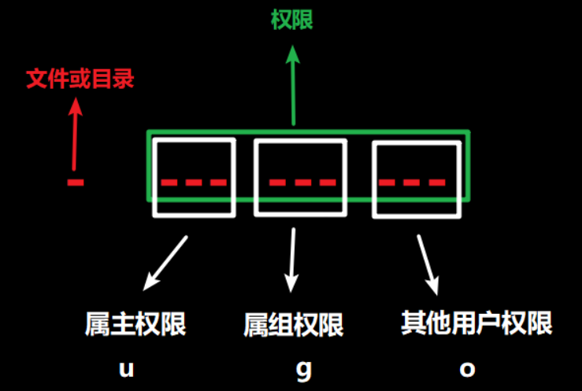

# Linux

## Linux 常用基础命令


> 命令: 告诉我们要做什么事
>
> 选项: 规定做事的方式
>
> 参数: 规定对谁做这件事

### ls 显示文件列表命令

```shell
# ls 展示目录中的文件信息
ls
# -a 展示所有文件内容,包括隐藏文件(以点开头的文件内容)
# -l 以列表形式详细展示文件内容
# -h 以合适的单位展示文件大小, 配合-l进行使用
# 以上三个选项可以随意自由组合,顺序可以随意调整
# ls 可以查询相对路径和绝对路径
ls /bin
ls -l ../ect
 
由于我们开发中经常使用ls -l 查询文件内容,所以centos中提供了一个快捷指令ll
ll 全等于 ls -l 同时-a和-h也可以使用
```

### cd 切换目录

> 补充
>
> home目录就是家目录,每个用户都有自己不同的家目录,两个不同的用户不能共用一个家目录
>
> 超级管理员用户的家目录 : /root
>
> 普通用户的家目录: /home/用户名
>
> 注意: 超级管理员用户有且只有一个,拥有最高权限(能自毁)
>
> 当我们进入linux系统时,系统会默认加载到家目录下.

```shell
# cd可以修改工作目录 
# 格式: cd 要切换到的路径信息
cd 绝对路径
cd 相对路径
cd ./  切换到当前目录
cd /  切换到根目录
cd .. 切换到上一级目录
cd - 切换到上一次使用的工作目录
cd ~ 切换到家目录
cd 切换到家目录
```

### pwd 查看当前路径

```shell
查询当前工作目录的绝对路径
```

### cp 复制文件或目录

```shell
# 格式: cp -r 原文件路径 目标文件路径
# cp可以使用相对路径也可以使用绝对路径
# 在复制的过程中同时可以修改文件名称
# 如果我们复制的是目录,需要使用-r进行递归复制,否则报错(即使被复制的目录是空目录也必须进行-r操作)
```

### mv 移动文件或目录

```shell
# 格式: mv 源文件路径 目标文件路径
# mv可以将源文件路径的文件移动到目标文件路径中,移动过程中原路径的文件会消失
# 移动过程中可以给文件改名,如果在同一个路径下移动就形成了重命名
# 如果我们移动的是目录,不需要加-r直接可以移动
# 总结
# 移动：目标路径若为目录，且目录存在，则为移动
# 重命名：若目标路径为文件 或者是不存在的目录， 则为重命名
```

### rm 删除文件或目录

```shell
# 格式: rm 被删除的文件路径
# -r 递归删除, 删除目录时必须使用这个选项,哪怕是空目录
# -f 强制删除, 不进行系统提示
 
rm -rf 是非常危险的,我们尽量少用,删除时要谨慎.
```

### touch 创建空文件

```shell
# touch 创建新文件
touch linux文件路径(相对路径和绝对路径均可)
# 一次性创建多个新文件
touch 多个文件路径中间用空格隔开
# 如果被创建的文件已经存在,则不会报错,仅刷新其创建修改时间,不修改原文件内容
```

### mkdir 创建空目录

```shell
# mkdir 创建一个空目录
mkdir 相对路径
mkdir 绝对路径
mkdir -p 多级目录  使用-p选项后,如果父目录不存在,则创建

# 注意: 使用mkdir创建目录时,如果该目录已经存在,则该命令会报错
```

### ln 创建软链接

```shell
# 软连接主要就是在指定位置创建一个原文件的快捷访问入口,提高我们获取数据的效率
# 格式: ln -s 原文件路径 目标连接路径
ln -s 1.txt 2.java
 
# 注意: 我们访问连接和访问原文件完全相同,但是如果连接被删除,原文件可用,原文件被删除,连接不可用.
# 在使用ll进行查询时,连接的展示方式如下:
lrwxrwxrwx. 1 root   root      5 3月  28 15:47 2.java -> 1.txt

# 如果不使用-s则创建的连接为硬连接,相当于把数据备份了一份.
# 当我们修改或添加数据时,无论操作的是源文件还是连接文件,数据都发生改变.
# 删除原文件,连接文件依然可用, 删除连接文件也不会影响原文件
 
# 软连接的安全性没有硬链接高,但是软连接的使用更加广泛.因为硬连接需要占用两份硬盘空间.
```

### cat 查看文件全内容

```shell
# 查看文件内容,一次性将文件中的内容全部展示到终端中,仅适合查看小文件.
cat 文件路径
```

### more 分页查看文件内容

```shell
分页查看文件内容, 可以使用快捷指令进行翻页或退出,适合查看中小型文件.
# enter 向下翻指定行
# space 向下翻一页
# b 向上翻一页
# q 退出查看
```

### find 查找文件或目录

```shell
# find可以按照指定的规则查询文件或目录
find 查询路径 -name 名称规则 
# 名称规则中可以使用*作为通配符使用
	# *ssh  以ssh结尾
	# ssh* 以ssh开头
	# *ssh* 包含ssh
find / -name *ssh

find 查询路径 -size 文件大小
	# + - 代表大于小于
	# k M G 代表kb mb 和gb
find / -size +10M

find 查询路径 -type 文件类型
	# f 文件
	# d 目录
find / -type f

注意: -name -size -type可以随意组合
例如:
# 查询类型为文件,名称以ssh结尾,文件大小大于10kb的文件的绝对路径
find / -type f -name *ssh -size +10k

# 如果查询的内容不存在,也不会报错,但是查不到任何东西.
```

### which

```shell
# 查询linux终端指令程序所在的位置
[root@node1 ~]# which ll
alias ll='ls -l --color=auto'
        /usr/bin/ls
```

### head

```shell
# head查询文本头的内容 (默认查看十行)
	# -num 查询头多少行数据
```

### tail

```shell
# tail查询文本末尾的内容 (默认查看十行)
	# -f 持续监控文本末尾的变化情况
	# -num 查询末尾多少行数据
	
tail -2 1.txt 
tail -f 1.txt  # 持续监控过程中,使用echo持续重定向追加数据到文件中,监控终端中的数据会发生变化
```

### grep

```shell
# grep全文检索命令
# 格式: grep -n 要检索的字符 目标文件或文本
grep anaconda anancond-ks.cfg
# -n 在查找到的内容之前添加行号
grep -n anaconda anancond-ks.cfg
```

### 管道命令 |

```shell
# 前一个命令的输出,就是下一个命令的输入
# 将ll查询到的文件详情进行全文检索,找到包含txt的行 ll的输出就是grep的输入
ll | grep txt
# 找到8月份创建的文件
ll | grep 8月
# 找到8月份创建的txt文件
ll | grep 8月 | grep .txt
```

### echo

```shell
# 向终端那种输出指定字符,并在终端中显示
echo hello world!!!
```

### 重定向符号  >  和 >>

```shell
# 重定向的意义就是改变文本的输出位置
# > 重定向覆盖
echo 111 > 1.txt
# >> 重定向追加
echo 222 >> 1.txt
```

### tar 打包/解包

> - 打包格式 tar -options 文件名
>
>   - -c 打包
>   - -f 指定文件名
>   - -v 显示打包的清单
>   - -z 压缩
>
> - 注意
>
>   -f 必须在最末尾，因为-f 后紧跟打包文件名
>
> - 解包格式  tar -xf tar包名 -C 解压路径   （解压路径必须存在）
>
>   - -x 解包
>   - -f 指定文件名
>   - -v 显示打包的清单
>   - -z 压缩
>
> - 注意
>
>   解包使用 -z ，前提必须是压缩包 

### vim

> **vi/vim编辑器有三种模式**
>
> 命令模式: 所有的按键会作为命令使用,如果没有该命令则无效,无法随机编辑
>
> 插入模式: 随机编辑
>
> 底线命令模式: 一般用于保存退出等

> 命令模式:
>
> - 光标移动
>   - hjkl  左下上右
>   - 0 来到行首
>   - $ 来到行尾
>   - **G 来到文本末尾**
>   - **gg 来到文本开头**
> - 全文检索
>   - /要检索的文字
>   - n  向下查找
>   - N  向上查找
> - 文本编辑
>   - **dd 删除一行**
>   - ndd 删除n行
>   - **yy 复制一行**
>   - nyy复制n行
>   - **p 向下一行粘贴**
>   - **P向上一行粘贴**
>   - **u 撤销**
>   - **ctrl + r 重做**
>   - dG 从当前行删除到末尾
>   - dgg 从当前行删除到开头
>   - d0 从当前光标位置删除到行首
>   - d$ 从当前光标位置删除到行尾
>
> 插入模式:
>
> 在命令模式下输入如下内容可以进入插入模式
>
> - **i  从当前光标之前插入**
> - I  从当前行开头插入
> - **o  在当前行下方插入一行进入编辑模式**
> - O 在当前行上方插入一行进入编辑模式
> - a  在当前光标之后插入
> - A  在当前行末尾进行插入
>
> 末行模式:
>
> - **q : 退出**
> - **q! : 强制退出**
> - **w : 保存**
> - **wq : 保存并退出**
> - Shift + Z + Z  保存并退出
> - **w  文件路径: 另存为**
> - :set nu 设置行号
> - :set nonu 取消行号
> - nohl: 取消高亮
> - %s/旧字符/新字符: 替换字符
>
>  
>
> - **注意: 在我们的开发中经常会使用G + o的组合形式进行快速在文件末尾追加数据的操作.** 

注意: vi编辑器三种模式间的转换,只能从命令模式进入编辑模式和末行模式, 编辑模式和末行模式之间无法相互跳转,需要先回到命令模式.


#### 解决问题

如果我们使用vi或者vim编辑器修改文件后,没有进行保存,异常退出,再次打开文件时,由于缓存文件的存在,将无法继续操作该文件,报如下提示信息


- 解决方案1:
  - 根据下方提示,可以进行交换文件的删除 D, 或者 回复数据 R
- 解决方案2:
  - 可以直接使用rm 指令删除 交换文件

### ping命令

```shell
# ping可以检查主机与指定ip服务器间的网络是否畅通
ping 127.0.0.1  # 可以检查网卡是否正常启动
ping www.baidu.com # 可以检查我们的服务器是否可以连接互联网
ping ip地址 # 检查主机与该ip之间的连接是否畅通
```

### ifconfig命令

> - 查看网卡信息
>   - 注意: 在windows中查看网络服务状态的指令是 ipconfig

### 系统管理命令 ps (process)

> - ps [-选项] [parameters]
>
> - 查看所有活着的进程：ps -ef 

### kill 杀死进程

> - kill -9 进程号（pid）

### hostname 查看主机名

> - hostname

### clear 清屏

> - clear
> - 快捷键： ctrl + l
>

### 关机/重启

> - 关机：shutdown -h now
> - 重启：reboot
>

### free 查看计算机内存信息

> - free
>   - free -h  # 进行单位换算操作
>   - free -t  # 对内存进行汇总操作

### df/du 磁盘信息

> - df(disk free): 以列表形式展示更多磁盘信息
>   - -h: 单位换算
> - du(disk usage): 展示目录及子目录的磁盘信息
>   - -h: 单位换算
>   - -s: 只展示当前目录的磁盘信息, 不展示子目录

```shell
df 
df -h
du 
du -h
du -sh
```

### top 查看资源占用情况

> top命令可以查看linux中的资源占用情况,相当于windows中的任务管理器
>
> 能够从top中获取的重要参数有哪些?
>
> - 各类型任务数量
> - cpu占用率
> - 内存占用率
> - pid 进程编号
> - 进程归属
> - 各个进程占用的cpu和内存数量
> - pr 任务优先级, 数值越小优先级越高(不是级别高先执行,而是级别高cpu执行到这个任务的概率更大.)
>
> 关闭top : ctrl + c
>
> top指令每隔5秒刷新一次,我们可以通过其观察实时情况,并且有些监控组件会将top数据保存到日志文件中.

### iostat 查看磁盘读写状态

> 查看磁盘读写状态
>
> - 磁盘读写速度
> - 磁盘读写数量
> - cpu使用情况
>
> 格式: iostat -x num1 num2
>
> -x  展示详细信息
>
> num1  间隔时间
>
> num2  查询次数 
>
>  
>
> - 查看读写速度的作用是什么呢?
>   - 检测服务性能,调节服务参数,可以最大限度使用服务器进行任务执行,提升任务执行效率.

### 补充

如果我们还有哪些命令或参数不清楚不理解,我们可以使用linux自带的帮助信息查看使用方式

```shell
# --help 帮助信息
ls --help
 
# man ls 查看使用手册
man ls
# 此时使用手册信息是分页展示的
G 到达使用手册末尾
g 到达使用手册开始位置
enter 向下翻一行
space 向下翻一页
b 向上翻一页
q 退出
```

## 用户、用户组管理

> 关于用户和用户组创建修改删除的一切指令都必须由root用户完成

### 用户组:

```shell
# 添加用户组 groupadd
groupadd itheima
# 查看用户组信息
getent group  # 等价于  cat /etc/group
# 删除用户组 groupdel
groupdel itheima
```

### 用户管理:

```shell
# 创建用户
# 格式: useradd -g 组名 -d 家目录路径 用户名称
useradd -g itcast python
# -g 后可以使用用户组名或者用户组id 指定用户的用户组
# 如果不指定组,则自动创建一个与用户同名的组,并加入, 如果不指定家目录路径则自动添加到/home中

# 设置密码 : 未设置密码的用户无法登录
passwd 用户名

# 删除用户
# 格式: userdel -r 用户名
userdel -r python
# 如果不添加-r则删除用户时无法删除家目录

# 查看用户
id 用户名
# 如果不添加用户名,则默认查询自身信息

# 将用户添加到分组中
# 格式: usermod -aG 用户组名 用户名
usermod -aG itcast python
# 将用户添加到新的用户组,不会影响原有用户组, 一个用户可以加入多个用户组

# 查看所有用户
getent passwd  # vim /etc/passwd
```

### 认知root用户

> 超级管理员用户在linux中有且仅有一个,就是root用户

### su命令

```shell
# su命令可以切换用户
su itcast 
su root
# root用户使用su切换普通用户时,不需要输入密码
# 普通用户切换用户时必须输入密码
 
# 退出到上一级用户
exit 
ctrl + d
```

### sudo命令

```shell
# 让普通用户临时获取root用户权限
sudo ls /root

# 但是这个权限的范围需要root用户进行设定
visudo 开启权限设置文件

# sudo每次输入密码后,五分钟内可以持续访问不需要重新输入密码
```


## 权限控制

### 查看权限信息

```shell
ls -l
ll

# 第一列: 文件类型(- 普通文件  d 目录  l 软连接)
# 2-4列: 创建文件的用户权限
# 5-7列: 用户所在组的其他成员权限
# 8-10列: 除用户及其所在组成员外的其他用户权限

#  权限类型:
# r 可读权限
# w 可写权限
# x 可执行权限
# - 无权限  
```



### 修改权限控制 - chmod

```shell
# 字母型
# u : 用户
# g : 用户组
# o : 其他用户
chmod u+r,g=rx,o=x 1.txt
# + : 添加权限
# - : 减少权限
# = : 赋值权限
 
# 数值型
# r : 4
# w : 2
# x : 1
# - : 0
chmod 764 1.txt
```

### 修改权限控制 - chown

```shell
# chown是修改文件归属的
# 格式: chown -R 用户名:组名 文件名称
chown root 1.txt  # 将文件的属主修改为root
chown itcast:python 1.txt # 将文件的属主修改为itcast,属组修改为python
chown :python 1.txt # 属组修改为python
chown -R root aaa # 在将目录的归属修改时,同时修改其子文件的归属.
```

## 各类小技巧（快捷键）

- ctrl + c : 强行终止 (终止服务或指令)
  - 例如结束ping
- ctrl + d : 强制退出 (退出登录)
  - 例如退出mysql客户端
- ctrl + z : 强制退出 (结束编辑)
  - 例如退出vim编辑器

无论是ctrl + c 还是ctrl + d 都无法退出vi编辑器

- 历史查看命令
  - history : 查看历史命令 (查看的是当前用户的历史命令)
  - !命令 : 模糊匹配我们使用过的终端命令,只调用最后一次满足条件的命令
  - ctrl + r : 倒序搜索历史命令,  使用enter键直接调用,如果需要获取命令不执行使用左右键
- 光标移动命令
  - ctrl + a : 移动到命令开头
  - ctrl + e : 移动到命令末尾
  - ctrl + 键盘左键: 向左移动一个单词的位置
  - ctrl + 键盘右键: 向右移动一个单词的位置
- 清屏 : ctrl + L  (clear)

## 软件安装

> **RPM包管理工具**（简称**RPM**，全称为**RedHat Package Manager**）是在Linux下广泛使用的软件包管理器。
>
> 最初是由redhat公司开发并推出的开源软件管理工具包, 后被其他发行版厂商采用
>
> Yum在线包管理工具: 其本质就是可以通过互联网检索,远程安装卸载和查询rpm包
>
> yum最重要的功能不是安装和卸载,是在安装软件的过程中,可以自动解决软件包的依赖问题.

[Search the RPM repository on rpmfind.net](https://rpmfind.net/linux/rpm2html/search.php) RPM包下载地址

### yum的语法

```shell
# 安装软件包: yum -y install 软件包名称  
# 移除软件包: yum -y remove 软件包名称  
# 查询软件包: yum search 软件包名称  
# -y 在安装或卸载过程中,如果有系统问询统一回复y
```

注意: yum在安装过程中必须连接互联网

> 不能下载软件的原因 基本都是因为虚拟机无法联网
>
> 1. 虚拟网络编辑器   网络适配器  以及  linux虚拟机中的网关不一致  192.168.88.1
> 2. DNS域名解析服务器地址必须要写,且要写正确

##  systemctl

```shell
# 系统软件控制命令
# 可以控制其启动, 停止, 状态查询, 开机自启, 关闭开机自启
# 格式: systemctl 命令状态  服务名称
	# start : 启动
	# stop  : 停止
	# status: 状态查询
	# restart : 重启
	# enable: 开机自启
	# disable: 关闭开机自启
# 可以操作的服务: network   NetworkManager  firewalld ....
```

## 日期、时区

> 我们计算机中用的日期有两种
>
> - 时间戳: 从1970年1月1日0时0分0秒 到现在一共经历了多少秒/毫秒/纳秒  的整数值
> - 标准时间格式: 2023-08-16 16:05:44
>
> 如果我们获取或者采集到的时间类型是其他格式,基本都需要进行转换.
>
> 时区: 我国使用的是北京时间   时区是上海时区(东八区)
>
>  
>
> 国家授时服务中心 : 全国人民使用的时间都必须实时和授时中心同步.

### date命令

```shell
# date 获取当前时间的linux命令
date # 按照指定格式获取当前时间
date +%Y-%m-%d  # 获取当前日期,自定义格式
date "+%Y-%m-%d %H:%M:%S" # 获取当前的日期和时间,自定义格式

# -d 根据指定的字符规则显示时间,一般用于日期计算
date -d "+1 day" "+%Y-%m-%d %H:%M:%S"  # 当前时间加一天
date -d "+1 month" "+%Y-%m-%d %H:%M:%S"  # 当前时间加一个月
date -d "-2 hour" "+%Y-%m-%d %H:%M:%S"  # 当前时间减去2小时
```

### 时区修改

```shell
# /etc/localtime 并不是一个文件,而是一个软连接, 他连接哪个时区,我们就使用哪个时区
# 使用root权限，执行如下命令，修改时区为东八区
rm -f /etc/localtime
sudo ln -s /usr/share/zoneinfo/Asia/shanghai /etc/localtime
```

### ntp服务

```shell
# ntp时用来校准时间的服务
# 安装方式
yum -y install ntp
# 启动ntp服务
systemctl start ntpd
# 将ntp服务添加到开机自启
systemctl enable ntpd

# ntp服务,会定义校准时间, 一般是 一分钟
```

### ntpdate

> ntpdate 是linux中自带的时间校准工具,使用方式非常简单
>
> ntpdate 授时服务器地址

```shell
# ntpdate也是时间校准工具
ntpdate -u ntp1.aliyun.com
# 一般公司可能会提供授时服务器, 在企业级开发中,北京时间没有企业时间重要,我们需要的是集群中所有的服务时间统一
```

### 扩展:

> 企业中我们更愿意使用ntp而不是ntpdate 因为ntp时缓慢校准,而ntpdate是一次性校准.容易产生时间跳跃.

##  IP地址、主机名

### ip地址

> ip地址: 是设备在互联网中的唯一标识,在同一网络中同一ip的设备只能有一个,否则无法上网(逻辑)
>
> mac地址: 网卡的物理地址,网卡的唯一编码.(物理)
>
> >  举例: 计算机相当于一台手机, 每一台手机都有一个手机卡,手机卡都有号码,ip就相当于手机号 , mac地址就相当于手机的串码,串码不可更改,且不能重复.
>
> 特殊ip地址:
>
> `127.0.0.1` 本地回环地址,代表当前主机的ip地址
>
> `0.0.0.0` 代表任意主机地址或当前主机地址
>
> `*.*.*.255` 广播地址

### 主机名称

> 可以理解为我们给这台计算机起的别名,这个别名方便程序员在多台服务器之间操作时,区分我们操作的是哪一台主机.

```shell
# 查询主机名称
hostname
# 修改主机名称
vim /etc/hostname
# 注意修改后不会生效,需要重启计算机后才可以生效
进入linux系统后,我们的linxu系统会在命令行之前加入前缀
用户名@主机名
```

### 域名解析

> 其实就是ip地址的别名 : 我们在互联网中找到某一个网站一般都是通过一串字符组合进行查找, 一般不会记忆ip地址.
>
> 因为域名更方便记忆, ip地址比较难以记住.

> 1. 输入网址(域名)
> 2. 在本地域名映射中查询是否存在该域名 (hosts)
> 3. 如果存在则访问对应ip
> 4. 如果不存在则在DNS域名解析服务器中查询

> 本地域名映射的配置路径
>
> windows : C:\Windows\System32\drivers\etc\hosts
>
> linux : /etc/hosts
>
> 注意: 如果windows中修改hosts没有权限,就复制到桌面上,修改完成后覆盖原文件
>
> 
>
> 域名映射的配置方式
>
> ip地址  域名1  域名2 ....

### 固定ip方式

1. 修改虚拟网络编辑器,绑定固定网段(已做完)
2. 修改网卡配置信息

```shell
# 网卡配置文件地址
vim /etc/sysconfig/network-scripts/ifcfg-ens33 
```

```properties
TYPE="Ethernet"  # 代表以太网
PROXY_METHOD="none"
BROWSER_ONLY="no"
BOOTPROTO="static"  # ip获取方式 dhcp自动获取 static 静态ip  none也是静态ip
DEFROUTE="yes"
IPV4_FAILURE_FATAL="no"
IPV6INIT="yes"
IPV6_AUTOCONF="yes"
IPV6_DEFROUTE="yes"
IPV6_FAILURE_FATAL="no"
IPV6_ADDR_GEN_MODE="stable-privacy"
NAME="ens33"  # 网卡名称
UUID="a158ae80-7423-435c-87b1-d2a94c748bf3"
DEVICE="ens33"
ONBOOT="yes"
IPADDR="192.168.88.100" # 固定IP地址
PREFIX="24" # 子网掩码  255.255.255.0
GATEWAY="192.168.88.1" # 网关
DNS1="8.8.8.8" # 域名解析服务器地址
DOMAIN="114.114.114.114"
```

3. 重启网络服务

```shell
systemctl restart network
```

注意: 如果重启网络失败,需要关闭主网络服务后再重启网卡

```shell
systemctl stop NetworkManager
systemctl restart network
```

