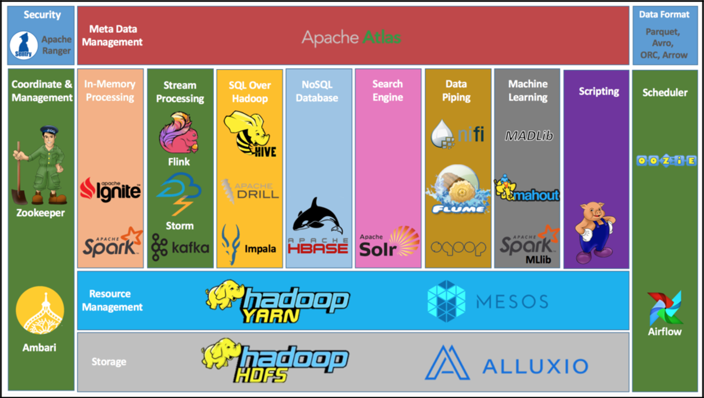

# Hadoop

## 大数据概述

### 	大数据特征


> **5V特征:**
>
> 数据体量大
>
> 数据种类多
>
> 价值密度低
>
> 增长速度快
>
> 数据质量差
>
> 
>
> 解决方案:  以更快,更好的技术深层次的挖掘数据中的价值,避免数据的各种干扰；从海量的高增长、多类别、低信息密度的数据中挖掘出高质量的结果。

### 大数据的主要工作

- 海量数据的存储: 存的下
- 海量数据的计算: 算得出
- 海量数据的传输: 传的快

### 大数据软件生态圈

> **Apache软件基金会**（也就是 Apache Software Foundation，简称 ASF），是专门为支持开源软件项目而办的一个非盈利性组织。在它所支持的 Apache 项目与子项目中，所发行的软件产品都遵循 Apache 许可证（Apache License）。



### 分布式和集群

> **集群:** 多台服务器共同完成相同的业务,就是一个集群.
>
> 
>
> 举例: 一个饭店,有三个部门,传菜,后厨,收银,由于客户数量太多,所以一个人传菜效率太低,为保证服务质量,我们招聘了三个传菜工,此时三个传菜工就相当于三台服务器,这三台服务器做的是相同的工作,这个传菜部门就相当于一个集群.
>
> ------
>
> **分布式:** 多台服务器共同完成不同的业务就是分布式.
>
> 
>
> 举例: 在一个饭店,有3个部门,传菜,后厨,收银,他们共同为客户提供用餐服务,此时传菜,收银和后厨就相当于三个服务器,此时用户使用的就是基于这三个服务器的分布式系统,他们互相协同工作,但每个人负责的业务各不相同个.
>
> 
>
> 一般情况下,分布式和集群是同时存在的,例如饭店,既有多个部门,每个部门又有多个员工,所以我们一般会说分布式集群.
>
> 一般口语中说的分布式集群服务其实就是多台服务器组成的服务.

### Hadoop的组件

> HDFS分布式文件存储系统: 负责海量数据的存储工作
>
> MapReduce分布式计算框架: 负责海量数据的计算工作
>
> Yarn分布式资源调度工具: 负责分布式集群的资源调度工作

**hadoop 版本问题**

> Hadoop1.x : 只有HDFS 和MapReduce,这个架构存在一些问题: MapReduce既负责数据的计算,又负责资源的调度,效率低下,兼容扩展性差
>
> Hadoop2.x : 有三个组件 HDFS  MapReduce  Yarn
>
> - Yarn负责资源调度,  MapReduce只负责分布式计算, 分工明确效率高
> - Yarn是一个公共资源调度平台, 只要是遵循一定的规则,就可以从yarn中申请资源,此时可以兼容更多的计算引擎或组件.
> - Yarn 可以分配的资源有内存和cpu, 保证了hadoop的地位.
>
> Hadoop3.x : 架构方面没有任何改变,还是三大组件,但是在性能, 安全, 易用性等方面进行了全面的升级.

**hadoop社区版与商业版**

> 社区版: 开源免费
>
> - 优点: 更新速度快,技术新
> - 缺点: 兼容性差不稳定
>
> 商业版: CDH  将所有大数据相关组件都重写了一遍并进行了精细测试解决了兼容性问题和稳定性问题
>
> - 优点: 兼容稳定性好
> - 缺点: 技术旧,收费
>
> 注意: 在企业级开发中我们使用的大多是商业版hadoop, CDH版本Hadoop在6.2.4版本之前是不收费的.

### 分布式的基础架构分析

> 集群架构模式:
>
> 主从架构(**中心化**):
>
> - 主角色 master: 发号施令,负责任务的接受和分配
> - 从角色 slave:负责干活
>
> 主备架构:可以解决中心化存在的问题
>
> - 主角色active : 正常工作
> - 备角色standby : 观察主角色工作,并实时备份主角色数据,当主角色宕机后,立即上位.
>
> 
>
> hadoop中的HDFS集群和Yarn集群都是主从模式架构.

## HDFS

### HDFS的角色分配

> **NameNode:**是集群中的主角色或主节点,负责 DataNode的管理工作
>
> **DataNode:**是集群中的从角色或从节点, 负责数据文件的读或写
>
> **SecondaryNameNode:** 是集群中的辅助角色或辅助节点,负责帮助NameNode完成管理工作(负责元数据的合并工作).
>
> 
>
> 一个典型的HDFS集群中会有多个DataNode,但是活跃的NameNode只能有一个,如果集群资源不足,则需要扩展DataNode节点数量.如果元数据管理能力不足,则需要给namenode提升服务器性能.
>
> **HDFS是一个标准的主从架构**
>
> 注意: 通常情况下, NameNode的服务器性能,要比DataNode高.(cpu和内存大)

### HDFS集群启动与关闭

**一键脚本启动**

> 下方指令是针对于整个集群的启停.在node1中执行该命令, node2, node3中的服务都会被启动. 前提是免密登录

```shell
# 一键启动
start-dfs.sh 
# 一键停止
stop-dfs.sh
```

**单起单停**

```shell
# 只能控制当前服务器中服务的启停
hdfs --daemon start|stop|status namenode|datanode|secondarynamenode
```

### HDFS的Shell操作

**hdfs的shell命令格式:**

```shell
# 新写法
hdfs dfs -命令 [-选项] [参数]
# 老写法
hadoop fs -命令 [-选项] [参数]
```

> 在操作hdfs文件系统和本地文件系统中，两种写法没太大区别，都可以用，不过官方推荐在操作hdfs文件系统时使用hdfs dfs,若是操作其它文件系统的话就只能用hadoop fs,他能操作更多的文件系统。

**hadoop中的shell命令**

注意：使用hdfs必须先启动hdfs,否则所有的终端指令无法使用.

```shell
Usage: hadoop fs [generic options]
        [-appendToFile <localsrc> ... <dst>]
        [-cat [-ignoreCrc] <src> ...]
        [-checksum [-v] <src> ...]
        [-chgrp [-R] GROUP PATH...]
        [-chmod [-R] <MODE[,MODE]... | OCTALMODE> PATH...]
        [-chown [-R] [OWNER][:[GROUP]] PATH...]
        [-concat <target path> <src path> <src path> ...]
        [-copyFromLocal [-f] [-p] [-l] [-d] [-t <thread count>] [-q <thread pool queue size>] <localsrc> ... <dst>]
        [-copyToLocal [-f] [-p] [-crc] [-ignoreCrc] [-t <thread count>] [-q <thread pool queue size>] <src> ... <localdst>]
        [-count [-q] [-h] [-v] [-t [<storage type>]] [-u] [-x] [-e] [-s] <path> ...]
        [-cp [-f] [-p | -p[topax]] [-d] [-t <thread count>] [-q <thread pool queue size>] <src> ... <dst>]
        [-createSnapshot <snapshotDir> [<snapshotName>]]
        [-deleteSnapshot <snapshotDir> <snapshotName>]
        [-df [-h] [<path> ...]]
        [-du [-s] [-h] [-v] [-x] <path> ...]
        [-expunge [-immediate] [-fs <path>]]
        [-find <path> ... <expression> ...]
        [-get [-f] [-p] [-crc] [-ignoreCrc] [-t <thread count>] [-q <thread pool queue size>] <src> ... <localdst>]
        [-getfacl [-R] <path>]
        [-getfattr [-R] {-n name | -d} [-e en] <path>]
        [-getmerge [-nl] [-skip-empty-file] <src> <localdst>]
        [-head <file>]
        [-help [cmd ...]]
        [-ls [-C] [-d] [-h] [-q] [-R] [-t] [-S] [-r] [-u] [-e] [<path> ...]]
        [-mkdir [-p] <path> ...]
        [-moveFromLocal [-f] [-p] [-l] [-d] <localsrc> ... <dst>]
        [-moveToLocal <src> <localdst>]
        [-mv <src> ... <dst>]
        [-put [-f] [-p] [-l] [-d] [-t <thread count>] [-q <thread pool queue size>] <localsrc> ... <dst>]
        [-renameSnapshot <snapshotDir> <oldName> <newName>]
        [-rm [-f] [-r|-R] [-skipTrash] [-safely] <src> ...]
        [-rmdir [--ignore-fail-on-non-empty] <dir> ...]
        [-setfacl [-R] [{-b|-k} {-m|-x <acl_spec>} <path>]|[--set <acl_spec> <path>]]
        [-setfattr {-n name [-v value] | -x name} <path>]
        [-setrep [-R] [-w] <rep> <path> ...]
        [-stat [format] <path> ...]
        [-tail [-f] [-s <sleep interval>] <file>]
        [-test -[defswrz] <path>]
        [-text [-ignoreCrc] <src> ...]
        [-touch [-a] [-m] [-t TIMESTAMP (yyyyMMdd:HHmmss) ] [-c] <path> ...]
        [-touchz <path> ...]
        [-truncate [-w] <length> <path> ...]
        [-usage [cmd ...]]

Generic options supported are:
-conf <configuration file>        specify an application configuration file
-D <property=value>               define a value for a given property
-fs <file:///|hdfs://namenode:port> specify default filesystem URL to use, overrides 'fs.defaultFS' property from configurations.
-jt <local|resourcemanager:port>  specify a ResourceManager
-files <file1,...>                specify a comma-separated list of files to be copied to the map reduce cluster
-libjars <jar1,...>               specify a comma-separated list of jar files to be included in the classpath
-archives <archive1,...>          specify a comma-separated list of archives to be unarchived on the compute machines

The general command line syntax is:
command [genericOptions] [commandOptions]

```

#### 查询本地文件系统

```shell
# 查询hdfs文件系统
hadoop fs -ls /aaa  # 使用默认的文件管理系统
hadoop fs -ls hdfs://node1:8020/aaa  # 使用完整版文件管理系统地址
# 查询本地文件系统
hadoop fs -ls file:///aaa
```

#### 文件的上传和下载

**put指令**: 从linux 服务器本地上传到hdfs文件系统中

```shell
# 格式: hdoop fs -put linux中的文件路径  hdfs中的文件路径
# 上传1.txt 到hdfs中
hadoop fs -put file:///home/hadoop/1.txt hdfs://node1:8020/itcast
# 如果文件已经存在,则添加-f
hadoop fs -put -f file:///home/hadoop/1.txt hdfs://node1:8020/itcast
# 简写形式 : 默认put的源文件在linux服务器上,同时linux系统可以使用相对路径 目标是hdfs文件系统
hadoop fs -put -f /home/hadoop/2.txt /itcast
```

**get命令**: 从hdfs文件系统将文件下载到linux文件系统中

```shell
# 格式: hadoop fs -get hdfs中的文件路径  linux中的文件路径
# 下载1.txt 文件到hadoop家目录的aaa目录下
hadoop fs -get hdfs://node1:8020/itcast/1.txt file:///home/hadoop/aaa
# 如果文件已经存在则添加-f
hadoop fs -get -f hdfs://node1:8020/itcast/1.txt file:///home/hadoop/aaa
# 简写形式: 默认get的源文件在hdfs文件系统中, 目标路径在linux文件系统中,同时linux系统可以使用相对路径
hadoop fs -get -f /itcast/2.txt ./aaa
```

#### 移动mv和复制cp命令

```shell
# 格式: hadoop fs -mv 原文件路径  目标文件路径
# mv 只能在同一个文件系统中移动,hdfs
# hadoop fs -mv hdfs://node1:8020/itcast/1.txt file:///home/hadoop/aaa/bbb  报错
# 移动本地文件系统数据
hadoop fs -mv file:///home/hadoop/aaa/1.txt file:///home/hadoop/aaa/bbb
# 移动hdfs中文件
hadoop fs -mv hdfs://node1:8020/aaa  hdfs://node1:8020/itcast

# 格式: hadoop fs -cp 原文件路径  目标文件路径
# 3.3版本以后cp可以再不同文件系统间复制.
# cp和linux中的复制基本相同,唯一的不同是,我们复制目录时不需要加-r
hadoop fs -cp hdfs://node1:8020/itcast/aaa  hdfs://node1:8020/bbb
 
# 在mv 和cp中只要我们是hdfs中的路径,可以不写hdfs://node1:8020 因为在服务启动前已经将其配置到core-site.xml中
hadoop fs -cp /itcast/aaa  /ccc
```

#### 删除命令rm

```shell
# 格式: hadoop fs -rm 文件名称
# 格式: hadoop fs -rm -r 目录名称
hadoop fs -rm -r /ccc

# 注意: 在hadoop中rm命令没有-f选项
```

#### 合并上传及合并下载

**appendToFile** 合并上传

```shell
# appendToFile的作用就是将本地的小文件上传到hdfs中,合并为一个大文件
# 格式: hadoop fs -appendToFile 本地文件路径 hdfs文件路径
# 可以将数据追加到某个已有的文件末尾
hadoop fs -appendToFile 3.txt /tmp/aaa.txt
# 也可以同时和并上传多个小文件.
hadoop fs -appendToFile 1.txt 2.txt 3.txt /tmp/1.txt
```

**getmerge** 合并下载

```shell
# getmerge的作用就是将hdfs中的小文件下载到本地,合并为一个大文件
# 格式: hadoop fs -getmerge hdfs路径 本地路径
hadoop fs -getmerge /tmp/small/* merge.txt
 
# 合并下载用的比合并上传少很多,因为在linux中一本合并与否不影响数据使用, 而hdfs中如果小文件数量过多,需要合并,否则内存占用极大.
```

## MapReduce


## YARN

> yarn不光可以对于hadoop平台的MR任务进行资源调度,可以对于所有的基于yarn的规则申请资源的服务进行资源调度,也就保证了我们基于hadoop组件运行的其他大数据服务可以获得合理的资源分配.
>
> 除了MapReduce,我们的Yarn还支持多种计算引擎  taz spark等

### YARN架构

Yarn是标准的主从架构集群

> 主角色ResourceManager: 统一管理和分配集群资源,监控每一个NodeManager的健康状况.
>
> 从角色NodeManager: 统计汇报集群资源给RM,当前服务器集群资源的使用和容器拆分.监督资源回收

容器机制:

> NodeManager,在程序没有执行时就预先抢占一部分资源划分为容器,等待服务进行使用
>
> 程序运行时先申请资源,RM分配资源后,由NodeManager划分出相应的资源支持程序运行
>
> 程序运行期间无法突破资源限制最多只能使用容器范围内的资源
>
> 容器资源分为: 内存资源和cpu资源

### Yarn集群的启停

一键启动

```shell
# 启动yarn集群
start-yarn.sh
# 停止yarn集群
stop-yarn.sh
```

单起单停

```sh
yarn --daemon start|stop|status resourcemanager|nodemanager
```

一键自动hdfs和yarn集群

```sh
# 启动
start-all.sh
# 终止
stop-all.sh
```

> 执行mapreduce任务：
>
> 保证服务启动且可以正常使用(yarn 和hdfs)