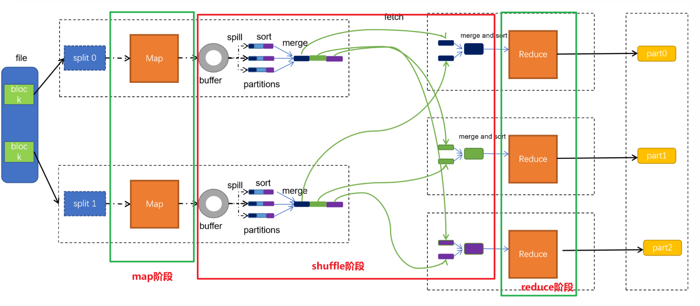

# Hadoop

## 大数据概述

### 	大数据特征


> **5V特征:**
>
> 数据体量大
>
> 数据种类多
>
> 价值密度低
>
> 增长速度快
>
> 数据质量差
>
> 
>
> 解决方案:  以更快,更好的技术深层次的挖掘数据中的价值,避免数据的各种干扰；从海量的高增长、多类别、低信息密度的数据中挖掘出高质量的结果。

### 大数据的主要工作

- 海量数据的存储: 存的下
- 海量数据的计算: 算得出
- 海量数据的传输: 传的快

### 大数据软件生态圈

> **Apache软件基金会**（也就是 Apache Software Foundation，简称 ASF），是专门为支持开源软件项目而办的一个非盈利性组织。在它所支持的 Apache 项目与子项目中，所发行的软件产品都遵循 Apache 许可证（Apache License）。


### 分布式和集群

> **集群:** 多台服务器共同完成相同的业务,就是一个集群.
>
> 
>
> 举例: 一个饭店,有三个部门,传菜,后厨,收银,由于客户数量太多,所以一个人传菜效率太低,为保证服务质量,我们招聘了三个传菜工,此时三个传菜工就相当于三台服务器,这三台服务器做的是相同的工作,这个传菜部门就相当于一个集群.
>
> ------
>
> **分布式:** 多台服务器共同完成不同的业务就是分布式.
>
> 
>
> 举例: 在一个饭店,有3个部门,传菜,后厨,收银,他们共同为客户提供用餐服务,此时传菜,收银和后厨就相当于三个服务器,此时用户使用的就是基于这三个服务器的分布式系统,他们互相协同工作,但每个人负责的业务各不相同个.
>
> 
>
> 一般情况下,分布式和集群是同时存在的,例如饭店,既有多个部门,每个部门又有多个员工,所以我们一般会说分布式集群.
>
> 一般口语中说的分布式集群服务其实就是多台服务器组成的服务.

### Hadoop的组件

> HDFS分布式文件存储系统: 负责海量数据的存储工作
>
> MapReduce分布式计算框架: 负责海量数据的计算工作
>
> Yarn分布式资源调度工具: 负责分布式集群的资源调度工作

**hadoop 版本问题**

> Hadoop1.x : 只有HDFS 和MapReduce,这个架构存在一些问题: MapReduce既负责数据的计算,又负责资源的调度,效率低下,兼容扩展性差
>
> Hadoop2.x : 有三个组件 HDFS  MapReduce  Yarn
>
> - Yarn负责资源调度,  MapReduce只负责分布式计算, 分工明确效率高
> - Yarn是一个公共资源调度平台, 只要是遵循一定的规则,就可以从yarn中申请资源,此时可以兼容更多的计算引擎或组件.
> - Yarn 可以分配的资源有内存和cpu, 保证了hadoop的地位.
>
> Hadoop3.x : 架构方面没有任何改变,还是三大组件,但是在性能, 安全, 易用性等方面进行了全面的升级.

**hadoop社区版与商业版**

> 社区版: 开源免费
>
> - 优点: 更新速度快,技术新
> - 缺点: 兼容性差不稳定
>
> 商业版: CDH  将所有大数据相关组件都重写了一遍并进行了精细测试解决了兼容性问题和稳定性问题
>
> - 优点: 兼容稳定性好
> - 缺点: 技术旧,收费
>
> 注意: 在企业级开发中我们使用的大多是商业版hadoop, CDH版本Hadoop在6.2.4版本之前是不收费的.

### 分布式的基础架构分析

> 集群架构模式:
>
> 主从架构(**中心化**):
>
> - 主角色 master: 发号施令,负责任务的接受和分配
> - 从角色 slave:负责干活
>
> 主备架构:可以解决中心化存在的问题
>
> - 主角色active : 正常工作
> - 备角色standby : 观察主角色工作,并实时备份主角色数据,当主角色宕机后,立即上位.
>
> 
>
> hadoop中的HDFS集群和Yarn集群都是主从模式架构.

## HDFS

### HDFS的角色分配

> **NameNode:**是集群中的主角色或主节点,负责 DataNode的管理工作
>
> **DataNode:**是集群中的从角色或从节点, 负责数据文件的读或写
>
> **SecondaryNameNode:** 是集群中的辅助角色或辅助节点,负责帮助NameNode完成管理工作(负责元数据的合并工作).
>
> 
>
> 一个典型的HDFS集群中会有多个DataNode,但是活跃的NameNode只能有一个,如果集群资源不足,则需要扩展DataNode节点数量.如果元数据管理能力不足,则需要给namenode提升服务器性能.
>
> **HDFS是一个标准的主从架构**
>
> 注意: 通常情况下, NameNode的服务器性能,要比DataNode高.(cpu和内存大)

### HDFS集群启动与关闭

**一键脚本启动**

> 下方指令是针对于整个集群的启停.在node1中执行该命令, node2, node3中的服务都会被启动. 前提是免密登录

```shell
# 一键启动
start-dfs.sh 
# 一键停止
stop-dfs.sh
```

**单起单停**

```shell
# 只能控制当前服务器中服务的启停
hdfs --daemon start|stop|status namenode|datanode|secondarynamenode
```

### HDFS的Shell操作

**hdfs的shell命令格式:**

```shell
# 新写法
hdfs dfs -命令 [-选项] [参数]
# 老写法
hadoop fs -命令 [-选项] [参数]
```

> 在操作hdfs文件系统和本地文件系统中，两种写法没太大区别，都可以用，不过官方推荐在操作hdfs文件系统时使用hdfs dfs,若是操作其它文件系统的话就只能用hadoop fs,他能操作更多的文件系统。

**hadoop中的shell命令**

注意：使用hdfs必须先启动hdfs,否则所有的终端指令无法使用.

```shell
Usage: hadoop fs [generic options]
        [-appendToFile <localsrc> ... <dst>]
        [-cat [-ignoreCrc] <src> ...]
        [-checksum [-v] <src> ...]
        [-chgrp [-R] GROUP PATH...]
        [-chmod [-R] <MODE[,MODE]... | OCTALMODE> PATH...]
        [-chown [-R] [OWNER][:[GROUP]] PATH...]
        [-concat <target path> <src path> <src path> ...]
        [-copyFromLocal [-f] [-p] [-l] [-d] [-t <thread count>] [-q <thread pool queue size>] <localsrc> ... <dst>]
        [-copyToLocal [-f] [-p] [-crc] [-ignoreCrc] [-t <thread count>] [-q <thread pool queue size>] <src> ... <localdst>]
        [-count [-q] [-h] [-v] [-t [<storage type>]] [-u] [-x] [-e] [-s] <path> ...]
        [-cp [-f] [-p | -p[topax]] [-d] [-t <thread count>] [-q <thread pool queue size>] <src> ... <dst>]
        [-createSnapshot <snapshotDir> [<snapshotName>]]
        [-deleteSnapshot <snapshotDir> <snapshotName>]
        [-df [-h] [<path> ...]]
        [-du [-s] [-h] [-v] [-x] <path> ...]
        [-expunge [-immediate] [-fs <path>]]
        [-find <path> ... <expression> ...]
        [-get [-f] [-p] [-crc] [-ignoreCrc] [-t <thread count>] [-q <thread pool queue size>] <src> ... <localdst>]
        [-getfacl [-R] <path>]
        [-getfattr [-R] {-n name | -d} [-e en] <path>]
        [-getmerge [-nl] [-skip-empty-file] <src> <localdst>]
        [-head <file>]
        [-help [cmd ...]]
        [-ls [-C] [-d] [-h] [-q] [-R] [-t] [-S] [-r] [-u] [-e] [<path> ...]]
        [-mkdir [-p] <path> ...]
        [-moveFromLocal [-f] [-p] [-l] [-d] <localsrc> ... <dst>]
        [-moveToLocal <src> <localdst>]
        [-mv <src> ... <dst>]
        [-put [-f] [-p] [-l] [-d] [-t <thread count>] [-q <thread pool queue size>] <localsrc> ... <dst>]
        [-renameSnapshot <snapshotDir> <oldName> <newName>]
        [-rm [-f] [-r|-R] [-skipTrash] [-safely] <src> ...]
        [-rmdir [--ignore-fail-on-non-empty] <dir> ...]
        [-setfacl [-R] [{-b|-k} {-m|-x <acl_spec>} <path>]|[--set <acl_spec> <path>]]
        [-setfattr {-n name [-v value] | -x name} <path>]
        [-setrep [-R] [-w] <rep> <path> ...]
        [-stat [format] <path> ...]
        [-tail [-f] [-s <sleep interval>] <file>]
        [-test -[defswrz] <path>]
        [-text [-ignoreCrc] <src> ...]
        [-touch [-a] [-m] [-t TIMESTAMP (yyyyMMdd:HHmmss) ] [-c] <path> ...]
        [-touchz <path> ...]
        [-truncate [-w] <length> <path> ...]
        [-usage [cmd ...]]

Generic options supported are:
-conf <configuration file>        specify an application configuration file
-D <property=value>               define a value for a given property
-fs <file:///|hdfs://namenode:port> specify default filesystem URL to use, overrides 'fs.defaultFS' property from configurations.
-jt <local|resourcemanager:port>  specify a ResourceManager
-files <file1,...>                specify a comma-separated list of files to be copied to the map reduce cluster
-libjars <jar1,...>               specify a comma-separated list of jar files to be included in the classpath
-archives <archive1,...>          specify a comma-separated list of archives to be unarchived on the compute machines

The general command line syntax is:
command [genericOptions] [commandOptions]

```

#### 查询本地文件系统

```shell
# 查询hdfs文件系统
hadoop fs -ls /aaa  # 使用默认的文件管理系统
hadoop fs -ls hdfs://node1:8020/aaa  # 使用完整版文件管理系统地址
# 查询本地文件系统
hadoop fs -ls file:///aaa
```

#### 文件的上传和下载

**put指令**: 从linux 服务器本地上传到hdfs文件系统中

```shell
# 格式: hdoop fs -put linux中的文件路径  hdfs中的文件路径
# 上传1.txt 到hdfs中
hadoop fs -put file:///home/hadoop/1.txt hdfs://node1:8020/itcast
# 如果文件已经存在,则添加-f
hadoop fs -put -f file:///home/hadoop/1.txt hdfs://node1:8020/itcast
# 简写形式 : 默认put的源文件在linux服务器上,同时linux系统可以使用相对路径 目标是hdfs文件系统
hadoop fs -put -f /home/hadoop/2.txt /itcast
```

**get命令**: 从hdfs文件系统将文件下载到linux文件系统中

```shell
# 格式: hadoop fs -get hdfs中的文件路径  linux中的文件路径
# 下载1.txt 文件到hadoop家目录的aaa目录下
hadoop fs -get hdfs://node1:8020/itcast/1.txt file:///home/hadoop/aaa
# 如果文件已经存在则添加-f
hadoop fs -get -f hdfs://node1:8020/itcast/1.txt file:///home/hadoop/aaa
# 简写形式: 默认get的源文件在hdfs文件系统中, 目标路径在linux文件系统中,同时linux系统可以使用相对路径
hadoop fs -get -f /itcast/2.txt ./aaa
```

#### 移动mv和复制cp命令

```shell
# 格式: hadoop fs -mv 原文件路径  目标文件路径
# mv 只能在同一个文件系统中移动,hdfs
# hadoop fs -mv hdfs://node1:8020/itcast/1.txt file:///home/hadoop/aaa/bbb  报错
# 移动本地文件系统数据
hadoop fs -mv file:///home/hadoop/aaa/1.txt file:///home/hadoop/aaa/bbb
# 移动hdfs中文件
hadoop fs -mv hdfs://node1:8020/aaa  hdfs://node1:8020/itcast

# 格式: hadoop fs -cp 原文件路径  目标文件路径
# 3.3版本以后cp可以再不同文件系统间复制.
# cp和linux中的复制基本相同,唯一的不同是,我们复制目录时不需要加-r
hadoop fs -cp hdfs://node1:8020/itcast/aaa  hdfs://node1:8020/bbb
 
# 在mv 和cp中只要我们是hdfs中的路径,可以不写hdfs://node1:8020 因为在服务启动前已经将其配置到core-site.xml中
hadoop fs -cp /itcast/aaa  /ccc
```

#### 删除命令rm

```shell
# 格式: hadoop fs -rm 文件名称
# 格式: hadoop fs -rm -r 目录名称
hadoop fs -rm -r /ccc

# 注意: 在hadoop中rm命令没有-f选项
```

#### 合并上传及合并下载

**appendToFile** 合并上传

```shell
# appendToFile的作用就是将本地的小文件上传到hdfs中,合并为一个大文件
# 格式: hadoop fs -appendToFile 本地文件路径 hdfs文件路径
# 可以将数据追加到某个已有的文件末尾
hadoop fs -appendToFile 3.txt /tmp/aaa.txt
# 也可以同时和并上传多个小文件.
hadoop fs -appendToFile 1.txt 2.txt 3.txt /tmp/1.txt
```

**getmerge** 合并下载

```shell
# getmerge的作用就是将hdfs中的小文件下载到本地,合并为一个大文件
# 格式: hadoop fs -getmerge hdfs路径 本地路径
hadoop fs -getmerge /tmp/small/* merge.txt
 
# 合并下载用的比合并上传少很多,因为在linux中一本合并与否不影响数据使用, 而hdfs中如果小文件数量过多,需要合并,否则内存占用极大.
```

### HDFS的大文件存储方案

注意: 一般企业中,block块的大小是128M(默认) 或 256M

> 在hive **2.6.7版本之前block块的默认大小是64M**
>
> 因为服务器性能在不断升级,此时block块的大小也会相应的调整

> 注意:为了减少小文件的出现,hdfs底层对于文件进行了优化,**如果仅比128M大一点则作为一个块存储**
>
> 
>
> 存储1.txt 需要几个块?  1个  blk-1  100M
>
> 存储2.txt 需要几个块?  3个  blk-1 128M  blk-2 128M blk-3 44M
>
> 存储3.txt 需要几个块?  1个  blk-1 129M
>
> 
>
> 同时存储1.txt 2.txt 3.txt 一共几个块???5个, **不同的文件一定在不同的块中**

**为了服务的安全性考虑: 采用多副本机制**

> 将一个文件存储为多份,分别放置在不同的服务上,当一个数据丢失时,可以从其他服务上进行备份,保证数据安全
>
> 
>
> 多副本机制默认是三个副本
>
> 
>
> 如果想保证安全几个副本最安全????
>
> 越多越好,但是副本机制属于用空间换安全,空间越大成本越高,所以我们一**般使用3副本机制.** 

如果想要调整副本数量,就在hdfs-site中修改如下参数即可


### NameNode的block块管理方案

> hdfs集群中  DataNode负责block块的存储,NameNode负责block块的管理

**思考: NameNode是通过什么手段管理block的呢?**

> **通过管理元数据管理block块**
>
> hdfs中的数据是什么??? block块
>
> hdfs中的元数据是什么??? 文件存放的位置, 文件名称,文件大小,文件的bloc块数,文件的创建和修改时间......
>
> 通过对于元数据的增删改查,就可以对于DataNode上的block块进行增删改查
>
> 增: 指挥datanode存储数据后将元数据记录在NameNode中
>
> 删: 将元数据中的文件记录删除,对比块信息时,datanode 自动删除没有被记录的块信息
>
> 改: hdfs 不支持修改
>
> 查: namenode中可以查看到指定的文件具体对应的是哪几个block,指挥客户端读取即可

**思考: 元数据是存放在内存中还是磁盘中呢?**

> 存储在磁盘中,读写效率太低,在实际开发中,很多服务同时使用hdfs,且各个程序员都在访问,如果读写效率低,则会影响开发效率.
>
> 存储在内存中, 不安全,断电,服务器崩溃等,都会造成数据丢失,且无法恢复.
>
> 
>
> **hdfs中将元数据存储两份,存储在磁盘中一份,存储在内存中一份**
>
> 存储在内存中的元数据,高速和其他服务与用户进行交互
>
> 存储在磁盘中的元数据,负责备份,服务崩溃或重启服务时,我们将磁盘中的元数据读取,读取到内存中,构建内存中的元数据.

**思考: 内存中读写效率极高,磁盘中读写效率低,我们是怎样备份才能够让内存和磁盘中的数据相同呢?**

> edits: hdfs中进行的任何增删操作,都会记录在edits文件中,但是不执行.
>
> - hdfs不支持修改,且查询不会影响元数据,所以edits只记录增删操作
>
> fsimage : hdfs中元数据的镜像文件,就是将edits中的所有记录执行一遍,将运行结果保存到fsimage中
>
> fsimage中的数据内容,就是元数据内容包括: 文件的名称,大小,创建修改时间,备份数量.....
>
>  
>
> 当我们第一次使用 hadoop NameNode -format时就将我们的第一个fsimage文件和edits文件创建好了
>
> 后续我们会将fsimage先读取到内存中,然后依次执行edits文件中的操作
>
> 执行完成后的edits 我们会进行保存,但是下次合并时将不会执行
>
> 每次合并都是将fsimage读取到内存中,然后运行新的edits
>
>  
>
> 此时又出现了新的问题??? NameNode所在的服务器合并数据时内存占用量极大
>
> 怎么解决这个问题??? **创建一个SecondaryNameNode 辅助NameNode进行元数据管理.让SN合并元数据.**

**思考: SecondaryNameNode 怎么知道该进行数据合并了呢?**

> 定期检查NameNode的元数据,如果满足合并条件,则将NameNode的数据复制到SecondaryNameNode所在的服务器,完成合并后,再传输回NameNode中.
>
> 
>
> 满足元数据合并的条件:
>
> 1. 距上一次合并的时间间隔达到1小时
> 2. 从上一次合并开始操作记录数达到1000000次记录
>
>  
>
> 每隔60秒检查一次
>
>  
>
> 触发元数据合并的时机可以修改.
>
> 

### HDFS的其他机制

#### 副本机制

> 三副本机制采用默认分配手段
>
> 第一个副本存放在本地服务器的DataNode中 
>
> - 我们连接hdfs需要通过客户端进行连接,启动客户端的服务器优先存储数据
>
> 第二个副本存放在于当前服务器机架不同的机架的任意服务器上
>
> 第三个副本存放在于第二个副本相同机架的不同服务器上
>
> 
>
> 如果公司集群中只有一个机架,则会使用佛系分配模式, 就是随机分配


#### 负载均衡机制

> 当客户端访问NameNode要存储数据时,NameNode首先让剩余存储空间较多的服务存储数据.

#### 心跳机制

> 1. DataNode每隔3秒钟向NameNode发送一次心跳包,我们称之为报活.
> 2. 如果超过3秒没有收到心跳包,NameNode就会给当前的DataNode一个标记,被标记的DataNode暂时无法提供读写功能.
> 3. 等待十次心跳时间,也就是30秒,如果还没有报活,则每隔5分钟NameNode会主动联系一次DataNode,一共联系两次
> 4. 10分30秒后,NameNode会将失联的DataNode踢出集群
> 5. 此时立即统计副本数量,副本数量不足的会进行备份,保证副本数量达标.
>
>  
>
> 事后DataNode经过重启修复后又连接进入集群:
>
> 1. 进入进群后,向NameNode发送快信息数据.
> 2. NameNode要统计块信息,查询副本数量是否有缺失或冗余
> 3. 缺失则立即备份,冗余则立即删除(负载均衡),保证副本数量不变.

点击网页端的node1:9870中的DataNode可以查看DataNode信息


正常情况下,DataNode的最后链接时间不会大于2S 否则该服务报活失败

#### DataNode块信息汇报

> DataNode在启动成功后,会立即向NameNode汇报自身的快信息
>
> 此后每隔6小时汇报一次块信息
>
> 
>
> **在fsimage中存放的元数据信息,不包括块的位置信息**     内存中包含
>
> 因为我们读取fsimage时,要么服务出现了问题,要么重启服务,此时会重新读取fsimage文件到内存中.
>
> DataNode也会重新接入集群,发送块信息汇报,
>
> 我们可以使用DataNode汇报的信息快速构建块信息架构,不需要在文件中进行保存.
>


### HDFS的数据写入


> 1. 写入DataNode之前必须访问NameNode,NameNode允许写入后方可写入数据
> 2. 将文件按block块进行切割，依次发送每个block块
> 3. 每个block块以packet包的形式进行拆分,每64kb一个包,进行数据传输
> 4. 向DataNode写入数据时,不是同时写入三个服务器,而是先将第一个副本写入后,由该副本所在的DataNode备份到其他服务中
> 5. 每个packet写入完成后会进行ack回调,收到回调后会写入下一个packet,如果一个block写满后会开启下一个block块继续写入,直到数据写入完成
> 6. 所有数据写入完成后,需要向NameNode汇报写入完成,NameNode查询确认后保存元数据信息,方可使用该文件.
> 7. NameNode查询确认时,只要有一个副本完整保存,则元数据信息即可开放使用

**思考: 为什么不使用一次性写入三个DataNode的方法呢? 为什么要写入一个然后备份呢?**

> 理论上,一次性写入三个服务器肯定效率最高,速度最快,但是现实不是这样的
>
> **同时向三个服务写入:**
>
> - 带宽30M/s 一次写入三个服务器共用30M带宽, 每一个DataNode占用10M/s 传完一个10M的数据 需要1S
>
> **使用管道pipline:**
>
> - 带宽30M/s 先写入第一个DataNode占用完整带宽30M/s 传输一个10M的数据需要0.33秒
> - 第一个DataNode将数据备份到第二个DataNode,也是30M/s带块,传输一个10M的数据需要0.33秒
> - 第二个DataNode传输到第三个DataNode,也是0.33秒
> - 由于我们将数据拆分为多个packet包,所以可以异步备份,此时完成数据存储的总用时一定小于1s
>
> 
>
> 所以在服务器带宽有限的情况下使用pipline效果更好.
>
>  
>
> 互联网分为上行速度(上传带宽)和下行速度(下载带宽)互不影响  

### HDFS的数据读取


> 1. NameNode返回的blcok位置列表中,不仅包含块位置还包含其副本的位置
> 2. 如果出现DataNode不可用的情况会在读取结束后向NameNode进行汇报,如果无不可用的情况不需要向NameNode进行任何汇报
> 3. 读取文件时先读取到内存缓冲区,当将多个block读取完成后进行拼接合并后写入文件中.

### HDFS的元数据管理

> fsimage 和 edits之间的关系:
>
> fsimage相当于一个数据表,内部存储了大量的元数据
>
> edits相当于大量sql语句的脚本
>
> 
>
> **合并元数据就相当于将数据表读取到内存中,然后执行sql语句,将数据表更新到最新状态,然后保存成文件覆盖原来的数据表**


> **启动服务时:**
>
> 从磁盘中的fsimage中读取全部的元数据加载到内存中,再找到最新的edits文件,将内部的日志文件执行
>
> - edits中的日志信息是解析完成的二进制指令(占用空间更小,执行效率更快)
>
> 从DataNode中获取所有节点的块信息数据,获取完成后在内存中构建完整的元数据服务
>
> 
>
> **触发元数据合并时:(合并间隔1小时或100万条记录)**
>
> 1. 将日志文件备份,将原日志文件修改为新的名称,后续的日志信息将记录在新文件中,备份文件将用于数据合并 
> 2. 将fsimage和备份的edits文件复制到SecondaryNameNode中
> 3. 在SNN中将fsimage读取到内存中,将edits运行一遍,获得一个新的镜像文件命名为fsimage.checkpoint
> 4. 将fsimage.checkpoint复制到NameNode中,将其改名为fsimage覆盖原来的镜像文件.
>
>  
>
> 如果遇到意外情况SNN可以帮助NN进行数据恢复,但是,会有数据损失.

### HDFS安全模式


**安全模式下只可以进行元数据操作,数据文件不可以操作**


> 其实安全模式就是服务器启动后,满足使用条件之前的这段时间.如果在这段时间内操作数据可能造成数据的错误或丢失,所以hdfs开启安全模式防止数据出现问题.

如何自动退出安全模式:

> 1. 启动服务后,集群中的block块的数量达到总块数的99.9%
> 2. 接入DataNode的总数大于等于0,但是后续可以修改
> 3. 前两种状态满足后,等待30秒即可退出安全模式


手动进入和退出安全模式:

```sh
# 查询安全模式状态
 hdfs dfsadmin -safemode get
# 进入安全模式
 hdfs dfsadmin -safemode enter
# 退出安全模式
 hdfs dfsadmin -safemode leave
```

不符合条件进入的安全模式,和手动进入的安全模式不相同


> **注意:** 如果block块为0 可以退出安全模式,但是退出后,只能操作元数据的增删改,无法进行数据查询和增删改操作.(只能操作文件夹,不能操作文件.)

### HDFS归档机制

**思考:为什么HDFS不适合存储小文件???**

> 因为存储小文件和存储大文件的元数据开销几乎相同,小文件过多就会产生大量的元数据信息,将内存占满
>
> 举例:
>
> 1. 小文件1个文件占1KB磁盘空间,元数据占用1KB内存空间, 如果存储10G的小文件,占用内存空间为10G
> 2. 大文件1个文件占1GB磁盘空间, 元数据占用1KB内存空间,如果存储10G的大文件,占用内存空间为10KB
>
> 内存资源比磁盘资源昂贵很多,所以我们不建议储存过多的小文件.
>
> 有些时候,我们不可避免的保存了小文件该怎么办呢?  **归档**
>
> 一般公司1个星期左右进行一次小文件归档,使用归档脚本完成即可

```shell
#创建档案
hadoop archive -archiveName test.har -p /small /outputdir

基于自己的需求 删除小文件 减少对内存的消耗
hadoop fs -rm /small/*

#查看档案文件 --归档之后的样子
[root@node1 ~]# hadoop fs -ls hdfs://node1:8020/outputdir/test.har
Found 4 items
hdfs://node1:8020/outputdir/test.har/_SUCCESS
hdfs://node1:8020/outputdir/test.har/_index
hdfs://node1:8020/outputdir/test.har/_masterindex
hdfs://node1:8020/outputdir/test.har/part-0

#查看档案文件 --归档之前的样子  使用har协议查看即可
[root@node1 ~]# hadoop fs -ls har://hdfs-node1:8020/outputdir/test.har
Found 3 items
 har://hdfs-node1:8020/outputdir/test.har/1.txt
 har://hdfs-node1:8020/outputdir/test.har/2.txt
 har://hdfs-node1:8020/outputdir/test.har/3.txt

#从档案文件中提取文件
[root@node1 ~]# hadoop fs -cp har://hdfs-node1:8020/outputdir/test.har/* /small/
[root@node1 ~]# hadoop fs -ls /small
Found 3 items
-rw-r--r--   3 root supergroup          2 2021-05-24 17:58 /small/1.txt
-rw-r--r--   3 root supergroup          2 2021-05-24 17:58 /small/2.txt
-rw-r--r--   3 root supergroup          2 2021-05-24 17:58 /small/3.txt
```

har文件中存储的数据内容其实就是元数据信息+原数据内容

> 归档的本质,不是将数据进行和并,而是将元数据保存到磁盘中,元数据管理压力减小了
>
> 但是由于每次读取文件之前先要读取元数据信息,所以读写效率降低了


> **注意:** 归档时只是简单的合并,并没有进行压缩,占用的磁盘空间没有减少,反而由于存储了元数据而增加,此处也是牺牲磁盘空间换内存空间

## MapReduce

### MapReduce的执行流程

**我们的MapReduce任务中有几个Maptask是由什么决定的呢??**

> 根据split size 大小决定的,也就是要把大的数据文件拆分成多少个小份进行执行  
>
> split size 默认和block size大小相同,也就是在不单独配置的情况下,有多少个block块,就开启多少个map任务

**我们的map任务的数据结果会有多少个分区呢?**

> 有多少个分区,由reducetask的数量决定
>
> 默认情况下,reducetask的数量是-1, 我们可以手动修改reducetask的数量

**MapReduce任务执行完成后,会写入磁盘多少个数据文件呢?**

> 有多少个reducetask就会产生多少个数据文件

**MapReduce计算引擎的缺点是什么?**

> **计算效率低**
>
> 原因: MapReduce任务会将计算任务在磁盘和内存中反复读写,计算效率低下
>
> 还有一种说法,  MapReduce在任务执行阶段多次落盘,效率低下


**MapReduce是一个失败的产品么?**

> **不是**
>
> 第一个被业界广泛认可的开源大数据计算框架
>
> 在当时的业务背景下,服务器性能低下,MapReduce任务在计算的同时,对于资源的占用极少,所以在大数据开发初期有着不可磨灭的贡献
>
> 无论是spark还是flink 现阶段数据安全和服务稳定性还是不能和mr相比.
>
> 
>
> spark号称迭代计算效率比MapReduce快100倍.

**MapReduce一共分为几个阶段?**

> map阶段: 执行map任务 
>
> shuffle阶段: 从map任务输出结果,到reduce阶段输入数据之前的所有内容都是shuffle阶段
>
> reduce阶段: 执行 reduce任务
>
> 
>
> shuffle阶段是我们MapReduce的最精华部分,也是他最大的败笔



**shuffle阶段做了什么事情?**

> **Collect阶段：** **将MapTask的结果输出到**默认大小为100M的环形**缓冲区**，保存的是key/value，Partition分区信息等(将key计算处hash值,根据哈希取余计算分区)
> **Spill阶段**：当内存中的数据量达到一定的阀值(80%)的时候，就会将数据写入本地磁盘，在**将数据写入磁盘**之前需要对数据**进行**一次**排序**的操作，如果配置了combiner，还会将有相同分区号和key的数据进行排序
> **Merge阶段：**把所有溢出的**临时文件**进行一次**合并**操作，以确保一个MapTask最终只产生一个中间数据文件
> **Copy阶段：** ReduceTask启动Fetcher线程到已经完成**MapTask**的节点上**复制一份属于自己的数据**，这些数据默认会保存在内存的缓冲区中，当内存的缓冲区达到一定的阀值的时候，就会将数据写到磁盘之上
> **Merge阶段：**在ReduceTask远程复制数据的同时，会在后台开启两个线程对内存到本地的**数据文件进行合并操作**。
> **Sort阶段：**在对数据进行合并的同时，会**进行排序操作**，由于MapTask阶段已经对数据进行了局部的排序，ReduceTask只需保证Copy的数据的最终整体有效性即可。 
>
> 
>
> 简化: **分区,排序,合并**

我们的任务执行顺序是先执行map任务,后执行reduce任务,为什么map的分区数,可以和reduce任务数量相同???

> 执行MapReduce任务之前先进行任务计划,生成job文件
>
> job文件提交给ResourceManager,申请容器
>
> 我们此时就会将需要多少个map任务和多少个reduce任务规划好,并申请相对应的容器数量.

## YARN

> yarn不光可以对于hadoop平台的MR任务进行资源调度,可以对于所有的基于yarn的规则申请资源的服务进行资源调度,也就保证了我们基于hadoop组件运行的其他大数据服务可以获得合理的资源分配.
>
> 除了MapReduce,我们的Yarn还支持多种计算引擎  taz spark等

### YARN架构

Yarn是标准的主从架构集群

> 主角色ResourceManager: 统一管理和分配集群资源,监控每一个NodeManager的健康状况.
>
> 从角色NodeManager: 统计汇报集群资源给RM,当前服务器集群资源的使用和容器拆分.监督资源回收

容器机制:

> NodeManager,在程序没有执行时就预先抢占一部分资源划分为容器,等待服务进行使用
>
> 程序运行时先申请资源,RM分配资源后,由NodeManager划分出相应的资源支持程序运行
>
> 程序运行期间无法突破资源限制最多只能使用容器范围内的资源
>
> 容器资源分为: 内存资源和cpu资源

### Yarn集群的启停

一键启动

```shell
# 启动yarn集群
start-yarn.sh
# 停止yarn集群
stop-yarn.sh
```

单起单停

```sh
yarn --daemon start|stop|status resourcemanager|nodemanager
```

一键自动hdfs和yarn集群

```sh
# 启动
start-all.sh
# 终止
stop-all.sh
```

> 执行mapreduce任务：
>
> 保证服务启动且可以正常使用(yarn 和hdfs)

### Yarn执行MapReduce的流程

> Yarn的角色分配**
>
> 主角色: ResourceManager 负责资源的分配
>
> 从角色: NodeManager 负责资源的统计汇报和使用  

**Yarn中的容器机制?** 

> 1. Yarn会将服务器中的资源大小不同的多个部分,称为容器
> 2. Yarn中的容器机制其实就是在服务器中预先占用一部分内存和cpu资源,等待程序的运行
> 3. 容器的管理和使用是由NodeManager完成的,但是会将容器信息汇报给ResourceManager,由其统一分配
> 4. 容器中运行的程序无法突破容器的限制,使用容器限定资源之外的资源.


**ApplicationMaster 做了哪些事情??**

> 1. 启动appmaster后和ApplicationManager建立心跳关系(**如果心跳中断会停止任务执行回收资源**)
> 2. 向资源调度器申请执行计算任务的容器
> 3. 与容器所在的NodeManager建立连接并保持心跳,让NodeManager开启容器
> 4. 将计算任务按照需求发送给容器并执行
> 5. 监控任务执行的进度
> 6. 向client实时汇报任务进度
> 7. 任务执行完成后找ApplicationManager注销自己回收资源

**为什么Yarn能够作为公共分布式资源调度平台? 为什么Yarn可以兼容各种的计算框架**

> 因为Yarn不关心计算任务怎么执行,也不关心其具体任务的执行情况,只分配的计算任务需要的资源
>
> 所以所有的计算框架或者分布式服务,只要符合yarn的资源申请规则,就可以在yarn上进行资源调度

**Yarn执行mr任务时,ResourceManager做了什么事情?**

> 1. 接收并解析client传递过来的计算任务(**计算任务必须有创建ApplicationMaster的代码**)
> 2. 指定NodeManager开启容器并执行创建ApplicationMaster的代码
> 3. 保持与ApplicationMaster的连接,连接保持资源可以持续使用,连接中断或注销后,资源回收

### Yarn的三大调度策略

> 先进先出调度器: 先进入调度器的任务先执行,占用全部的资源其他任务等待
>
> 公平调度器: 所有的任务平分资源,当任务执行完成后,将资源释放平分给正在执行的其他任务
>
> 容量调度器: 将资源分为多份,每份的资源比例不变,任务只能使用当前队列的资源不能使用全部资源

**思考: 哪种调度策略更好呢?**

> 先进先出肯定不好 不用考虑他.
>
> 
>
> 公平调度在任务满载状态下效率最高,且大任务单独执行时会占用全部资源运行效率高
>
> 一般公司或团队仅有一个业务线,或者服务资源充沛时使用公平调度
>
> 
>
> 容量调度可以将资源分配给多个任务队列,任务执行互不干扰,但是资源利用率较差
>
> 一般公司有多个团队开发不同的业务,或者公司的测试服务和正式服务在同一个集群中的情况下我们使用容量调度
>
> 
>
> apache版本的hadoop默认使用容量调度策略,默认仅有一个default队列,任务执行也是先进先出的
>
> CDH版本的Hadoop默认使用公平调度策略