# Hive

## Apache Hive 概述

**Apache Hive是大数据数仓管理工具**

> 数仓的最基本功能:
>
> 存储数据
>
> 数据的写入
>
> 数据的读取
>
> 数据的计算
>
> 
>
> **Hive不能存储数据**(包括读写),其存储功能依托于HDFS
>
> **Hive也不能计算数据**, 其计算功能依托于MapReduce+Yarn
>
> 
>
> **Hive可以将结构化的数据映射为表**
>
> **Hive可以将简单的SQL语句规划为结构逻辑复杂的MapReduce计算任务**
>
> 
>
> Hive极大的降低了大数据开发的准入门槛,提高了大数据开发的工作效率

```
1, 小明, 13
2, 小芳, 15
```

| id   | name | age  |
| ---- | ---- | ---- |
| 1    | 小明 | 13   |
| 2    | 小芳 | 15   |

### 什么是元数据

> 描述数据的数据
>
> 举例: 
>
> 在mysql中存储一个学员的信息,  1, 小明, 男,18   如果查询数据我们想获取的就是这一串内容
>
> 但是,我们怎样查询和存储这个数据呢? 要知道如下内容
>
> - 该数据在哪个数据库中
> - 在哪个表中
> - 每个字段的含义
> - 每个字段的数据类型
> - 这条记录的创建修改时间
> - ........
>
> 上方的举例中1, 小明, 男,18是数据
>
> 其余均为元数据
>
> 
>
> **可以理解为,元数据通过各种表述,创建了一张空表. 数据可以将表的内容填写完整.**

> 元数据管理 : 建议在关系型数据库中管理元数据,因为存取效率高,且可以随意删改,企业中大多使用mysql
>
> sql解析器 : 将sql语句转换为mr任务,并进行优化,提交,运行以及结果输出.

### Hive基础架构

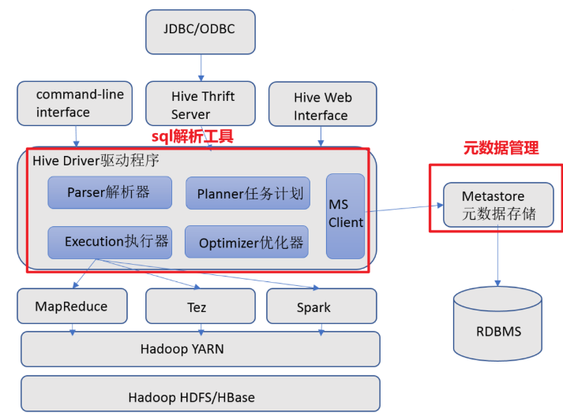

> - 三种客户端模式:
>   - 命令行模式  hive
>   - 第三方服务(要遵循jdbc协议) : java database connection  datagrip  beeline
>   - web页面: 几乎不用
>
> - metastore元数据服务
>   - 帮助我们查询元数据
>
> - HiveDriver hive驱动  
>   - 解析sql语句
>   - 制定执行任务
>   - 优化执行方案
>   - 提交mr任务
>
> - 执行计算任务
>   - 向yarn申请资源
>   - 从hdfs中提取数据
>
> 注意: hivedriver支持多种计算引擎, 例如  MapReduce  Tez  Spark

### 远程模式

> 1、元数据使用外置的RDBMS，常见使用最多的是MySQL。
>
> 2、metastore服务单独配置  单独手动启动  全局唯一。
>
> 这样的话各个客户端只能通过这一个metastore服务访问Hive.企业生产环境中使用的模式，支持多客户端远程并发操作访问Hive.
>

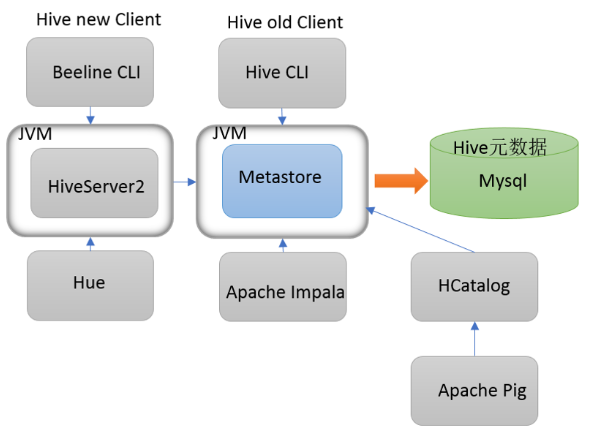

### Hive客户端

**metastore和hiveserver2的启动**

```shell
# 前台启动
# 前台启动 (当终端任务结束后,立即结束服务)
# 前台启动,可以比较方便的查看日志信息
hive --service metastore
hive --service hiveserver2

# 后台启动
# 后台启动 (不影响中端使用,在那个目录下启动该服务,就会在该目录下,生成一个nohup.out文件,记录日志信息.)
nohup hive --service metastore &
nohup hive --service hiveserver2 & 
```

**第一代客户端: hive**

第一代客户端直接使用hive指令连接,链接的就是metastore服务,并且只要连接成功就可以操作hive数据库

```shell
# 使用第一代客户端
hive
```

> 第一代客户端存在的问题:
>
> 1. metastore既负责元数据的管理,又负责客户端的连接保持(峰值性能不强)
> 2. 没有身份识别,只要能够连接metastore就可以操作hive安全性不强
> 3. 无法第三方服务协议进行连接(JDBC)

**第二代客户端: beeline**

> 创建了一个单独的hiveserver2服务
>
> 1. 专门处理客户端连接请求,以及保持客户端连接,
> 2. 并且hiveserver2会对于客户端身份进行校验,如果不满足将无法使用hive服务,
> 3. 使用jdfc协议连接,可以无缝连接第三方服务

```shell
# 第二代客户端启动
beeline

# 第二代客户端连接
!connect jdbc:hive2://node1:10000
# 输入账号: root 密码 :
```

**注意:** hiveserver2服务启动后1-2分钟后才可用

如果不放心可以使用`lsof -i:10000` 去查询,如果有进程使用了该端口号则hiveserver2服务就可用了

metastore占用的端口号是: 9083

### 数仓的分层架构

> ODS层(operation data Store): 数据操作层,源数据层,主要就是将各个数据源中的数据集中采集到指定平台中,几乎不对数据做任何处理,只是临时存放等待后续处理
>
> 
>
> DW层(Data Warehouse) : 数据仓库层, 对于数据进行数据清洗,数据处理,数据转换等,使其满足数据分析的要求
>
> 
>
> DA层APP层(application) : 数据应用层, 根据业务部门的需求,进行数据分析处理,获得的数据可以直接用于前端展示或数据报表等.

每一个公司的数仓分层策略都不同,只需要记住三层架构即可,在公司中,通常会对于dw层和da层进行细化.

**分层好处**

- 解耦合(相互依赖),方便协同开发
- 可以追根溯源,更快对于问题进行解决和修复
- 过程中创建的中间表可以重复利用
- 空间换时间 提高最终应用层使用数据的效率

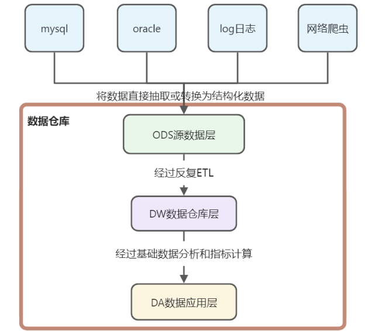

## 数据库操作

```sql
-- 1. 创建一个数据库
-- 注意: 在hive中 database 和 schema 是完全相同的
create database test_db;
create schema test_db2;

-- 创建数据库时,如果数据库已存在将会报错,我们可以使用if not exists进行异常规避
create database if not exists test_db;

-- 2. 使用数据库
-- hive中没有使用数据库依旧可以创建成功默认使用default数据库
create table student(
    id int,
    name varchar(255)
);

-- 使用数据库后则可以将表创建到指定数据库中
use test_db;

create table student(
    id int,
    name varchar(255)
);

-- 3. 查看当前使用的数据库
select current_database();

-- 4. 查看数据库详细信息
desc database test_db;

-- 5. 创建数据库时指定数据存放位置
create database if not exists test_db3 location 'hdfs://node1:8020/tmp/db_1';

create table test_db3.student(
    id int,
    name varchar(255)
);

-- 6. 创建数据库时指定注释信息
create database if not exists test_db4 comment 'this db is a test';

desc database test_db4;

-- 7. 删除数据库
-- 空数据库可以直接删除
drop database test_db4;

-- Database test_db3 is not empty. One or more tables exist.
-- 空数据库可以直接删除,但是如果内部创建了表,则不能随意删除
-- drop database test_db3;

-- 如果需要强行删除非空数据库,需要使用cascade 进行修饰
drop database test_db3 cascade;
```

### 表操作语法和数据类型

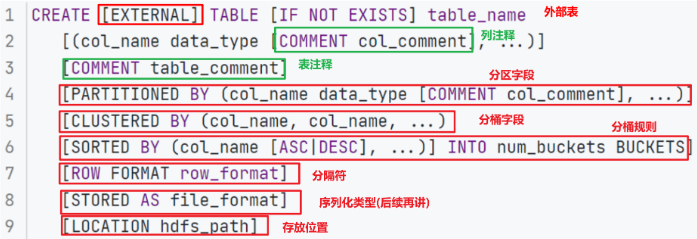

- 内部表和外部表(分隔符+存放位置)
- 分区
- 分桶
- 序列化

#### 数据类型

> hive中不仅支持sql中的数据类型,还支持 java中的部分数据类型

在hive中支持的数据类型比较多,我们常用的数据类型如下:

> 整型: int
>
> 浮点型: double
>
> 字符型: string
>
> 时间型: date timestamp
>
> 复杂数据类型: map array

**注意: 在mysql中 没有string类型数据,而hive中有, 在mysql中有datetime类型而hive中不存在.在mysql中不支持复杂数据类型,hive中支持**

### 内部表操作

使用`desc formatted 表名;`查看后table type是manged_table则该表为内部表;

```shell
-- 1. 创建一个数据表
create table test_db.student1
(
    id   int comment 'stu_id',
    name string comment 'stu_name'
) comment 'student_table';

-- 2. 查询表的信息
desc test_db.student1;

-- 3. 查询表的元数据信息
desc formatted test_db.student1;

-- 4. 查看数据库中所有的表名
show tables;
show tables in test_db;

-- 5. 向表中插入数据信息
insert into test_db.student1
values (1, '小红'),
       (2, '小明'),
       (3, '小刚');

-- 6. 查询表中的数据
select *
from test_db.student1;

-- 我们的hive不会使用常见字符作为默认分隔符,使用的是`\001`

select '1\001小明';

```

在数据表中插入数据,系统会在字段之间添加一个默认的分隔符,帮助系统判别不同的字段,但是这个字符不能是常见的字符,

> `\001`是一个不可见字符,代表标题开始.编程软件和编程语言很容易就可以输出,但是任何一款文本编辑器都不能轻易输出该字符,所以在使用过程中,不会和数据库中的数据产生歧义

### 自定义字段分隔符的方式

```sql
-- 创建一个内部表, 并且指定分隔符为 \t
create table test_db.student2(
    id int,
    name string
)
row format delimited -- 默认的序列化格式
fields terminated by '\t'; -- 使用 \t作为字段间的分隔符

-- 上传数据后,查询数据内容
select * from student2;
```

### 创建内部表的另外两种方式

```shell
-- 1. create table as ...   将查询结果创建一个表保存起来
create table test_db.student_copy as select * from test_db.student2;

-- 查看表结构
desc test_db.student_copy;

-- 查看表中的数据内容
select * from test_db.student_copy;

-- 2. create table ... like ... 创建一个内部表,表的结构复制指定的表
create table test_db.student_copy1 like test_db.student2;

-- 查看表结构
desc test_db.student_copy1;

-- 查看表中的数据内容
-- 查看该表时,发现没有数据,所以like 方法只能复制表结构,不能复制内部的数据内容.所以仅仅copy了他的元数据信息,速度非常快不走mr任务.
select * from test_db.student_copy1;
```

### 删除内部表

```sql
-- 删除内部表
-- 数据表中无论是否有数据都可以直接删除,并且删除时没有询问或提示,所以要慎重.
drop table test_db.student2;

-- 内部表在删除时,会将文件和目录一起删除掉
drop table test_db.student1;

-- 内部表被删除时,会将元数据同时删除
show tables in test_db;

-- 结论: 在删除内部表时,会将元数据和数据同时删除. (所有的数据完全受到hive控制)
```

### 修改表操作

```sql
-- 创建一个内部表
create table test_db.person
(
    id   int,
    age  int,
    name string
)
    row format delimited
        fields terminated by '\t';

-- 查看表的详细信息
desc formatted test_db.person;

-- 1. 增加一个字段
alter table test_db.person
    add columns (gender string, height double);

desc formatted test_db.person;

-- 2. 修改字段
alter table test_db.person
    change gender sex string;

desc formatted test_db.person;

-- 删除字段
-- alter table test_db.person drop sex;
-- hive中不支持删除字段的方法, 如果字段多余,可以重建表

-- 3. 修改表名
-- 自定义位置的表名不会修改
alter table test_db.person
    rename to test_db.person_tb;

show tables in test_db;

-- 4. 修改表数据的存储位置(不常用)
-- 在person_db目录中添加一行数据
insert into test_db.person_tb
values (1, 12, '小明', '男', 1.75);
select *
from test_db.person_tb;
-- 修改表绑定的数据位置
alter table test_db.person_tb
    set location '/tmp/person_test';

desc formatted test_db.person_tb;

select *
from test_db.person_tb;
-- 修改表绑定的数据位置后,原有数据不会移动,但是数据查找的位置发生了改变

-- 在新位置插入一条数据
insert into test_db.person_tb
values (2, 16, '小芳', '女', 1.96);

-- 自定义路径下的表,修改表名后,目录名称不会发生改变
alter table test_db.person_tb
    rename to test_db.person_tb1;

-- 5. 修改表的属性
-- 如果修改的属性为EXTERNAL就会修改表的类型  值为true就修改为外部表  值为false就修改为内部表
-- 强调: EXTERNAL必须为大写, 而flase和true可以是大写或小写
-- 如果属性名存在就是修改属性名
alter table test_db.person_tb1 set tblproperties ('EXTERNAL'='false');
-- 如果属性名不存在,就是添加新的属性键值对
alter table test_db.person_tb1 set tblproperties ('chuanzhi'='bangbangda');

desc formatted test_db.person_tb1;

-- 6. 清空表数据
-- Attempt to do update or delete using transaction manager that does not support these operations.
-- hive数据仓库中,不支持更新和删除操作
-- delete from test_db.person_tb1;

-- Cannot truncate non-managed table test_db.person_tb1.
-- 外部表不支持清空操作, 内部表可以清空
truncate table test_db.person_tb1;

-- 7. 表的删除操作
drop table test_db.person_tb1;
```

### 外部表操作

```shell
-- 1. 创建一个外部表
-- 在创建表时,使用external进行修饰,就是外部表
drop table test_db.ext_person;
create external table test_db.ext_person (
    id int,
    name string
)
row format delimited
fields terminated by '\t';

-- 2. 查询外部表的详细信息
desc formatted test_db.ext_person;

-- 3. 向外部表中插入数据
insert into test_db.ext_person values (1, '小明'), (2, '小红');

-- 4. 从外部表中查询数据内容
select * from test_db.ext_person;

-- 5. 清空外部表中的数据
-- Cannot truncate non-managed table test_db.ext_person.
-- 外部表中的数据不可以被清空
-- truncate table test_db.ext_person;

-- 6. 删除外部表
drop table test_db.ext_person;

-- 数据表,在元数据中已经被删除,无法查询和使用
select * from ext_person;  -- Table not found 'ext_person'
show tables in test_db;

-- 经查询,hdfs中该表所涉及的目录和数据文件依然存在,没有被删除

-- 结论: 删除外部表时,只能删除元数据, 不能删除其数据内容 (该表只有元数据收到hive控制,数据内容不受hive控制)
```

**使用外部表的场景:**

> 1. 数据极其重要或不易获得,在使用过程中为了防止误删,必须使用外部表
> 2. 数据集被多个表引用,或被多个用户引用,此时如果删除会影响其他人操作,我们就使用外部表
>
> 有一些表会做成外部表, 公司组织架构表, 日期表....

### 数据加载

```sql
-- 数据准备
CREATE TABLE test_db.test_load
(
    dt      string comment '时间（时分秒）',
    user_id string comment '用户ID',
    word    string comment '搜索词',
    url     string comment '用户访问网址'
) comment '搜索引擎日志表' ROW FORMAT DELIMITED FIELDS TERMINATED BY '\t';

-- 1. 从linux中,将数据上传到hdfs的指定目录下,映射数据
-- 步骤1: 将数据文件先存放在 /root/hive_data目录中
-- 步骤2: 使用shell指令将数据文件上传至 hdfs目录中  /user/hive/warehouse/test_db.db/test_load
hadoop fs -put /root/hive_data/search_log.txt /user/hive/warehouse/test_db.db/test_load
-- 步骤3: 查看表中是否映射成功该文件内容
select * from test_db.test_load;

-- 注意 使用该方法映射文件要注意,分隔符的指定一定要正确,否则无法映射成功

-- 2. load data sql语句,可以直接从本地文件中加载数据文件
-- 步骤1: 复制一个test_load表结构
create table test_db.test_load1 like test_db.test_load;
-- 步骤2: 使用load data语法将数据从本地加载到表中
-- 加载格式: load data local inpath '文件路径' into table 表名;
load data local inpath '/root/hive_data/search_log.txt' into table test_db.test_load1;
-- 步骤3: 查看表中的数据是否映射成功
select * from test_db.test_load1;

-- 结论: load data 的操作方式其实和put基本一致, 上传文件后数据原文件依然存在

-- 3. load data sql语句, 可以从hdfs上将数据加载到表目录中
-- 步骤1: 复制一个test_load表结构
create table test_db.test_load2 like test_db.test_load;
-- 步骤2: 将数据上传到/tmp/test_data/
-- 步骤3: 将hdfs上的/tmp/test_data/search_log.txt 文件加载到表中
-- 加载格式: load data inpath 'hdfs中的文件路径' into table 表名;
load data inpath 'hdfs://node1:8020/tmp/test_data/search_log.txt' into table test_db.test_load2;
-- 步骤4: 查看数据是否映射成功
select * from test_db.test_load2;

-- 结论: load data 的操作方式,如果将hdfs上的数据进行上传,则为移动该文件到表目录中, 原位置文件消失.

-- 4. load data ... overwrite ... 覆盖加载数据
-- 可以对同一个表加载多次数据,数据会累加显示在虚拟表中.但是我们有时为了防止其重复加载,会使用overwrite进行覆盖加载
-- 刚才对于test_load1进行了多次加载,此时我们要使用覆盖加载,将原有数据清空,插入新数据
load data local inpath '/root/hive_data/search_log.txt' overwrite into table test_db.test_load1;

-- 查看文件是否加载成功, 此时之前的数据被清空,仅保留本次插入的数据内容.
select * from test_db.test_load1;
```


**数据加载的其他方式**

```sql
-- 1. insert into values
-- 步骤1: 复制test_load的表结构
create table test_db.test_load3 like test_db.test_load;
-- 步骤2: 使用 insert into values 加载2条数据
insert into test_db.test_load3
values ('00:00:01', '1233215666', '传智播客', 'http://www.itcast.cn'),
       ('00:50:00', '2233216666', '黑马程序员', 'http://www.itcast.cn');
-- 步骤3: 查看数据内容是否加载完成  建表时指定的分隔符是什么,此时加载数据就使用什么分隔符
select *
from test_db.test_load3;

-- 结论: 该操作方式,加载数据过于缓慢,我们一般不用

-- 2. insert into ... select
-- 将我们查询或清洗后的数据结果加载到目标表中
-- 步骤1: 复制test_load的表结构
create table test_db.test_load4 like test_db.test_load;
-- 步骤2: 将test_load中的数据文件全部读取出来,并且存放到test_load4当中
insert into test_db.test_load4
select *
from test_db.test_load
where user_id > '1233333333';
-- 步骤3: 查询表中的数据是否加载成功
select *
from test_db.test_load4;

-- 结论: 这种方式用的比较多,因为我们不希望在插入数据这种机械操作中浪费时间,但是我们清洗后将结果插入浪费的时间有价值.

-- 3. insert overwrite ... select
-- 将我们查询或者清洗后的数据结果覆盖加载到目标表中
-- 步骤1: 复将test_load中的数据读取出来,并且筛选user_id < '1233333333' 覆盖加载到test_load4表中
insert overwrite table test_db.test_load4
select *
from test_db.test_load
where user_id < '1233333333';

-- 步骤2: 查询加载后的文件是否准确覆盖
select * from test_db.test_load4;

-- 结论: 覆盖方法其实使用的也不是特别多,因为在开发中我们需要保留历史数据.
```

### 数据导出

```sql
-- 1. insert overwrite local directory  '' select * from....
-- 将查询到的数据结果,保存到指定的本地目录中
-- 有local 就是保存或者加载本地数据
-- 步骤1: 将test_load中的数据导出到node1 的/root/aaa 目录中
-- 指定的导出位置只能是目录,不能是文件
insert overwrite local directory '/root/aaa'
select *
from test_db.test_load;
-- 步骤2: 观察导出文件分隔符为\001  导出文件后,目标目录被覆盖,所有文件被清除,仅保留导出结果使用默认文件名.
-- 步骤3: 导出文件时增加分隔符
insert overwrite local directory '/root/aaa' row format delimited fields terminated by '\t'
select *
from test_db.test_load;

-- 2. insert overwrite  directory  '' select * from....
-- 将查询到的数据结果,保存到hdfs上的目录中
insert overwrite directory '/tmp/small' select *from test_db.test_load;

-- 3. 导出文件没有追加方法
-- insert into  directory '/tmp/small' select *from test_db.test_load;

-- 注意: 使用insert overwrite directory 进行数据导出,一定要注意谨慎操作,因为会将该目录中原有的数据全部清空,且无法恢复.
```

> 注意: 
>
> 1. 我们导出数据时导出到指定的目录下,指定文件名称无用,最终会形成一个默认名称的文件
>
> 2. 导出数据只能覆盖,不能追加

### 使用hive的shell指令运行hsql

> 思考: hive中的shell客户端有几个???
>
> hive : 在hive中只有第一代客户端是shell客户端
>
> beeline : 第二代客户端是使用jdbc协议远程连接的,不是shell客户端.

```sql
-- 方式1: 使用终端运行sql语句
hive -e 'select * from db_test.test_load;'
-- 方式2: 使用脚本文件运行sql语句
-- 先创建一个hive.hql文件,在文件内部书写`select * from hive_day02.test_load;`
hive -f hive.hql
```

> -e 就是执行命令
>
> -f  就是执行脚本文件

### 分区表

**单分区表**

```sql
-- 1. 创建分区表
/*
分区表格式
create table 表名(
字段1 字段类型,
字段2 字段类型....
)
partitioned by (分区字段 字段类型)
 */
-- Column repeated in partitioning columns
-- 分区表中,分区字段也会出现在虚拟表中, 此时该字段的字段名称,不能与其他实体字段冲突
create table test_db.score_part(
    s_name string,
    s_course string,
    score int
)
partitioned by (month string)
row format delimited
fields terminated by '\t';

-- 2. 查看表结构
desc formatted test_db.score_part;

-- 3. 给分区表加载数据
load data local inpath '/root/hive_data/score.txt' into table test_db.score_part;

-- 4. 查看表中加载的数据内容
-- 经过观察发现,如果不书写分区名称,则加载到默认分区中
select * from test_db.score_part;

-- 5. 使用put将数据上传至 表目录中.
hadoop fs -put /root/hive_data/score.txt /user/hive/warehouse/test_db.db/score_part
select * from test_db.score_part;
-- 经过查询,我们发现没有映射出新的数据,在表目录中添加数据文件,不能映射成功

-- 6. 指定分区名称加载数据内容
-- 我们在加载数据时指定分区名称,则在该表目录下会创建一个分区目录,将数据加载进去
load data local inpath '/root/hive_data/score.txt' into table test_db.score_part partition (month='2022-12');
load data local inpath '/root/hive_data/score.txt' into table test_db.score_part partition (month='2022-10');

-- 7. 查看分区内数据是否可以映射成功
-- 经观察发现,只有写入到分区目录中的文件才会被映射成功,否则映射失败.
select * from test_db.score_part;
```

**多级分区表**

```sql
-- 1. 创建一个多级分区表
-- 多级分区表其实就是指定多个分区字段
create table test_db.score_parts
(
    s_name   string,
    s_course string,
    score    int
)
    partitioned by (year string, month string, day string)
    row format delimited fields terminated by '\t';

-- 2. 给多级分区表加载数据
-- 和普通分区表相比,多级分区表就是在普通分区表基础上增加几个键=值即可
load data local inpath '/root/hive_data/score.txt' into table test_db.score_parts partition (year = '2022', month = '03', day = '05');
load data local inpath '/root/hive_data/score.txt' into table test_db.score_parts partition (year = '2022', month = '06', day = '05');
load data local inpath '/root/hive_data/score.txt' into table test_db.score_parts partition (year = '2022', month = '06', day = '15');

-- 3. 查询使用该方法插入的数据打印结果是什么
select *
from test_db.score_parts;

-- 4. 在表目录下,添加一个分区格式目录,并插入数据后,数据映射并不会成功,因为没有源数 存储,没有办法进行该操作
hadoop fs -mkdir /user/hive/warehouse/test_db.db/score_parts/year=2022/month=01/day=01
hadoop fs -put /root/hive_data/score.txt /user/hive/warehouse/test_db.db/score_parts/year=2022/month=01/day=01

-- 4.1 可以添加分区 (添加分区时,不能遗漏任何一个分区字段)
alter table test_db.score_parts
    add partition (year = '2022', month = '01', day = '01');

-- 增加分区结束后,数据就添加完成了
select *
from test_db.score_parts;

-- 4.2 可以一次性添加多个分区
alter table test_db.score_parts
    add partition (year = '2022', month = '02', day = '16') partition (year = '2022', month = '02', day = '01');

-- 5. 查看分区
show partitions test_db.score_parts;

-- 6. 删除分区
alter table test_db.score_parts
    drop partition (year = '2022', month = '02', day = '16');

-- 7. 修改分区名称
alter table test_db.score_parts
    partition (year = '2022', month = '02', day = '01') rename to partition (year = '2022', month = '04', day = '12');

```

> 多级分区表必须多个层级间有从属关系,例如年月日, 省市区   
>
> 多级分区表的层级一般不超过三级,因为数据层级过多,就会产生大量的小文件.

> 查询数据内容时, 如果对于表进行了分区,并且根据分区字段进行了筛选则我们读取文件时只读取对应分区内的数据条目,减少了数据的检索方位,提高了执行效率.

### 分桶表

```sql
-- 1. 创建一个分桶表, 分簇表
/*
分桶表格式
create table 表名(
字段1 字段类型,
字段2 字段类型....
)
clustered by (分桶字段) into 分桶数 buckets
 */
-- 在分桶表中,分桶字段,必须是已经存在的实体字段.
create table test_db.course_buck(
    c_id string,
    c_name string,
    t_id string
)
clustered by (c_id) into 3 buckets
row format delimited
fields terminated by '\t';

-- 2. 查看分桶表的详细信息
desc formatted test_db.course_buck;

-- 3. 向分桶表中插入数据
-- 方式一: 直接load data
-- 在hive早期版本中这种方式插入无效.
load data local  inpath '/root/hive_data/course.txt' into table test_db.course_buck;

-- 查看加载结果
select * from test_db.course_buck;

-- 方式二: 间接加载
-- 步骤1: 创建一个未分桶的临时表,将数据全部加载进来
create table test_db.course(
    c_id string,
    c_name string,
    t_id string
)
row format delimited
fields terminated by '\t';

-- 步骤2: 使用load data 给 临时表加载数据
load data local  inpath '/root/hive_data/course.txt' into table test_db.course;

-- 步骤3: 查看临时表中的数据是否完全
select * from test_db.course;

-- 步骤4: 复制一个course_buck的表结构
create table test_db.course_buck1 like test_db.course_buck;

-- 步骤5: 读取临时表中的数据 insert into 插入到分桶表中
insert into test_db.course_buck1 select * from test_db.course;

-- 步骤6: 查询插入后的分桶表数据
select * from course_buck1;

-- 结论: 两种方式导入数据时,结果完全一致,且都拆分为了3个文件,而3就是分桶数量.

```

**分桶依据:哈希取模法**

> 哈希: 散列函数,这种函数使用任意一个变量都能计算处一个唯一值.该值为数字
>
> 根据这个哈希值的数值除以桶数计算出一个余数这种方式叫做取余或者取模

### 对比分区表和分桶表的优势

> 分区表:
>
> 1. 提高表的查询效率(**分区后减少了数据扫描范围**)
> 2. 分区表可以将表以多级目录形式展示逻辑更加清晰
>
> 注意: 如果我们想让分区表的查询效率提升 我们要根据分区字段进行筛选,如果不使用分区表筛选和使用普通表无异
>
> 举例: `select * from 表名 where 分区字段=分区值;`
>
> 分桶表:
>
> 1. 提高查询效率(**分桶后可以根据哈希取模的值缩小数据检索范围**)
>
> 2. 提高group by 分组效率(**在分桶时相同的数据已经存放在同一个分桶文件中**)
>
> 3. 降低join连接的笛卡尔积数量,提升链接效率
>
>    笛卡尔积: 左表和右表相连接,我们如果不分组就要进行左表记录数*右表记录数的连接次数,这种最大连接此时就是笛卡尔积.
>
> 4. 提高随机抽样效率
>
> 注意: 只有按照分桶字段进行筛选,分组和连接才会提高查询效率,否则和普通表无异

**分区表和分桶表有哪些不同:**

> 1. 分区表使用的分区字段是元数据字段,分桶表使用的字段是实体字段
> 2. 分区表将数据拆分为不同的目录存放,分桶表将数据拆分为不同的文件存放
> 3. 分区表主要是为了提高查询效率,降低检索范围,分桶表主要是提高连接效率

**分区表和分桶表的相同点:**

> 1. 无论是分区还是分桶,都是对于表的优化手段.(可有可无)
> 2. 分区表和分桶表都能一定程度的提高查询效率
> 3. 分区表和分桶表都必须按照分区,分桶字段进行操作才可以达到优化的目的

### 复杂数据类型

#### serde机制: 就是数据读写的规则

```sql
-- serde机制
-- serde 就是序列化和反序列化机制,(文件读写的规则)
-- 指定了文件中的字段分隔符, 换行符, 集合间的分隔符, map间的kv分隔符.
-- 默认的序列化机制是lazysampleserde   使用delimited 代替
-- 默认的序列化机类,可以满足日常工作百分之九十以上的需求.
create table test_db.serde_test(
    id int,
    name string
)
row format delimited -- delimited 代表我们使用的是默认的lazysampleserde
fields terminated by  '\t' -- 以\t作为字段之间的分隔符
collection items terminated by ';' -- 集合元素之间的分隔符
map keys terminated by ':' -- map类型 kv之间的分隔符
lines terminated by '\n' ;-- 换行符

-- 查询一下serde_test 使用的序列化类是哪一种
desc formatted test_db.serde_test;

-- 复杂的数据类型
-- array 数组
-- 1,2,3,4,5 在一个字段值中包含多个同类型的数据内容就是数组 该数组包含5个元素,元素间分隔符是逗号

-- map 双列集合
-- a:1,b:2,c:3  在一个字段值中,包含多个键值对, 该map数据中有三个元素,元素间分隔符是, kv间分隔符是:

-- struct结构体
-- 小明:18  在一个字段值中包含多个数据,我们在构建字段类型时,指定该这些数据的键,该类型为结构体
```

#### array类型数据

```sql
-- 1. 创建一个表,用来加载array类型数据
create table test_db.array_tb(
    name string,
    address array<string> -- 代表array类型数据中存放的是string元素, <type>的写法叫做泛型
)
row format delimited -- 使用默认的序列化方式
fields terminated by '\t' -- 指定字段间的分隔符为\t
collection items terminated by ',';

-- 2. 向array_tb中导入数据
load data local  inpath '/root/hive_data/data_for_array_type.txt' into table test_db.array_tb;

-- 3. 查看表中的数据内容
select * from test_db.array_tb;

-- 4. 使用数组类型数据
-- 需求: 获取所有的用户 和用户去过的第二个城市
select name, address[1] from test_db.array_tb;

-- 需求: 查寻所有的用户分别去过几个城市
select name, size(address) from test_db.array_tb;

-- 需求: 筛选所有用户中,去过上海的用户
select * from test_db.array_tb where array_contains(address, 'shanghai');
```

#### map类型数据

```sql
-- 1. 创建一个表使用map数据类型处理数据
create table test_db.map_tb
(
    id      int,
    name    string,
    members map<string,string>, -- 这个map类型数据中存放的键值对,键为string类型,值也为string类型数据, 这个也是泛型
    age     int
)
    row format delimited
        fields terminated by ','
        collection items terminated by '#'
        map keys terminated by ':';

-- 2. 向表中导入数据
load data local inpath '/root/hive_data/data_for_map_type.txt' into table test_db.map_tb;

-- 3. 查看表中的数据内容
select *
from test_db.map_tb;

-- 4. 查看表的详细信息,内部可以查看到所有的分隔符样式
desc formatted test_db.map_tb;

-- 5. map类型数据的应用
-- 需求: 获取当前学员id 和每个家庭成员的姓名
select id,
       name,
       members['father']  as father,
       members['mother']  as mother,
       members['brother'] as brother
from test_db.map_tb;

-- 需求: 找到有哥哥的学员
-- 如果获取的键不存在则返回null 所以如果值不是null则证明有哥哥
select *
from test_db.map_tb
where members['brother'] is not null;

-- 需求: 获取家庭成员为4人的学员
-- 可以一次性获取map类型数据中所有的key 和所有的 value
-- 我们使用 map_keys 和 map_values 可以获取key 和value的数组
select id,
       name,
       map_keys(members)   as keys,
       map_values(members) as value
from test_db.map_tb;

-- 判断该学员的member 有三人,且有自己,就有四个人了
select id,
       name,
       age
from test_db.map_tb
where size(map_values(members)) + 1 = 4;

-- size查询map类型是计算键值对的数量
select id,
       name,
       age
from test_db.map_tb
where size(members) + 1 = 4;
```

#### struct数据类型

struct数据类型和map数据类型查询时展示效果一致,但是map类型的键原文件中读取的,而struct中的键是我们自己定义的.

```sql
-- 1. 创建一个数据表,用来处理struct数据
create table test_db.struct_tb(
    id int,
    info struct<name:string, age: string> -- 这个数据类型是struct 第一个键是name值是string类型, 第二个键值对,键是age值是string类型,这个也是泛型
)
row format delimited
fields terminated by '#'
collection items terminated by ':';

-- 2. 导入数据内容
load data local inpath '/root/hive_data/data_for_struct_type.txt' into table test_db.struct_tb;

-- 3. 查询该表中的数据内容
select * from test_db.struct_tb;

-- 4. struct的使用方式和map基本相同
-- 需求: 获取所有学员的学号和姓名
select
id,
info.name
from test_db.struct_tb;


-- 结论: map 和 struct相比, map的键是在数据内部的, 而 struct的键是我们手动定义的.
```

## hive查询语句

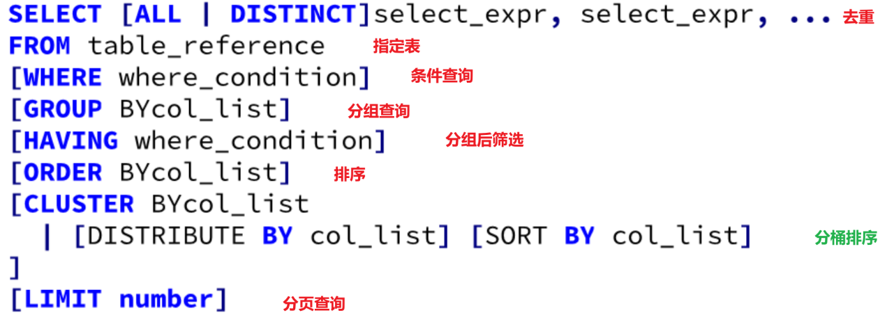

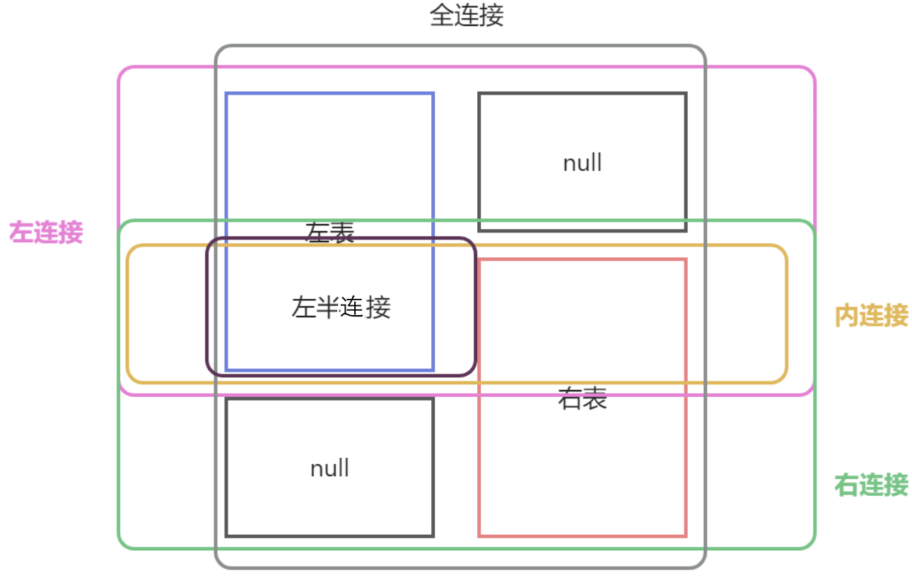

### 桶内排序

> 桶内排序,就是对于分桶表进行每一个桶内的强制排序,与全局排序相比效率更高

#### 创建分桶排序表

```sql
-- 1. 创建一个分桶排序表
/*
 create table 表名
(
    字段名1     字段类型,
    字段名2   字段类型,
    ...
 )
    clustered by (分桶字段)
        sorted by (排序字段 desc|asc) into n buckets;
 */

create table test_db.student_buck_sort
(
    id     int,
    name   string,
    gender string,
    age    int,
    class  string
)
clustered by (id) sorted by (age) into 3 buckets
row format delimited
fields terminated by ',';

-- 2. 查看表的详细信息
desc formatted test_db.student_buck_sort;

-- 3. 导入数据
load data local inpath '/root/hive_data/students.txt' into table test_db.student_buck_sort;

-- 4. 查看表中的数据内容
select * from test_db.student_buck_sort;

-- 结论: 
-- 1. 桶内排序表会将我们写入表中的数据强制进行桶内排序
-- 2. 桶内排序顾名思义,就是将一个分桶内的数据按照指定规则排序,所以操作顺序也是先分桶,再排序
-- 3. 分桶和排序可以是相同字段,也可以是不同字段.但是必须是表中实体字段.
```

> 使用这种方式创建表后,导入的数据会自动分桶并排序.
>
> 这种排序方式是在自己的桶内进行排序

#### 查询时分桶排序

> 注意:一定先修改分桶数量,后续操作才能有分桶效果
>
> `set mapreduce.job.reduces = 3;`

```sql
-- 1. 创建一个普通的非分桶表
create table test_db.students
(
    id     int,
    name   string,
    gender string,
    age    int,
    class  string
)
row format delimited
fields terminated by ',';

-- 2. 给students表插入数据
load data local inpath '/root/hive_data/students.txt' into table test_db.students;

-- 3. 查看数据是否映射成功
select * from students;

-- 4. 全局排序  order by
select * from test_db.students order by id;

-- 5. 分桶排序 cluster by
select * from test_db.students cluster by id;

-- 通过执行发现,此时排序结果完全相同,因为cluster by 的分桶数量是按照reducetask数量决定的,默认为 1 一个桶相当于没有分桶

-- 6. 修改reducetask的数量为 3
set mapreduce.job.reduces;  -- 默认值为-1 代表根据使用场景自行判断reducetask数量
set mapreduce.job.reduces = 3;

-- 7. 修改后进行分桶排序
select * from test_db.students cluster by id; -- 此时 按照id进行分桶,且按照id的升序进行排序

-- 8. 修改后进行全局排序
select * from test_db.students order by id;
-- 在终端中执行该代码,我们发现,无论reducetask设置为几,最终我们仅会使用1个reduce任务进行排序
-- 所以在数据量较大时,order效率远低于cluster by , 在开发中,我们尽量避免使用order by

-- 9. distribute by (仅分桶) + sort by (仅排序)
-- cluster by 具有局限性, 分桶和排序字段必须相同,且只能使用升序排列
-- 所以 distribute by + sort by 更加灵活
-- 需求: 按照id进行分桶,  按照年龄进行排序
select * from test_db.students distribute by id sort by age desc;

-- sort by 是在桶内进行排序, order 是全局排序,不能对于一个数据集同时使用
-- select * from test_db.students distribute by id  sort by age order by age;

-- 同理: 当我们使用相同字段分桶且排序,并且升序排列时, distribute by + sort by  就等价于 cluster by


-- 为什么要在查询时分桶排序,不在建表时操作呢?
-- 建表时分桶字段一定是经常用于连接或查询的字段
-- 有些字段我们不经常连接,偶尔使用一次且想提高连接效率,则可以使用该方法
-- 分桶排序排序效率比全局排序效率高,所以我们使用分桶排序代替全局排序
```

### 正则匹配

> 正则匹配: 就是使用正则表达式的语法规则去匹配符合规则的字符串信息
>
> 之前我们学过模糊查询 like 语法,但是在开发中几乎不用,因为查询效率太低
>
> 如果需要进行模糊查询,我们会使用正则匹配,关键字是 rlike
>
> 除了通配符不一致其余完全相同

```sql
-- 正则匹配使用的关键字是rlike
-- 需求1: 从orders表中查找广东省的数据
-- like  _ 代表任意一个字符   % 代表任意多个字符
select * from test_db.orders where useraddress like '广东省%';

-- rlike .代表任意字符, * 代表出现任意多次
select * from test_db.orders where useraddress rlike '广东.*';

-- 需求2: 从orders表中查找惠州市的数据
select * from test_db.orders where useraddress like '%惠州市%';

select * from test_db.orders where useraddress rlike '.*惠州市.*';

-- 需求3: 查询订单中有7位数字的订单编号
-- like  此处其实只判断了7位,但是没有判断是否为数字
select * from test_db.orders where orderno like '_______';
-- rlike 正则表达式的灵活性,准确性更高.并且可以适配多种函数使用.
select * from test_db.orders where orderno rlike '\\d{7}';


-- 正则表达式,是一种非常晦涩的语法. 且复杂规则下,正则表达式的可读性极差
-- 但是几乎所有的编程语言都天然支持正则表达式,所以不好学,但是逃不开.
-- 正则表达式的学习目标就是可以根据网上的正则表达式进行常规修改即可.
```

### UNION联合查询

> 1. union联合查询在连接后会自动去重,如果不需要去重,则使用union all
> 2. union联合查询,在查询后会自动按哈希值排序,我们无法控制,如果需要排序在合并完成后排序.

### sampling采样

```sql
-- 抽取测试数据 sampling
-- 格式: select ... from ...tablesample ( bucket x out of y on 字段名);
-- 解析:  一共抽取 1桶 / 6  共获取当前1/6桶的数据, 且从第三3 开始查找 每个6 个数据查询一次
select * from test_db.students tablesample ( bucket 3 out of 6 on id);

-- 此时我们使用全部随机模式进行抽样数据,此时效率更高,数据的随机性更大
select * from test_db.student_buck_sort tablesample ( bucket 2 out of 3 on id);
select * from test_db.student_buck_sort tablesample ( bucket 1 out of 3 on rand());


-- 注意: x永远要小于y,否则报错
-- select * from hive_day02.orders tablesample ( bucket 6 out of 5 on 3);
```

###  virtual columns 虚拟列

> 虚拟列: 这个列,并不是真实存在的,而是元数据伪造的数据列

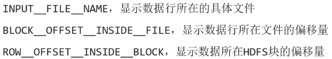

> 在开发中我们经常会根据文件名称分组获取数据,此时查询范围可以得到一定的减小,其余虚拟列应用场景不多

## 函数

### 函数的分类

hive中的函数分为: 内置函数和自定义函数两种

> 内置函数: 系统定义的函数,安装hive后自动获取
>
> 自定义函数: 用户自己定义的函数

**hive中的函数分类也可以按照数据输入数据内容分为:UDF  UDAF UDTF三类**

> UDF: 普通函数 一进一出  round
>
> UDAF: 聚合函数 多进一出  max  min..
>
> UDTF: 表输出函数  一进多出  explode    

函数分类表准的扩大化

> udf : (user defined function)  用户自定义函数
>
> 
>
> 最初这种共分类方式,是对于用户自定义函数进行分类的,但是慢慢就推广到了所有的hive函数中..


### 查看函数的使用方法

```sql
-- 1. 查看hive中有哪些函数
show functions;

-- 2. 如何查看函数或运算符的使用方法
desc function +; -- a + b - Returns a+b
desc function extended +;

-- 需求: 查询concat 函数如何使用
-- 查看函数的使用方式,不要加括号,否则无法查看
desc function concat;
desc function extended concat;

-- 官方示例
SELECT concat('abc', 'def');
```

### 字符串函数

```sql
-- 1. concat字符串拼接
select concat('hello ', 'world!!!');
-- 可以连接多个字符串
select concat('飒爽英姿五尺枪,', '曙光初照演兵场.', '中华儿女多奇志,', '不爱红装爱武装.');

-- 2. concat_ws 字符串拼接(可以指定连接符号)
-- 查询使用方法
desc function extended concat_ws;
-- 官方示例
SELECT concat_ws('.', 'www', array('facebook', 'com'));
-- 使用格式: concat_ws(分隔符, 字符串 | 字符串数组)
select concat_ws('❤', '牛郎', '织女');
select concat_ws('❤', '牛郎', '织女', '吴刚', '玉兔');
-- 可以使用字符串数组 (数组内部的数据连接时会强行转换为字符串类型,转换失败则报错.)
select concat_ws('❤', `array`('牛郎', '织女', '吴刚'), '玉兔');
select concat_ws('❤', `array`('牛郎', '织女', null), '玉兔');
select concat_ws('❤', `array`('牛郎', '织女', 1), '玉兔');
-- select concat_ws('❤', `array`('牛郎', '织女', false), '玉兔');  -- 布尔类型不能用于连接

-- 3. length 计算字符串长度
select length('北国风光,千里冰封,万里雪飘.');

-- 4. lower 将数据转换为小写  upper 将数据转换为大写
select lower('HeLLo wOrlD!!!!'); -- hello world!!!!
select upper('HeLLo wOrlD!!!!');
-- HELLO WORLD!!!!

-- 5. trim 裁剪字符串左右两侧的空格
-- 仅去除左右两侧的空格,中间的空格不会被取消
select trim('    hello  world     !!!!!     ');

-- 6. split 按照指定的分隔符拆分字符串
-- 格式: split(字符串, 拆分分隔符)
select split('独立寒秋,湘江北去,橘子洲头', ',');
-- ["独立寒秋","湘江北去","橘子洲头"]
-- 拆分后,该字符串将变为一个数组,将每一个子字符串放置在数组内部.

-- 7.substr  截取部分字符串, 完全等价于 substring
-- 格式: substr(要截取的字符串, 截取位置, 截取长度)
-- 特别注意,此处和其他编程语言的截取不一样,是从1开始数的.
select substr('红军不怕远征难', 1, 2); -- 红军, 从第一个字符开始,截取2个字符
select substr('红军不怕远征难', 5, 2); -- 远征 从第5个字符开始,截取2个字符

-- 此处还可以使用负数索引, 从右至左,从-1开始依次递减
select substr('红军不怕远征难', -7, 2); -- 红军,
select substr('红军不怕远征难', -3, 2); -- 远征,

-- 8.parse_url url解析函数
desc function extended parse_url;

-- 官方示例:
-- http:// PROTOCOL
-- facebook.com 域名也叫主机地址 HOST
-- /path/p1.php 资源路径    PATH
-- ?query=1 参数  QUERY
SELECT parse_url('http://facebook.com/path/p1.php?query=1', 'PROTOCOL'); -- 获取协议
SELECT parse_url('http://facebook.com/path/p1.php?query=1', 'HOST'); -- 获取域名
SELECT parse_url('http://facebook.com/path/p1.php?query=1', 'PATH'); -- 获取资源路径
SELECT parse_url('http://facebook.com/path/p1.php?query=1', 'QUERY'); -- 获取参数


-- get_json_object
-- json数据我们可以先理解为 map类型和array类型的互相嵌套
-- 格式: get_json_object(json数据, 数据提取规则)
desc function extended get_json_object;
-- 获取json数据中的信息
select get_json_object('{
    "sites": [
    { "name":"菜鸟教程" , "url":"www.runoob.com" },
    { "name":"google" , "url":"www.google.com" },
    { "name":"微博" , "url":"www.weibo.com" }
    ]
}', '$.sites[1].url'); -- www.google.com

select get_json_object('{
    "sites": [
    { "name":"菜鸟教程" , "url":"www.runoob.com" },
    { "name":"google" , "url":"www.google.com" },
    { "name":"微博" , "url":"www.weibo.com" }
    ]
}', '$.sites*.url'); -- ["www.runoob.com","www.google.com","www.weibo.com"]

select get_json_object('[{"name":"杨过", "age":"18"}, {"name":"小龙女", "age":"26"}]', '$.[1].name');
```

### 时间函数

```sql
-- 1. 获取当前日期
select `current_date`();

-- 2. 获取当前的日期时间
select `current_timestamp`();

-- 3. to_date将数据转换为日期类型
select to_date(`current_timestamp`()); -- 将时间类型数据转换为日期
select to_date('2022-12-13 12:33:23'); -- 可以将日期时间类型字符串转换为日期
select to_date('2022-12-13 12:'); -- 将不完整的日期时间字符串转换为日期
select to_date('2022-12-');
-- 如果日期不完整,则转换为null

-- 获取指定时间的部分信息
select year(`current_timestamp`());
select month(`current_timestamp`());
select hour('2022-12-13 12:33:23');
select weekofyear('2022-12-13 12:33:23'); -- 获取一年的第几周
select `dayofweek`(`current_timestamp`());
-- 获取一周的第几天,hive中是从周日开始算第一天的.

-- 4. datediff 获取两个时间的时间差
-- 计算规则,就是前边的日期,减去后边的日期.
select datediff('2022-12-13 12:33:23', '2022-12-11 12:33:23');
select datediff('2022-12-11 12:33:23', '2022-12-15 12:33:23');
select datediff('2022-12-11', '2022-12-17');

-- 5. 时间偏移
-- date_add 增加时间, 时间向后偏移
select date_add('2022-12-11', 12);
-- date_sub 减少时间, 时间向前偏移
select date_sub('2022-12-11', 3);

-- 其实记住date_add 就可以,如果需要向前偏移时间,就是用负数偏移量就可以了.

-- 6.将时间数据转换为时间戳
-- 将时间类型转换
select unix_timestamp(`current_timestamp`());
-- 1692893000
-- 将时间格式字符串转换
select unix_timestamp('2022-12-11 08:12:22');
-- 1670746342
-- 如果时间字符串,不是标准时间格式,将返回null
select unix_timestamp('2022年12月11日 08时12分22秒');
-- NULL
-- 如果想转换非标准格式时间需要指定该字符串的时间格式
select unix_timestamp('2022年12月11日 08时12分22秒', 'yyyy年MM月dd日 HH时mm分ss秒');
-- 1670746342

-- 7. 将时间戳转换为时间类型数据
select from_unixtime(1692893000);
-- 转换为指定格式的时间类型字符串
select from_unixtime(1692893000, 'yyyy年MM月dd日 HH时mm分ss秒');

-- 8. date_format 将时间类型数据,或标准时间类型字符串,转换为指定格式的时间字符串
select date_format(`current_date`(), 'yyyy年MM月dd日 HH时mm分ss秒'); -- 格式化日期数据
select date_format(`current_timestamp`(), 'yyyy年MM月dd日 HH时mm分ss秒'); -- 格式化时间数据
select date_format('2022-12-11 08:12:22', 'yyyy年MM月dd日 HH时mm分ss秒'); -- 格式化标准时间类型字符串

```

### 数学函数

```sql
-- 1. rand 获取从0-1的随机数
-- 查看函数功能
desc function rand;

-- 获取随机数, 每次都不一样
select rand();

-- 获取随机数,多次获取值相同, 在括号内填写固定值,每次获取的随机数都相同,我们称这个数值为随机数种子
select rand(11);


-- 2. round 保留n位小数,并且四舍五入
select round(1.734568, 2); -- 保留两位小数
select round(1.734568);
-- 取整,并四舍五入

-- 3. floor 向下取整
select `floor`(1.73345); -- 1
select `floor`(-1.73345);
-- -2

-- 4. ceil 向上取整
select ceil(1.73345); -- 2
select ceil(-1.73345);
-- -1

-- 思考: 获取从1-7的随机整数怎么搞??
select round(rand() * 6 + 1);

-- 思考: 我们可以仅使用round完成向下取整 和向上取整么?
-- 向上取整
select round(1.03345 + 0.5);
-- 向下取整
select round(2.13345 - 0.5);
```

### 条件函数

```sql
-- 1. if条件函数
-- 格式: if(条件, 条件成立时使用的数据, 条件不成立时使用的数据)
select `if`(1 > 2, '成立', '不成立');
select `if`(5 > 2, '成立', '不成立');

-- 查询students中的数据内容gender字段如果是男,就返回王子, 如果是女就返回公主
select id,
       name,
       `if`(gender = '男', '王子', '公主')
           as gender,
       age,
       class
from test_db.students;

-- 2. 空值判断  is null  is not null
-- null类型数据,无法进行比较判断和等值判断 返回数据均为null
select null != 1;
select null == null;
select 3 > null;
-- 如果想进行空值判断需要借助is关键字
select 3 is null;
select 3 is not null;
select null is null;
select null is not null;

-- 3. nvl 传入一个数据,赋值一个默认值,如果该数据不为空,则返回该数据,如果该数据为空则返回默认值
select nvl(3, '默认值');
select nvl(null, '默认值');

-- 4. coalesce 传入多个数据,返回第一个不为空的数据
select coalesce(12, null, 14, 'chuanzhi'); -- 12
select coalesce(null, null, 14, 'chuanzhi'); -- 14
select coalesce(null, null, null, 'chuanzhi'); -- chuanzhi
select coalesce(null, null, null, null);
-- null

-- 5. case when 多情况判断
/*
使用方式一:
case
when 条件1 then 条件1成立时返回的数据
when 条件2 then 条件2成立时返回的数据
when 条件3 then 条件3成立时返回的数据
....
else 所有条件均不成立时返回的数据
end 代表当前case when语句结束
 */
-- 需求: 需要将支付类型的编号修改为支付类型的名称 0-现金支付 1-微信支付 2-支付宝支付 3-银行卡支付 4-未知
select orderid,
       totalmoney,
       case
           when paytype = 0 then '现金支付'
           when paytype = 1 then '微信支付'
           when paytype = 2 then '支付宝支付'
           when paytype = 3 then '银行卡支付'
           when paytype = 4 then '未知'
           else '数据错误'
           end
           as paytype,
       paytime
from test_db.orders;

/*
使用方式二:
case 表达式
when 表达式值1 then 表达式值为1时返回的数据
when 表达式值2 then 表达式值为2时返回的数据
when 表达式值3 then 表达式值为3时返回的数据
....
else 所有表达式的值均不成立时返回的数据
end 代表当前case when语句结束
 */

-- 需求: 需要将支付类型的编号修改为支付类型的名称 0-现金支付 1-微信支付 2-支付宝支付 3-银行卡支付 4-未知
select orderid,
       totalmoney,
       case paytype
           when 0 then '现金支付'
           when 1 then '微信支付'
           when 2 then '支付宝支付'
           when 3 then '银行卡支付'
           when 4 then '未知'
           else '数据错误'
           end
           as paytype,
       paytime
from test_db.orders;

-- 注意: 开发中如果需要对于字段值判断使用方式二,其余情况均使用方式一, 因为方式1不光可以判断数据值还可以使用计算式或者不等式,更为灵活
```

### 类型转换函数

```sql
-- cast 数据类型转换函数
select cast('11' as int);
select '11';

-- 将字符串类型数据转换为时间类型数据
select '2022-11-12 08:23:12';
select cast('2022-11-12 08:23:12' as timestamp);
select cast('2022-11-12 08:23:12' as date);

-- 转换时间类型数据时,如果数据格式不正确就会转换失败,或数据缺失
select cast('2022-11-12 08:23-12' as timestamp); -- 2022-11-12 00:00:00.000000000
select cast('2022-11月12 08:23:12' as timestamp); -- null

-- 在hive中时间类型字符串和时间类型数据,几乎时可以等价使用的,但是很多数据库或数据仓库工具中,时间类型非常严格必须转换后才能调用时间类型函数,例如presto
```

### 其他函数

```sql
-- 获取数据的哈希值 - hive中和java中哈希值求出来不一样
select hash('chuanzhi');
-- 1993223422

-- 获取一些系统参数
select current_user(), current_groups(), current_database(), logged_in_user(), version();

-- 加密方式
-- MD5 这个加密方式早就被破解了,所以几乎不用
select md5('hello');
-- 5d41402abc4b2a76b9719d911017c592

-- sha-1 sha-2.. 都是哈希加密 这些哈希加密算法都是不可逆加密

-- crc 循环冗余码校验主要进行数据完整性校验

-- 蒙板函数 使用特定字符,将字符进行遮盖, 大写字母用X代替,小写字母用x代替,数字用n代替,其他字符不遮盖
select mask('CHUANzhi123小明%%$$');
-- 自定义遮盖字符
select mask('CHUANzhi123小明%%$$', '大', '小', '数');

select mask_first_n('CHUANzhi123', 3); -- 遮盖前n个字符
select mask_last_n('CHUANzhi123', 3); --遮盖后n个字符
select mask_show_first_n('CHUANzhi123', 3); -- 显示前n个字符
select mask_show_last_n('CHUANzhi123', 3); --显示 后n个字符

-- 蒙板函数用的不多, 因为这个函数主要是用于数据脱敏的.  
-- 但是大数据开发一般情况下拿到的就是二手数据, 也就是脱敏后的数据.
```

### 集合函数

```sql
-- 1. 创建一个array类型数据
select `array`(1, 2, 3, 4, 5);
-- 创建array数据时, 如果数组内的数据类型不统一则报错
select `array`(1, 2, 3, 4, false);

-- 2. 创建一个map类型数据
select `map`('name', '小明', 'age', 18, 'gender', '男');
-- 创建map类型时,所有的键 和值数据类型要相同,否则报错
select `map`('name', '小明', 'age', false, 'gender', '男');

-- 3. size函数计算map和array数据的元素数量
select size(`array`(1, 2, 3, 4, 5));
select size(`map`('name', '小明', 'age', 18, 'gender', '男'));

-- 4. array_contains 判断数据元素是否在容器内
-- 判断数据元素是否在array内部
select array_contains(`array`(1, 2, 3, 4, 5), 9);

-- 判断数据元素是否在map的值内部
select array_contains(map_values(`map`('name', '小明', 'age', 18, 'gender', '男')), '女');

-- 5. 获取map类型数据中,所有的键 和所有的值
select map_keys(`map`('name', '小明', 'age', 18, 'gender', '男'));
select map_values(`map`('name', '小明', 'age', 18, 'gender', '男'));
\

-- 6. 对于array类型数据进行排序
select sort_array(`array`(4, 2, 5, 1, 3));
```

### CTE表达式

```sql
-- CTE表达式
-- 格式: with 临时表名 as 查询集
-- 在查询语句之前创建一个临时表,在该查询语句中可以随意使用

-- 1. 需求: 获取当前学员中与年龄最大的三个女性年龄相同的男生全部信息.
-- 获取年龄最大的三个女性的年龄
select age
from test_db.students
where gender = '女'
order by age desc
limit 3;

-- 子查询
select *
from students
where age in (select age from test_db.students where gender = '女' order by age desc limit 3)
  and gender = '男';

-- CTE表达式
-- 多此一举
-- with t1 as (select age from test_db.students where gender = '女' order by age desc limit 3)
-- select *
-- from students
-- where age in (select * from t1)
--   and gender = '男';

with t1 as (select age from test_db.students where gender = '女' order by age desc limit 3)
select *
from test_db.students
         join t1 on students.age = t1.age and students.gender = '男';

-- 2. CTE表达式中的临时表可以多次被sql语句使用,但是语句结束,该临时表也就失效了
with t1 as (select * from test_db.course)
select *
from t1
where c_name = '数学'
union
select *
from t1
where c_name = '语文';

-- select * from t1 ; -- sql结束 t1表就失效了

-- 3. 可以链式使用CTE表达式,也就是后边定义的表,可以使用先定义的临时表
with t1 as (select * from test_db.students),
     t2 as (select * from t1 where gender = '男'),
     t3 as (select * from t2 where age > 19)
select *
from t3;


-- cte表达式和子查询相比有一定的优势,使用起来更加灵活
-- 1. cte表达式创建的临时表可以重复使用,该临时表存储在内存中,读写效率快
-- 2. 后边创建的表,可以使用前边创建表的结果
-- 3. cte表达式的可读性比子查询更强
```

## 炸裂函数和侧视图

炸裂函数

```sql
-- explode 就是将一个array 或者一个map类型数据转换为表形式的数据,我们称之为炸裂函数 是一个典型的UDTF函数.
-- 1. 使用explode将array类型数据炸裂为多行
-- 此时数据从一个array类型数据,转换为三行数据.array中有多少元素,就转换为多少行.始终一列.
select explode(`array`('宝强', '羽凡', '乃亮'));
-- 给该列添加别名
select explode(`array`('宝强', '羽凡', '乃亮')) as name;

-- 2. 使用explode将map类型数据炸裂为多行
-- 此时数据从一个map类型数据转换为2列3行数据,有多少个键值对就转换为多少行,默认列名为 key 和 value
select explode(`map`('name', '小明', 'age', 18, 'gender', '男'));
-- 给列起别名
select explode(`map`('name', '小明', 'age', 18, 'gender', '男')) as (jian, zhi);
```

炸裂函数的应用

```sql
-- 1. 创建表
create table test_db.the_nba_championship
(
    team_name     string,       -- 队名
    champion_year array<string> -- 夺冠年份
) row format delimited
    fields terminated by ','
    collection items terminated by '|';

-- 2. 上传数据文件
-- 此处使用web页面直接上传,但是开发中禁止使用

-- 3. 查看数据是否上传成功
select *
from test_db.the_nba_championship;

-- 4. 将夺冠年份炸开,使用explode函数
select explode(champion_year)
from test_db.the_nba_championship;
-- 此时,teamname是一个字段,而explode炸开后是一个表, 我们处理的都是结构化数据,不能让一个字段值,对应一张表.
-- select team_name, explode(champion_year) from test_db.the_nba_championship;

-- 解决方案1: 可以使用 连接, 将explode产生的表和原始表进行连接
-- 理解 不需要会
select t1.team_name, t2.year
from test_db.the_nba_championship t1
         join (select explode(champion_year) as year from test_db.the_nba_championship) t2
              on array_contains(t1.champion_year, t2.year);

-- 上述解决方案,虽然可以解决问题,但是逻辑复杂,且效率低,我们开发中可以使用侧视图帮我们解决对应的问题.

-- 解决方案2: 
-- 侧视图 lateral view 就是将我们的UDTF函数结果当做主表的延伸看待,可以直接连接,书写简单效率高
select t1.team_name, t2.year
from test_db.the_nba_championship t1 lateral view explode(champion_year) t2 as year;
```

> 使用join ... on 对于连接结果进行筛选时,on后边的条件成立,则连接成功数据保留,如果条件不成,则连接不成功则数据销毁
>
> 只要结果为true或者 false的计算式都可以作为连接条件使用
>
> 
>
> **在开发中on 比where效率更高

## 行列转换

### 行转列

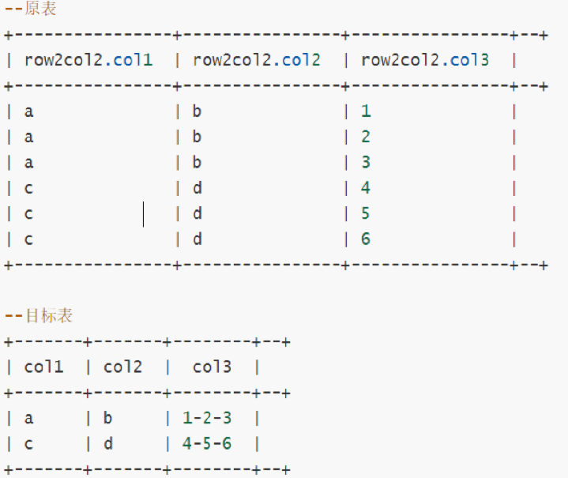


```sql
7-- 行转列
--建表
create table test_db.row2col2
(
    col1 string,·
    col2 string,
    col3 int
) row format delimited fields terminated by '\t';

-- 导入数据
-- 此处我们直接用web页面导入即可  --开发中不允许这样导入

-- 查询数据
select *
from test_db.row2col2;

-- 1. 先将col1 和col2 进行分组获取第一列和第二列的目标数据状态
select col1, col2
from test_db.row2col2
group by col1, col2;

-- 2. 将col3中的数据合并到一起,打包为一个array类型数据
-- 将一列数据打包为array
select collect_list(col3)
from test_db.row2col2;
-- 将其与第一步合并
-- 此处可以使用功能col3 因为collect_list是一个聚合函数.
select col1, col2, collect_list(col3)
from row2col2
group by col1, col2;

-- 3. 将该数组使用concat_ws进行合并, 分隔符为 -
-- Argument 2 of function CONCAT_WS must be "string or array<string>", but "array<int>" was found.
-- concat_ws进行连接时只能连接数组内部全部为string类型的数据,此处col3中全部为int类型,需要做数据类型转换
-- select col1, col2, concat_ws('-', collect_list(col3))
-- from row2col2
-- group by col1, col2;+-································

select col1, col2, concat_ws('-', collect_list(cast(col3 as string)))
from row2col2
group by col1, col2;
```

### 列转行

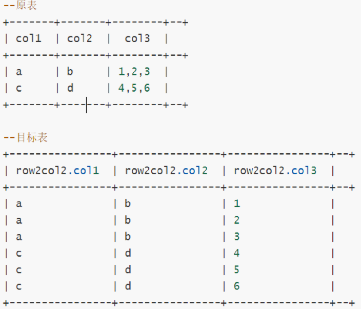

```sql
-- 列转行
--创建表
create table test_db.col2row2
(
    col1 string,
    col2 string,
    col3 string
) row format delimited fields terminated by '\t';

-- 导入数据
-- 直接使用web导入 -- 开发中禁用

-- 查看被导入的数据
select *
from test_db.col2row2;

-- 1. 将col3列拆分为一个数组类型数据
-- 可以使用split函数进行拆分
select split('1,2,3', ',') as col3;  -- ["1","2","3"]
-- 使用split拆分col3
select col1, col2, split(col3, ',') as col3
from test_db.col2row2;

-- 2. 将col3 使用explode炸开
select explode(split(col3, ',')) as col3
from test_db.col2row2;

-- 3. 使用侧视图,将炸开后的列与原数据合并到一起
select t1.col1, t1.col2, t2.col3
from col2row2 t1 lateral view explode(split(col3, ',')) t2 as col3;
```

##  json数据处理

```sql
-- 数据准备
--创建表
create table test_db.tb_json_test1
(
    json string
);

--加载数据
-- 使用web页面加载  开发中禁用

-- 查看数据是否加载成功
select *
from test_db.tb_json_test1;

-- 1. 使用 get_json_object 函数进行解析
select get_json_object('{"device":"device_30","deviceType":"kafka","signal":98.0,"time":1616817201390}',
                       '$.deviceType');

-- 获取整个tb_json_test1表的数据拆分为4列,分别是device, deviceType, signal, time
select get_json_object(json, '$.device')     as device,
       get_json_object(json, '$.deviceType') as deviceType,
       get_json_object(json, '$.signal')     as signal,
       get_json_object(json, '$.time')       as `time`
from test_db.tb_json_test1;

-- 2. json_tuple 函数进行解析
-- get_json_object 不太方便,因为有一个字段就要解析一次,并且代码比较冗长
-- 如果有多个字段需要解析,我们建议使用json_tuple函数进行解析
-- 查询json_tuple函数的使用方法
desc function extended json_tuple;

-- 尝试使用 json_tuple
select json_tuple('{"device":"device_30","deviceType":"kafka","signal":98.0,"time":1616817201390}', 'device',
                  'deviceType') as (device, deviceType);

-- 获取整个tb_json_test1表的数据拆分为4列,分别是device, deviceType, signal, time
select json_tuple(json, 'device', 'deviceType', 'signal', 'time') as (device, deviceType, signal, `time`)
from test_db.tb_json_test1;

-- 扩展: 如果我们想将json字符串也拼接到表中放在最开始为止应该怎么做呢?
-- 不能直接将json写在select后边,因为json_tuple是UDTF函数,必须配合侧视图才可以和原表连接
-- select json, json_tuple(json, 'device', 'deviceType', 'signal', 'time') as (device, deviceType, signal, `time`)
-- from test_db.tb_json_test1;

select t1.json, t2.*
from test_db.tb_json_test1 t1 lateral view json_tuple(json, 'device', 'deviceType', 'signal', 'time') t2 as device, deviceType, signal, `time`;

-- 3. 使用serde机制在建表时完成json 数据的映射
create table test_db.tb_json_test2
(
    device     string,
    deviceType string,
    signal     double,
    `time`     bigint
)
    row format serde 'org.apache.hive.hcatalog.data.JsonSerDe';


-- 导入数据
-- 在web页面导入 ,开发中禁用

-- 查看数据是否映射成功
select *
from test_db.tb_json_test2;

-- 使用场景
-- 这种方式一劳永逸,一般整个数据文件都是json的时候我们使用serde方法,
-- 如果只有其中的一两个字段是json则使用get_json_object 和json_tuple
```

将json映射为表的流程

书写后的json数据不一定格式正确,需要进行校验 

校验网站:https://www.bejson.com/

```json
{
	"students": [{
			"name": "xiaoming",
			"age": 18,
			"gender": "nan"
		},
		{
			"name": "xiaofang",
			"age": 18,
			"gender": "nan"
		},
		{
			"name": "xiaoli",
			"age": 19,
			"gender": "nv"
		}
	]
}
```

映射为一个数据表

1. 将students键对应的值取出,得到一个学生信息数组
2. 该数组中的键就是每个值的字段名称, 每一个map数据就是一条数据记录

最终转换结果为

student_info

|   name   | age  | gender |
| :------: | :--: | :----: |
| xiaoming |  18  |  nan   |
| xiaofang |  18  |  nan   |
|  xiaoli  |  19  |   nv   |

## 开窗函数

```sql
over() 默认窗口范围为整个表
over(partition by) 默认窗口范围为整个分组
over(order by) 默认窗口范围为第一行到当前行
over(partition by    order by) 默认窗口范围为分组第一行到当前行
```

> rows between
>
>  - preceding：往前
> - following：往后
> - current row：当前行
> - unbounded：起点
> - unbounded preceding 表示从前面的起点  第一行
> - unbounded following：表示到后面的终点  最后一行
>
> **使用格式:** 
>
> select 聚合函数 over(partiton by 分组字段 order by 排序字段 rows between 上边界 and 下边界)
>
> range bteween
>
> - 对order by排序的字段通过range对该字段指定的范围进行开窗计算
> - 在hive中对于时间字段，可以将时间字段转换为时间戳的格式进行排序，此时边界的范围就通过具体的数值进行指定范围。
> - 案例：近七日内开窗：前六天加今天。前六天 ==60\*60\*24\*6==\===518400==
>   - dt为时间戳，range中的值不能写==60\*60\*24\*6==必须写==518400==，当前值就通过current row进行指定
>   - over(partition by dt range 518400 preceding and current row)
>
> **使用格式:** 
>
> select 聚合函数 over(partiton by 分组字段 order by 排序字段 range between 上边界 and 下边界)

### 窗口排序函数

> RANK()  排序字段值相同时赋值重复排名,总数不变
>
> DENSE_RANK() 排序字段值相同时会重复排名,总数会减少
>
> ROW_NUMBER() 会根据顺序编号
>
> 
>
> 上述函数其实并不是用于排序,而是让我们的数据按照指定字段从大到小,或者从小到大编号
>
> 使用上述函数后,已有的数据条目顺序不会改变
>
> 
>
> NTILE(n)把每个分组内的数据分为n桶
>
> -- ntile 是按照分组排序后的数据,将每一个分组中的数据拆分为n份,每份数据尽量相同,如果不同,优先让最小办好的数据多一个

> 注意: **row_number** 使用的最多, 因为我们在hive开发中经常用于去重
>
> - mysql中常用的去重手段是distinct  但是这种方式会全局比对,效率极低
> - 我们一般采用使用row_number进行组内编号,再取出编号为1的数据,此时每一个组只有一条数据被取出,就完成了去重.(**对于分组字段进行去重**)
>
> 
>
> 使用row_num进行去重过的好处:
>
> 1. 执行效率比distinct 高
> 2. 可以同时绑定多个去重规则
> 3. 数据不会灭失

### 其他开窗函数

> 1. lag 获取当前行向上n行的数据内容
>    - lag(获取的字段名称, 向上的行数, 默认值)
> 2. lead 获取当前行想下n行的数据内容
>    - lead(获取的字段名称, 向下的行数, 默认值)
> 3. first_value 获取当前开窗范围内的第一个值
>    - first_value(获取的字段名称)
> 4. last_value 获取当前开窗范围内的最后一个值
>    - last_value(获取的字段名称)


## hive的参数配置

> hive的参数配置分为3种:
>
> 1. 配置文件
>
> - hive-site.xml 用户自定义的配置文件,我们对于hive修改都写在改文件中
>   - 当前环境文件在`/export/server/hive/conf/hive-site.xml`
>
> - hive-default.xml 系统的默认配置文件,运行服务时会优先读取hive-site.xml
>
> 2. 命令行配置参数
>
> ```shell
> hive --service hiveserver2 --hiveconf hive.root.logger=DEBUG,console
> # 配置了日志级别为debug 将数据输出到控制台中
> # 日志级别
> debug -- 开发调试过程中的日志信息
> info -- 服务正常执行时的日志信息
> warn -- 服务与预期执行效果不一致时的日志信息
> error -- 服务出现异常而停止运行时的日志信息
> ```
>
> 3. 使用参数声明进行配置
>
> - 这种配置方式,只有当前连接中生效,更换或退出连接后,设置失效
>
> ```sql
> set mapreduce.job.reduces = 3;
> ```
>
> 三种配置方式的优先级(其实就是运行的先后顺序,后执行的覆盖先执行的)
>
> 配置文件 < 命令行配置参数 < 参数声明
>
>  
>
> 三种配置方式的影响范围:
>
> 配置文件 > 命令行配置参数 > 参数声明 
>
> 配置文件: 影响该文件目录启动的任何hive服务
>
> 命令行配置参数: 影响本次启动的hive服务
>
> 参数声明: 当前使用的连接connect   
>
>  
>
> 我们更希望用户使用参数声明进行hive配置,
>
> 因为hive鼓励  **谁使用谁声明**


## Hive的数据压缩

> hive的表结构优化:
>
> 1. 分区表
> 2. 分桶表
> 3. 数据压缩
> 4. 数据存储格式

### 压缩:

> 1. map任务从hdfs当中读取数据时需要解压
> 2. map向中间临时存储空间中存储数据时需要压缩
> 3. reduce任务从临时存储空间中提取map计算结果的时候需要解压
> 4. reduce任务计算完成后向hdfs中存储数据时需要压缩
>
> 总结: 从内存到磁盘时进行压缩, 从磁盘到内存时解压.
>
> 所以hive的压缩本质上时mapreduce的压缩,修改的是hadoop配置
>
> 
>
> **压缩的优点:**
>
> - 可以提高数据的传输效率
> - 可以提高数据的存储效率
>
> **压缩的缺点:**
>
> - 压缩和解压过程需要消耗资源(主要是cpu).如果服务性能较差,不建议压缩
> - 小文件处理速度传输速度都不慢但是可能需要花费更多时间进行压缩(不善于处理小文件)

### mr中支持的压缩格式

> 注意: 原生的apache hadoop 是不支持snappy格式压缩的

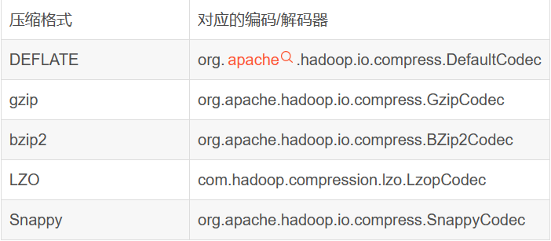

需要使用压缩格式,就直接将下方指令执行一遍即可

```sql
--设置Hive的中间压缩 也就是map的输出压缩
1）开启 hive 中间传输数据压缩功能
set hive.exec.compress.intermediate=true;
2）开启 mapreduce 中 map 输出压缩功能
set mapreduce.map.output.compress=true;
3）设置 mapreduce 中 map 输出数据的压缩方式
set mapreduce.map.output.compress.codec = org.apache.hadoop.io.compress.SnappyCodec;

--设置Hive的最终输出压缩，也就是Reduce输出压缩
1）开启 hive 最终输出数据压缩功能
set hive.exec.compress.output=true;
2）开启 mapreduce 最终输出数据压缩
set mapreduce.output.fileoutputformat.compress=true;
3）设置 mapreduce 最终数据输出压缩方式
set mapreduce.output.fileoutputformat.compress.codec =org.apache.hadoop.io.compress.SnappyCodec;
4）设置 mapreduce 最终数据输出压缩为块压缩  还可以指定RECORD
set mapreduce.output.fileoutputformat.compress.type=BLOCK;  
```

> **推荐使用snappy格式,因为压缩和解压速度极块**
>
> 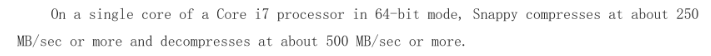

## Hive的数据存储格式

> 行存储:
>
> - 优点: 以整条记录为单位查询效率更高,插入和更新效率高
> - 缺点: 无法跳过不必要的列, 压缩比例偏低,使用时消耗的内存和cpu资源比较多
>
> 列存储
>
> - 优点: 查询数据时,可以跳过不必要的列,按照指定列查询效率高,压缩比例高,资源消耗少
> - 缺点: 插入和更新效率较低, 不适合小数据量扫描

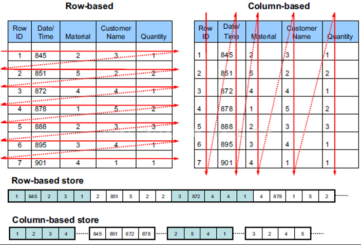

> 在实际开发中hive数仓更喜欢使用列式存储,因为hdfs不支持随机修改,我们也很少进行insert into插入, 更多的是进行数据的查询,且列式存储的时候可以跳过不必要的列,查询范围有所减少,对于服务器资源的消耗降低了,查询和使用的效率提高了
>

分别使用3种不同格式存储数据，去HDFS上查看底层文件存储空间的差异。

```sql
--1、创建表，存储数据格式为TEXTFILE
create table log_text (
track_time string,
url string,
session_id string,
referer string,
ip string,
end_user_id string,
city_id string
)
ROW FORMAT DELIMITED FIELDS TERMINATED BY '\t'
STORED AS TEXTFILE;  --如果不写stored as textfile 默认就是textfile

--加载数据
load data local inpath '/root/hivedata/log.data' into table log_text;

--2、创建表，存储数据格式为ORC
create table log_orc(
track_time string,
url string,
session_id string,
referer string,
ip string,
end_user_id string,
city_id string
)
ROW FORMAT DELIMITED FIELDS TERMINATED BY '\t'
STORED AS orc ;

--向表中插入数据 思考为什么不能使用load命令加载？ 因为load是纯复制移动操作 不会调整文件格式。
insert into table log_orc select * from log_text;

--3、创建表，存储数据格式为parquet
create table log_parquet(
track_time string,
url string,
session_id string,
referer string,
ip string,
end_user_id string,
city_id string
)
ROW FORMAT DELIMITED FIELDS TERMINATED BY '\t'
STORED AS PARQUET ;

--向表中插入数据 
insert into table log_parquet select * from log_text ;
```

在实际开发中，可以根据需求选择不同的文件格式并且搭配不同的压缩算法。可以得到更好的存储效果。

```sql
--不指定压缩格式 代表什么呢？
--orc 存储文件默认采用ZLIB 压缩。比 snappy 压缩的小
STORED AS orc;   --2.78M

--以ORC格式存储 不压缩
STORED AS orc tblproperties ("orc.compress"="NONE");  --7.69M

--以ORC格式存储  使用snappy压缩
STORED AS orc tblproperties ("orc.compress"="SNAPPY"); --3.78M
```

在实际开发中推荐使用orc+snappy存储数据

**注意: orc是列式存储格式, snappy是压缩格式**

> orc使用范围更广一下
>
> parquet 是 cdh版本中用的更多一些, 对于cdh版本支持性更好
>
> 
>
> 扩展: orc支持事务的, 而parquet 不支持

我们在开发中尽量不要使用select * 尤其是数据量极大的表中

## Hive通用调优

### Fetch抓取机制

- 功能：在执行sql的时候，能不走MapReduce程序处理就尽量不走MapReduce程序处理。

- 尽量直接去操作数据文件。

- 设置： hive.fetch.task.conversion= more。 **默认设置**

  ```sql
  --在下述4种情况下 sql不走mr程序
  
  -- more 模式下如下内容不需要走mr程序
  --全局查找
  select * from student;
  --字段查找
  select num,name from student;
  --limit 查找
  select num,name from student limit 2;
  -- 简单的条件过滤
  select num,name from student where num > 2;
  
  -- minimal 模式下如下内容不需要走mr程序
  --全局查找
  select * from student;
  --字段查找
  select num,name from student;
  --limit 查找
  select num,name from student limit 2;
  
  -- none 模式下所有的操作都需要走mr程序
  ```

### mapreduce本地模式

- 功能：如果非要执行MapReduce程序，能够本地执行的，尽量不提交yarn上执行。

- 默认是关闭的。意味着只要走MapReduce就提交yarn执行。

  ```
  mapreduce.framework.name = local 本地模式
  mapreduce.framework.name = yarn 集群模式 
  ```

- Hive提供了一个参数，自动切换MapReduce程序为本地模式，如果不满足条件，就执行yarn模式。

  > 开启本地模式后要注意: 我们满足如下条件后会走本地模式, 但是本地服务器中资源一定足够么? 不一定
  >
  > 有时候看上去还有空间但是空间已经分配给yarn了

  ```sql
  set hive.exec.mode.local.auto = true;
   
  --3个条件必须都满足 自动切换本地模式
  The total input size of the job is lower than: hive.exec.mode.local.auto.inputbytes.max (128MB by default)  --数据量小于128M
  
  The total number of map-tasks is less than: hive.exec.mode.local.auto.tasks.max (4 by default)  --maptask个数少于4个
  
  The total number of reduce tasks required is 1 or 0.  --reducetask个数是0 或者 1
  ```

  ```sql
  select * from test_db.log_text order by track_time;  -- 47秒
  
  set hive.exec.mode.local.auto = true;
  
  select * from test_db.log_text order by track_time;  -- 8秒
  ```

- 切换Hive的执行引擎

  ```properties
  WARNING: Hive-on-MR is deprecated in Hive 2 and may not be available in the future versions. Consider using a different execution engine (i.e. spark, tez) or using Hive 1.X releases.
  
  如果针对Hive的调优依然无法满足你的需求 还是效率低， 尝试使用spark计算引擎 或者Tez.
  ```

### join优化

- 底层还是MapReduce的join优化。

- MapReduce中有两种join方式。指的是join的行为发生什么阶段。

  - map端join
  - reduce端join

- 优化1：==Hive自动尝试选择map端join提高join的效率== 省去shuffle的过程。

- 这个优化策略在小表和大表的连接过程中使用

  ```sql
  开启 mapjoin 参数设置：
  （1）设置自动选择 mapjoin
  set hive.auto.convert.join = true;  --默认为 true
  （2）大表小表的阈值设置：
  set hive.mapjoin.smalltable.filesize= 25000000;
  ```

- 优化2：大表join大表

  ```sql
  --背景：
  大表join大表本身数据就十分具体，如果join字段存在null空值 如何处理它？
  任何数据和null进行连接,都无法连接成功,所以此时我们会进行空值处理
  
  --方式1：空key的过滤  此行数据不重要  where is not null
  参与join之前 先把空key的数据过滤掉
  SELECT a.* FROM (SELECT * FROM nullidtable WHERE id IS NOT NULL ) a JOIN ori b ON a.id =b.id;
  
  --方式2：空Key转换
  CASE WHEN a.id IS NULL THEN 'xxx任意字符串' ELSE a.id END  -- 如果给空值赋值默认值空值数量太大,会造成某个桶的数据量过大
  CASE WHEN a.id IS NULL THEN concat('hive', rand()) ELSE a.id  --避免转换之后数据倾斜 随机分布打散
  
  -- 方式3: 对于两张大表中的数据先过滤再连接  
  -- 不建议
  select * from t1 join t2 on t1.id = t2.id and t1.price > 1000;
  -- 建议
  select * from (select * from t1 where price > 1000) t1 join t2 on t1.id = t2.id;
  ```

- 优化3：桶表join提高优化效率。bucket mapjoin

  ```ini
  1.1 条件
  	1） set hive.optimize.bucketmapjoin = true;
  	2） 一个表的bucket数是另一个表bucket数的整数倍  第一个表分为4桶,第二个表可以是 1桶 2桶 4桶 8桶...
  	3） bucket列 == join列
  	4） 必须是应用在map join的场景中
  
  1.2 注意
  	1）如果表不是bucket的，只是做普通join。
  ```


