# zookeeper

## zookeeper集群架构

**zookeeper是动物园管理员的意思**

> hadoop生态圈中的大多数大数据组件的吉祥物或图标都是小动物
>
> 而zookeeper号称可以管理这些服务
>
> 
>
> zookeeper是一个分布式协调服务,本质上是一个分布式小文件存储系统
>
> zookeeper解决的是全局数据一致性问题.(无论在哪一台服务中读取数据,数据的内容完全相同)

**zookeeper分布式协调服务在每一台服务上访问都是相同的数据那与hdfs有什么不同呢?**

> hdfs进行数据读写都必须先访问NameNode,而NameNode在node1上,所以虽然使用hadoop fs - 访问的数据都一样,但是本事上都是在node1上查询
>
> zookeeper在每一台服务上都开启一个zkServer 我们访问每一个zkserver内部的数据完全相同

**为什么zookeeper可以协调其他的大数据组件???**

> 分布式服务中,最难得是什么?
>
> 数据和任务的协调统一,zookeeper可以帮我们完成这个事情.

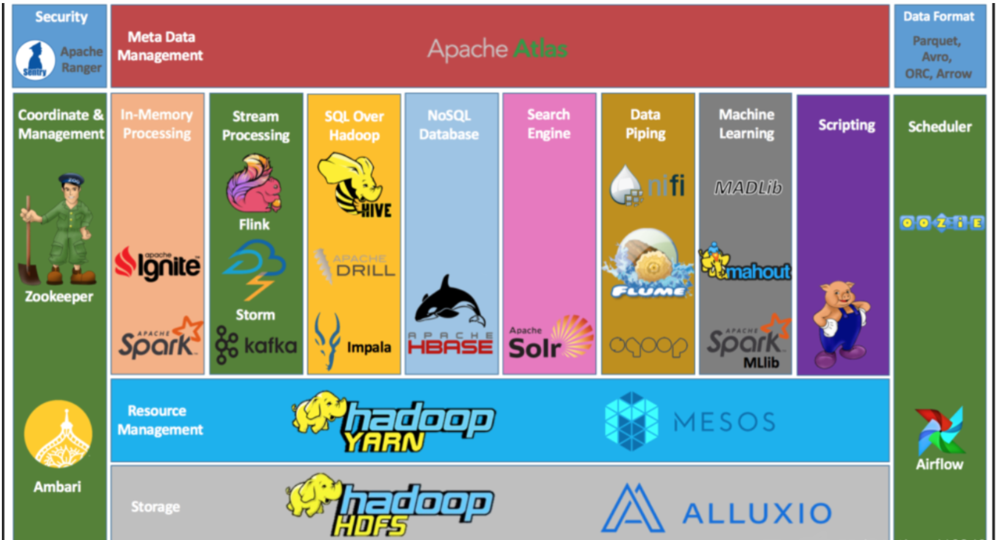

## zookeeper的文件系统结构

> 1. zookeeper的文件系统是**树状结构**的
> 2. zookeeper中所有的文件路径必须从根目录写起,**没有相对路径**
> 3. zookeeper中的每一个节点都是一个znode,**znode中既可以存储数据也可以创建子节点**
>
> 可以理解为我们的znode既可以作为文件,又可以 作为目录.
>
> 4. 每个节点**存储数据的大小最大为1M**,但是在开发中我们根本用不了这么大空间

##  zookeeper客户端操作

前提条件: 我们给大家的环境中已经搭建好了zookeeper服务

1. 修改配置文件(node1,node2,node3都要修改)

```sh
vim /etc/profile

# 在开启问文件的末尾书写如下内容:

# ZOOKEEPER_HOME
export ZOOKEEPER_HOME=/export/server/zookeeper
export PATH=$PATH:$ZOOKEEPER_HOME/bin


# 使用source进行配置文件的激活
source /etc/profile
```

2. 开启zookeeper的服务端(必须三台都启动)

```sh
# 开启服务
zkServer.sh start
# 查询服务状态
zkServer.sh status
# 关闭服务
zkServer.sh stop
```

3. 开启客户端

```sh
# 开启本地客户端
zkCli.sh
# 远程链接其他服务客户端
zkCli.sh -server 服务器ip
```

## zookeeper的集群角色

> 主角色: leader 管理者,负责管理所有的follower,是集群中唯一负责事务型请求的角色,可以投票
>
> 从角色: follower 追随者 , 负责数据的非事务型请求,以及事务型请求的转发(发送给leader), 以及投票
>
> 辅助角色: observer 观察者, 和从角色负责的工作相同只是没有投票权和被投票权
>
> 
>
> 事务型请求: 写入操作,数据的增删改,
>
> 非事务型请求: 读取操作,数据的查询

1. 向leader发送事务型请求,leader直接发送写入指令,如果写入成功的服务过半则证明写入成功,否则失败

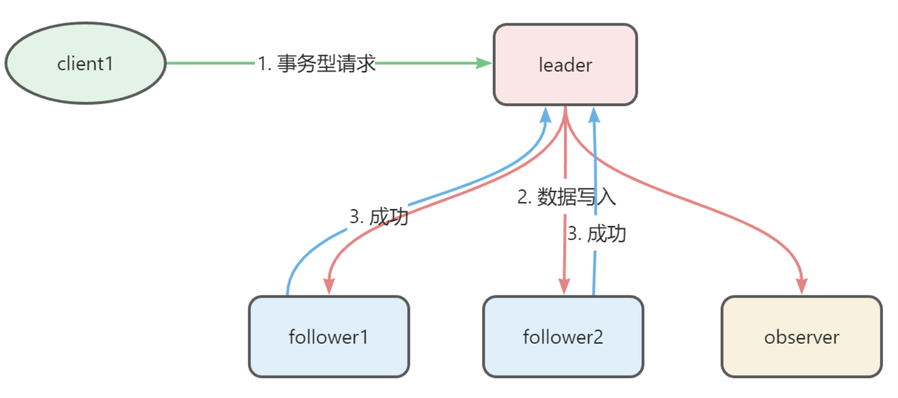

2. 如果向follower或者observer发送事务型请求会转发给leader进行事务型请求处理

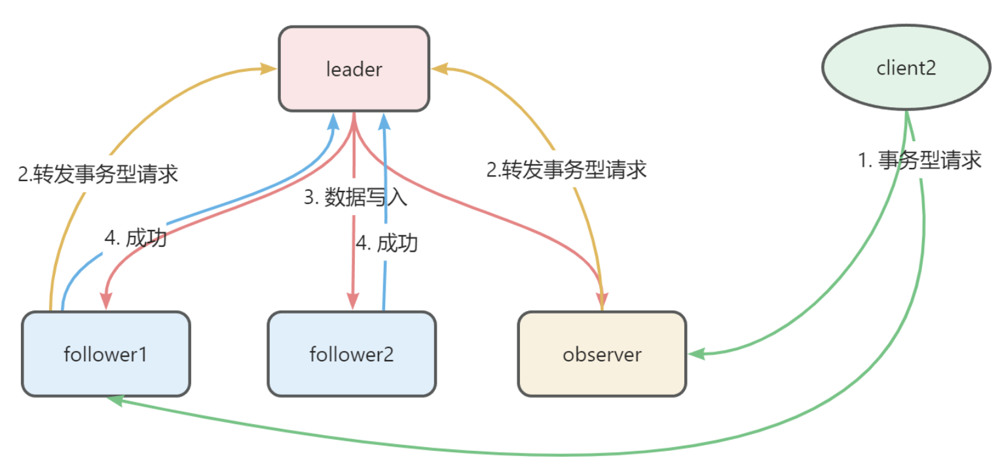

3. observer 和 follower 和leader 都可以响应非事务型请求

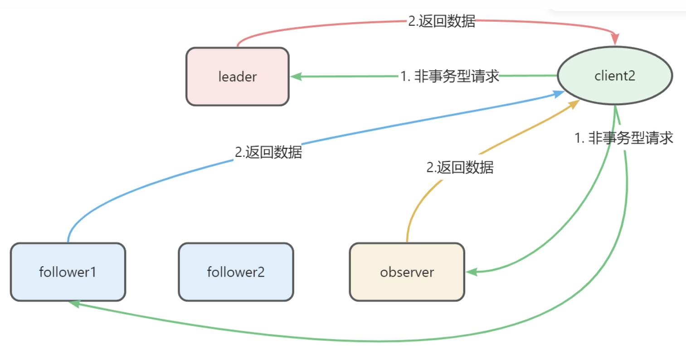

## zookeeper集群投票

> zookeeper的过半原则:
>
> 1. 事务型请求成功过半则成功,失败过半则失败
> 2. 集群投票如果其中一个服务获取票数过半则成功当选
> 3. 集群服务中启动服务数量过半则集群可用,宕机服务数量过半则服务崩溃
>
> zookeeper集群服务的数量一般都是单数,因为需要投票

**集群启动时zookeeper投票**

> 以5台服务为例
>
> node1  node2  node3  node4  node5
>
> 1. node1启动将票投给自己 : n1 : 1票    
> 2. node2启动对比编号自己编号最大票投给自己 n1 : 1票  n2 : 1票
> 3. 改票环节, node1发现node2比自己大,将票投给node2   n2 : 2票
> 4. node3启动对比编号发现自己最大,将票投给自己 : n2 : 2票  n3 : 1票
> 5. 改票环节, node1 node2 发现node3 更大,将票投给了node3  n3 : 3票  node3 直接当选为leader其余均为follower
> 6. node4启动.直接以follower身份加入集群
> 7. node5启动, 直接以follower身份加入集群

## zookeeper数据模型

zk服务的全部终端指令:

> 终端指令并不重要,主要是帮助大家验证zookeeper服务特性

```sh
[zk: node1(CONNECTED) 0] help
ZooKeeper -server host:port cmd args
        stat path [watch]  
        set path data [version] # 修改节点数据值
        ls path [watch]  # 查询节点信息
        delquota [-n|-b] path
        ls2 path [watch]
        setAcl path acl
        setquota -n|-b val path
        history 
        redo cmdno
        printwatches on|off
        delete path [version]  # 删除节点
        sync path
        listquota path
        rmr path
        get path [watch] # 获取节点详细数据
        create [-s] [-e] path data acl  # 创建节点
        addauth scheme auth
        quit 
        getAcl path
        close 
        connect host:port
```

## zookeeper节点类型和属性

> **节点按照持续时间分为两种:**
>
> 永久节点: 保存成功后持续存在于zookeeper文件系统中(默认的)
>
> 临时节点: 绑定创建节点的客户端,如果客户端断开连接,则节点销毁
>
> **节点按照序列化方式可以分为两种**:
>
> 序列化节点: 在定义节点时,系统会在节点名称后自动添加一个不断自增的序列化编号
>
> 非序列化节点: 在定义节点时不会添加编号(默认)

我们之前创建的节点 都是永久非序列化节点

> 所以自由组合后,节点一共有四种
>
> 永久序列化节点
>
> 永久非序列化节点
>
> 临时序列化节点
>
> 临时非序列化节点

创建永久节点


临时节点数据


临时节点中会保存一个会话编号,永久节点中没有

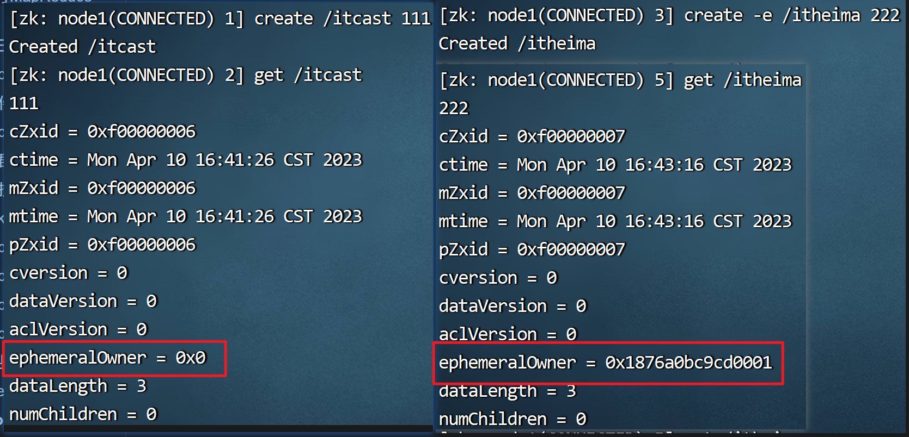

> 会话关闭后,临时节点被销毁,永久节点依然存在

非序列化节点在创建时不能创建同名节点,否则报错

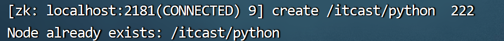

序列化节点可以创建同名节点,系统会按照创建的先后 顺序进行编号

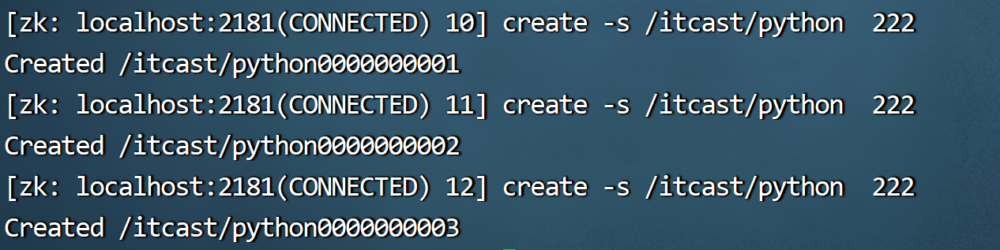

序列化编号从小到大一次递增,所以编号的顺序就是创建文件的顺序

##  zookeeper特性

记住**全局数据一致性**即可

> **全局数据一致性是分布式协调服务的基础**
>
> 为什么能够保证zookeeper中全局数据一致呢? 因为所有的数据,在zookeeper集群中的每一个服务中都保存了一份完整的数据.
>
> **可靠性:** 因为集群中只有leader发号施令其他人都干活不说话
>
> **顺序性:** 在zookeeper中所有的消息都是有序的 
>
> **原子性:** 更新数据时会返回成功回调,如果过半则成功,如果不过半则失败,失败后已经执行的数据进行回滚
>
> **实时性:** 数据的成功或失败会立即返回结果 

注意: 回滚就是恢复到指令执行之前的状态 

## watch监听机制

设置监听

```sh
get /itcast watch
```

使用另外一个客户端修改/itcast节点

```sh
set /itcast 444
```

触发监听

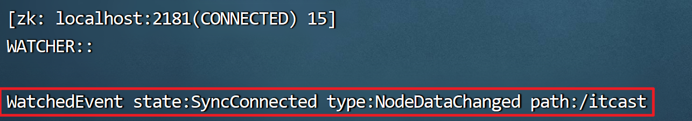


zookeeper 是典型的发布订阅机制

> 客户端订阅数据
>
> 如果数据改变服务端发布通知
>
> 客户端接受到通知后查询数据或执行其他任务
>
> 
>
> **在zookeeper中是客户端监听服务端**


zookeeper监听的特点:

> 1. 先监听后触发: 客户端需要先设置监听,服务端才可以触发监听
> 2. 一次性触发: 触发监听后,客户端需要重新监听才能再次获取通知
> 3. 异步监听: 设置监听后,客户端可以进行其他终端操作,如果监听被触发将会立即获得通知
> 4. 通知内容: 使用了java中的event类,通知中可以获取节点位置,通知类型等数据

> 异步: 可以同时执行
>
> 同步: 一个一个排队执行
>
> 
>
> 并行:  同时执行
>
> 串行: 一个一个排队执行

## zookeeper典型应用

1. 发布订阅机制

> 服务端可以将数据发布在zookeeper上,其他客户端或者服务可以订阅(监听)该数据节点,如果数据有更新,则会触发监听,客户端或服务会收到通知,收到通知后可以在zookeeper上获取最新数据

应用场景: 全局配置文件的统一管理

使用的技术: 监听机制

 

2. 集群选举功能

> 一般是用于主备结构的选举
>
> **启动服务时选举:**
>
> 两台服务启动时其实是没有主备之分的
>
> 1. 两台服务同时在zookeeper中注册相同名称的临时非序列化节点,如果注册成功了,就是主服务
>
> 2. 如果注册不成功,自动变成备用节点,在主服务节点上设置监听
>
> **主服务崩溃时选举:**
>
> 1. 主服务宕机或失联后在zookeeper中创建的临时节点会自动销毁
> 2. 给备用服务发送通知
> 3. 备用服务在zookeeper中同样注册临时非序列化节点,此时备用服务变为主服务
> 4. 原主服务重启后注册节点失败,设置监听后自动变为备用服务

应用场景: hdfs的主备切换, yarn的主备切换等

 应用的技术:  监听, 临时节点, 节点唯一性


3. 分布式锁

> 如果在分布式服务中多台服务器同时修改同一个数据可能造成数据混乱
>
> 此时就涉及到了资源竞争(资源抢夺)
>
> 
>
> 方案一:
>
> 多个服务同时注册同名节点: 
>
> 第一个服务抢到节点后操作数据,其余服务均不可操作,对于该节点注册监听
>
> 第一个服务执行完成后注销节点,其余节点继续抢注,依次类推.
>
> 
>
> 方案二:
>
> 多个服务同时注册同名序列化节点:
>
> 按照注册的序列化节点编号从小到大依次执行任务,每个任务执行完成后才能执行下一个任务

应用场景 : 解决分布式集群中的资源竞争问题

应用的技术: 监听, 临时节点, 节点唯一性, 序列化节点

## hadoop HA集群

分布式一致性算法: 过半成功

HA方案: high available  高可用方案

单点故障: 在集群中某一个服务出现异常则整个集群崩溃.

> hdfs中的单点故障是NameNode
>
> yarn中的单点故障是ResourceManager

系统鲁棒性: 服务抵御异常的能力,鲁棒性越高抵御异常的能力越强.

**HA高可用其实使用主备方案解决单点故障问题**

> 主备架构: 
>
> 当前集群中,有主服务和备用服务两个服务
>
> 备用服务一直同步数据,当主服务崩溃时, 备用服务立即提升为主服务,减少经济损失
>
> 主服务: active server
>
> 备用服务: standby server
>
> 
>
> 一般公司都是1主1备 , 备用机越多,鲁棒性越强,但是随之而来的成本也越高
>
> 
>
> 主服务和备用服务都必须使用相似规格的高性能服务器
>
> 
>
> hadoop3.X中可以设置1主多备,也就是同时也偶多个NameNode, 在hadoop2.x版本中只能一主一备

什么是高可用?

> 就是解决单点故障,使其出现异常时服务依然可用.

###  NameNode的高可用

NameNode HA ---QJM共享日志集群方案

- journal node 集群 : 分布式文件存储系统,存储的是NameNode的日志记录(edits)
  - 作用: 负责主服务和备用服务之间的数据备份
  - 主服务中的元数据信息 = journal node 中的日志记录 + 备用服务中的元数据信息

> **备用服务中存储几份元数据信息??? 两份**
>
> 磁盘 + 内存
>
> 备用服务和主服务要时刻保持一致,这样才可以随时上位
>
> 
>
> **SNN可不可以当做备用服务使用呢??** 不可以
>
> SNN只有NN一部分的功能,且无法进行元数据和客户端的交互,所以其永远不可能取代主服务
>
> 
>
> **为什么我们要使用一个分布式文件系统进行数据备份?**
>
> 不能直接进行activeNN 和standbyNN的数据传输,因为无法保证数据的可靠性.
>
> JN分布式文件存储,有过半成功原则,所以是否成功存储会给我们进行回调 
>
> 所以我们必须使用一个中间服务进行数据备份,而且这个服务必须是分布式服务
>
> 如果其不是分布式服务就会形成新的单点故障.
>
> 
>
> **JN在我们的hadoop服务中已经存在,不需要安装,只要配置生效后启动服务即可**
>
> 
>
> 主备服务切换时长根据集群规模和数据体量不同而发生变化,从不到1秒 到 几十秒不等.

- Failover Controller
  - 健康状态记录: 记录当前的NN是健康还是非蒋康状态
  - 状态记录 : 监控NN在zk中的 状态 (接收通知)
  - zkfc
    - 健康探测 : 定时向NN发送探测指令,如果有心跳证明没问题,否则标记非健康状态
    - 会话保持 : 保持会话,保证注册的临时节点不销毁,也会进行节点监听
    - Master选举 : 采用抢占机制分配主从角色

> zkfc就是zookeeper中的一个组件
>
> 每有一个NN都要开启一个与之对应的ZKFC服务

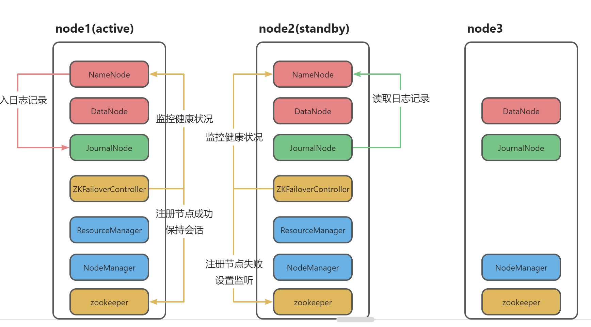

如果在上图中的高可用集群中再扩展三台服务器,每台服务器中运行的服务有哪些?

> 在后续扩展的服务器中,我们只需要运行DataNode和NodeManager即可.
>
> **为什么不部署zookeeper和jrounalnode了呢?**
>
> 为了满足高可用需求,我们必须启动zookeeper监控和协调NN健康状况, 以及使用JN进行元数据同步
>
> 但是本质上JN和ZK只服务于NN
>
> 如果服务器上没有NN就没有必要启动
>
> 但是我们需要启动JN和ZK集群就必须最少三台服务,所以node3中也需要启动这两个集群服务
>
> 但是后续扩展的服务器中不需要

**HA集群启动后的正常使用状态**

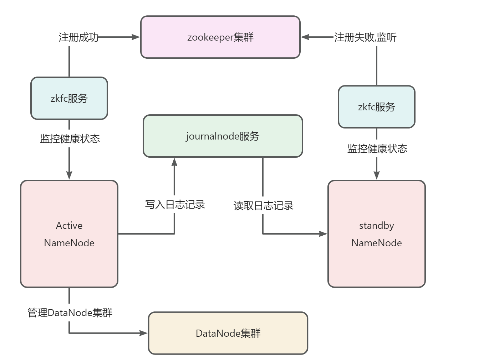

**高可用集群中的主备切换(重要)**

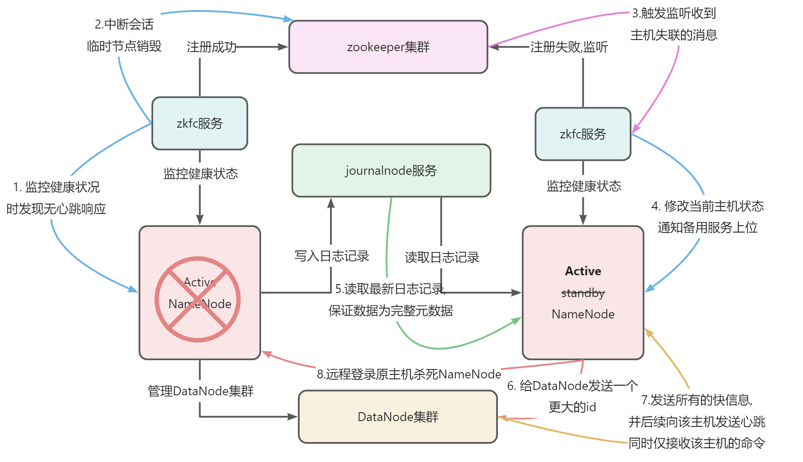


**zkfc可以避免脑裂问题:**

> 在一个集群中没有主角色或者有多个主角色都可以成为脑裂
>
> 当备用服务升级为主服务后会远程登录原主服务并且使用中断指令杀死服务.
>
> 保证一个集群中只有一个主服务.

**在hadoop-ha中由谁来合并fsimage和edits呢?**

答案是**StandybyNameNode**.

> 1. 首先edits文件会同步到JournalNodes节点的共享目录,StandbyNameNode同步edits文件到自己的目录中。
>
> 2. 完成一定的操作数或者经过一定的时间后(具体值可以配置),StandbyNameNode节点会触发其上CheckpointerThread线程的checkpoint操作,合并fsimage和edits文件。
> 3. 合并完成得到新得fsimage文件会被上传到ActiveNameNode相应目录,并清理掉旧的fsimage和edits文件。
>
> 至此,合并结束.

### Yarn的高可用

Resourcemanager HA --基于zk实现

- RM需要维护的数据量很少 不像NN需要同步文件系统大量的元数据。直接基于zk即可完成
- 别忘了 zk也是一个分布式小文件存储系统。

ResourceManager的高可用基于NameNode高可用的架构,删除JN和ZKFC即可.

ResourceManager可以自己注册节点保持会话,也可以基于zookeeper进行数据同步

> 企业开发中yarn的高可用不受重视,因为哪怕服务宕机我们重启后重新运行任务即可,没有NameNode服务宕机后的损失大.
>
> 
>
> hadoop 2.6版本以后才出现了yarn的高可用


