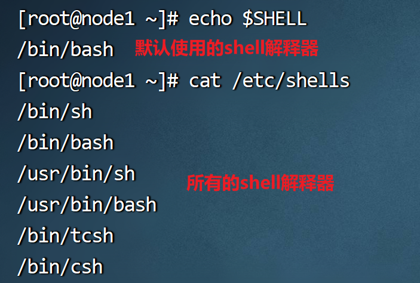

# Shell

## Shell介绍


### 什么是shell

```
1. 在计算机科学中，shell(壳)是操作系统的壳，操作系统相对于shell来说为核
2. shell是用户与操作系统之间的接口程序
3. shell是一个命令解释器-shell自己有内置的命令集，shell脚本编程就是操作这些命令
```

### 命令行shell

```
通过命令形式操作数据或引用程序；
如：
    windows -->cmd.exe  dos
    linux -->bash/..【本阶段学习】
提示：
    1. 我们通过常说的shell脚本编程就是指linux系统中的shell编程
    2. linux中的shell有很多种，如：sh/csh/ksh/..等，我们这里只学习现阶段shell编程最常用的bash shell
```

### Linux系统默认的shell类型和支持的shell类型

```sh
1. 查看默认shell类型                    
    打开命令行执行：echo $SHELL
        1). echo:显示输出指定内容
        2). $SHELL:SHELL为变量名称，$为变量标识符
        注意：$SHELL：为大写   
2. 查看支持的shell类型
    打开命令行执行：cat /etc/shells
        1). cat:查看文件内容命令
        2).  /etc/shells:文件路径及文件名
```



shell解释器: 将我们发送的shell指令解释为操作系统可以读懂的二进制数据的工具

shell解释器的版本有很多,功能大同小异, centos中默认的解释器版本为/bin/bash


学习shell编程的原因和目的是什么呢?

> 原因: 因为linux中默认支持shell脚本的运行,如果想让我们编写的代码定时,定量,按照一定逻辑自动执行,则需要将我们的代码编写为shell脚本.
>
> 
>
> shell脚本的优势,系统默认支持,不需要去配置相关环境, 同时 shell语法简单易学
>
> 
>
> 缺点: 不适合初学者使用, 因为报错不严谨  ,一定要注意shell脚本中,除了注释,不要出现中文信息.

##   shell的使用方式

```sh
1. 通过命令行直接输入
echo "hello world"
2. 通过编辑脚本
- 创建一个纯文本文件,最好以sh作为扩展名 (扩展名不影响调用该脚本,但是可以起到提示作用,告诉别人这就是一个脚本文件.)
- 将shell指令写入到脚本文件中
- 执行脚本文件

# 解释器路径  脚本文件路径
/bin/bash hello.sh
 
# 先给文件增加可执行权限,然后直接调用
./hello.sh
```

##  shell脚本规范

### 文件名称规范

> 1. 不能以数字开头；(不是不能用,只是调度工具执行脚本时可能会出错)
> 2. 脚本的名称尽量不为shell命令关键字
> 3. 后缀名尽量为.sh
> 4. 脚本命名最好有实际意义
> 5. 脚本名称不要出现中文(一定要注意)

### 内容规范

> 1. 首行声明编译器类型 如：#!/bin/bash
> 2. 等号前后不含空格
> 3. 成对内容一次写出来 如：{}、[]、''、``、""
> 4. []内容前后留空格 如 [ name ]
> 5. 变量的引用加双引号，大括号,"${name}"
> 6. 脚本尽量不要使用中文(防止脚本在切换环境后，因编码问题导致乱码)

### 注释规范

> 说明：在脚本中注释行不被编译器所执行
>
> ```sh
> # 此行为单行注释
> 
> 
> <<! 
> 多行注释
> 多行注释
> !
> 
> 注意: 
> 1. 多行注释必须换行后才有注释效果, 不能在<<!同一行书写内容
> 2. !可以被替换为任意字符,只要开始和结束的字符相同即可
> ```

### 执行脚本

> 使用解释器运行
>
> ```sh
> sh test01.sh
> bash test01.sh
> ```
>
> 运行可执行shell脚本(需增加可执行权限)
>
> ```sh
> chmod 766 test01
> test01
> ```

##   shell变量

### shell变量规范

> 1. 变量名以英文字母或者下划线开头，但是不能以数字开头, 变量名中只能由字母下划线和数字,不能存在各种特殊字符
>    (name="xiaoming" 正确；_age=18 正确；1a="error" 错误；)
> 2. 变量名区分大小写 
>    (如：name="zhangsan"与NAME="李四"不同)
> 3. 变量名与等号之间，等号与变量值之间不要有空格    
>    (如: name="zhangsan")
> 4. 使用$加变量名来使用变量的值    
>    (如：echo $name)
> 5. 引用变量名与字符串相连时，需要添加空格做分隔，或者变量名加{}修饰
>    (如：echo $name hello；echo ${name}hello；)

###  shell变量类型

本地变量 :  仅在当前文件或当前终端环境中使用的变量

> 在shell 脚本中,一般情况下,字符串类型数据都使用双引号.

```
1. 变量名=变量值   
- 这种形式变量值不能有空格  例如 name=xioaming 是正确的   name=xiao ming就不正确
2. 变量名='变量值'
- 这种形式的变量字符串内部不能使用其他变量 name='xiao ming' 正确 name='xiao ming $path'
3. 变量名="变量值"   
- 这种形式的变量字符串内部可以使用其他变量 name='xiao ming $path'
```

全局变量

> 我们之前添加的所有环境变量都是全局变量
>
> 在终端那种的任意工作目录下都可以调用该变量

```sh
1. 查看全局变量
    env --> 查看系统已存在的全局变量
2. 定义全局变量
    export 变量=值
```

内置变量

| 序号 | 变量  | 含义                                                      |
| ---- | ----- | --------------------------------------------------------- |
| 01   | $0    | 脚本名【掌握】                                            |
| 02   | $1-$9 | 参数位置1-9【掌握】                                       |
| 03   | $#    | 位置参数的个数【掌握】                                    |
| 04   | "$*"  | 所有位置参数(作为单个字符串)“$1 $2 $3" --> 传递了一个参数 |
| 05   | $?    | 返回值【掌握】 0为执行成功 如：echo $?                    |

### shell变量调用

```sh
echo ${变量名} 
```

### 取消变量

```sh
unset 变量名    --> unset name
开发中使用的很少,因为重新赋值该变量则值会被覆盖
```

##   运算符

### 比较运算

> 比较运算符也可以使用
>
> ==  等于
>
> !=   不等于
>
> 作为判断条件

| 序号 | 符号               | 说明     |
| ---- | ------------------ | -------- |
| 1    | -eq [equal]        | 等于     |
| 2    | -ne [no equal]     | 不等于   |
| 3    | -gt [greate than]  | 大于     |
| 4    | -ge [greate equal] | 大于等于 |
| 5    | -lt [less than]    | 小于     |
| 6    | -le [less equal]   | 小于等于 |

### 逻辑运算

| 序号 | 表达     | 说明 |
| ---- | -------- | ---- |
| 1    | -a [and] | 且   |
| 2    | -o [or]  | 或   |
| 3    | !        | 非   |

```sh
if [ $1 != $2  -a $2 -lt $3 ]
then
        echo '相等'
else
        echo '不相等'
fi

```

##  分支语句

```sh
说明：如果条件成立，那么 then 后边的语句将会被执行；否则，执行 else 后边的语句
格式：
    if [ 条件1 ]
    then
        条件1成立时执行的语句块
    elif [ 条件2 ]
    then
        条件2成立时执行的语句块
    ...
    else
        所有条件均不成li时执行的语句块
    fi   代表条件语句结束
```

> 注意:
>
> 1. [] 内部数据左右两侧必须书写空格,否则报错
> 2. 必须有fi代表分支语句结束,否则报错
> 3. 条件语句成立时执行的代码块尽量换行否则可能失败

read 语法

```sh
# read name
获取用户键盘键入的信息,用name变量名保存
# read -p '请输入您的名字' name
获取用户键入信息时给出提示文字
```

案例 : 

> 判断学生的成绩，90-100之间提示优秀，80-90之间提示良好，70-80之间提示一般，60-70之间提示及格，
>   其他则提示不及格；

```sh
#!/bin/bash
# 提示用户输入成绩
read -p "请输入成绩:" score
if [ "${score}" -ge 90 -a "${score}" -le 100 ]
then
    echo "成绩：${score} 优秀！"
elif [ "${score}" -ge 80 -a "${score}" -lt 90 ]
then
    echo "成绩：${score} 良好！"
elif [ "${score}" -ge 70 -a "${score}" -lt 80 ]
then
    echo "成绩：${score} 一般！"
elif [ "${score}" -ge 60 -a "${score}" -lt 70 ]
then
    echo "成绩：${score} 及格！"
else
    echo "成绩：${score} 不及格！"
fi
```

```sh
#!/bin/bash
# 判断学生的成绩，90-100之间提示优秀，80-90之间提示良好，70-80之间提示一般，60-70之间提示及格，其他则提示不及格；

read -p "请输入您的孩子的分数: " score

if [ ${score} -gt 100 -a $score -lt 0 ]
then
        echo "输入数据有误"
elif [ $score -gt 90 ]
then
        echo "优秀"
elif [ $score -gt 80 ]
then
        echo "良好"
elif [ $score -gt 70 ]
then
        echo "一般"
elif [ $score -gt 60 ]
then
        echo "及格"
else
        echo "不及格"
fi
```

> 注意: 代码从上到下依次执行,在分支语句中,只要有一个条件满足要求则剩余条件将不会继续判断
>
> 
>
> **shell脚本错误提示不友好**
>
> 很多时候错误提示的位置并不是出现问题的位置
>
> 所以正在shell开发中写一部分代码就要运行一遍,否则容易找不到问题出处

##  循环语句

```sh
遍历读取列表元素，列表元素遍历完毕，结束语句；

语法格式：
for 临时变量 in 列表
do
    执行语句
done
```

案例1:

> 使用for循环打印1-10之间的数；

```sh
#!/bin/bash
for i in $(seq 10)
do
        echo "$i"
done
```

> 参数说明:
>
> **i** 这是一个临时变量,每次从in 后边的数据集中取出一个元素,放在临时边来个中执行下方代码时可以使用该临时变量,下次循环会有新的数据写入临时变量覆盖原有的值
>
> **$(seq 10)**是一个创造整数集合的函数, seq 10 获取的是从1-10的整数集合 
>
> 扩展: 如果想获取从2-9等整数集合: $(seq 2 9)
>
> **do** 循环体的开始标记
>
> **done** 循环体的结束标记

案例2:

> 打印当前用户家目录下所有文件名称

```sh
#!/bin/bash
for i in $(ls /root)
do
echo "当前用户下文件有：${i}"
done
```

练习: 使用循环语句创建10个文件 1.txt 2.txt ...10.txt

```sh
#!/bin/bash

for i in $(seq 10)
do
        $(touch ${i}.txt)
done
```

练习：99乘法表

```sh
#!/bin/bash

for i in $(seq 9)
do
        for y in $(seq $i)
        do
                echo -n -e "$y x $i = $[$y * $i] \t"
        done
        echo ""
done
```


##   一键启动脚本

env-start.sh

```sh
#!/bin/bash
source /etc/profile

# 启动hadoop集群
start-all.sh
# 启动metastore
nohup hive --service metastore &
# 启动hivesever2
nohup hive --service hiveserver2 &
```

env-stop.sh

```sh
#!/bin/bash
source /etc/profile

# 关闭hadoop集群
stop-all.sh
# 关闭metastore
kill -9 $(netstat -nltp | grep 9083 | awk '{print $7}' | awk -F "/" '{print $1}')
# 关闭hiveserver2
kill -9 $(netstat -nltp | grep 10000 | awk '{print $7}' | awk -F "/" '{print $1}')
```

赋予脚本可执行权限

```sh
chmod +x env-start.sh
chmod +x env-stop.sh
```

将我们自己写的脚本存放在/bin目录下

```sh
mv env-start.sh /bin
mv env-stop.sh /bin
```

##  开机自启脚本

> 原理: 在linux各项服务启动完毕之后，会运行/etc/rc.d/rc.local这个文件，所以把我们需要运行的脚本放在这里面就行了。

1. 编辑`/etc/rc.d/rc.local`在文件的最后一行添加脚本绝对路径


2. 给脚本文件增加可执行权限

> 增加可执行权限的文件有两个,一个事rc.local 另一个是 脚本文件

```sh
chmod +x /etc/rc.d/rc.local
chmod +x 脚本文件
```


