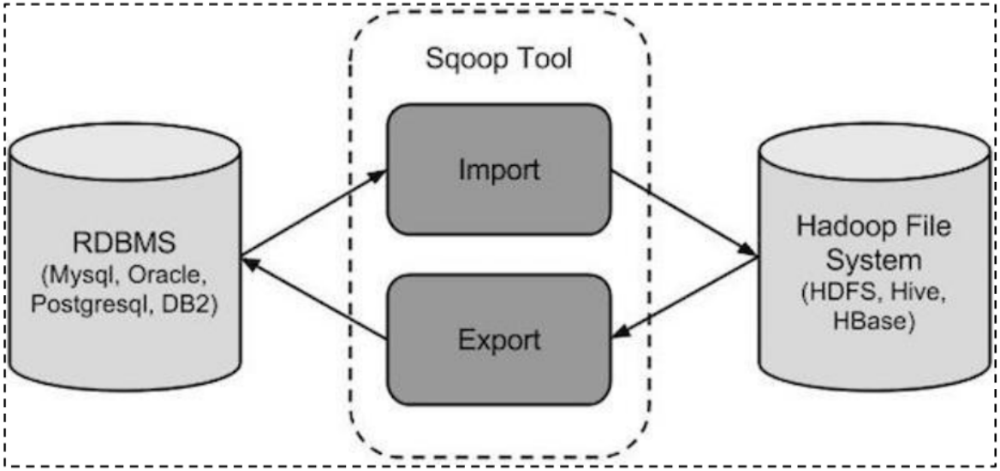

# Sqoop的基本使用操作

​	sqoop是apache旗下顶级项目. 主要是用于 RDBMS 和 大数据生态圈之间的数据导入导出的工具, 从RDBMS 到大数据生态圈 是导入操作, 反之为导出操作



**sqoop本质上也是一款翻译软件, 将sqoop的命令翻译为 MR程序**


关于使用sqoop 将数据导入到HIVE, 支持两种导入方案:  原生导入方案 和  hcatalog方式

> 区别点:  
>
> ​		如果使用原生导入方式, 导入HIVE , 仅支持 textFile导入方式
>
> ​		hcatalog支持数据存储方案比较多: textFile, ORC, sequence, parquet....
> ​	
>
> 原生方式支持数据覆盖导入
>
> hcatalog仅支持追加导入
>
> 
>
> 原生方式在导入时候, 根据字段的顺序, 导入到HIVE中
>
> hcatalog在导入的时候, 是根据字段的名称导入的   
>
>  (此部分建议在导入到HIVE , hive表字段的顺序 和 mysql表字段顺序保持一致, 名称保持一致)
>
> 
>
> 后续主要采用 hcatalog的导入方式, 因为建表的时候, 主要存储格式为 ORC

## 基本使用操作

### 如何查看  sqoop的 帮助文档

```properties
sqoop  help

如何查看某个操作下的相关的参数信息:
sqoop 操作 --help
```


### 基础操作

```properties
-- sqoop : sql + hadoop 负责 传统数据库 和 hdfs与hive交互
-- sqoop的本质: map reduce 特征: 慢 吞吐量大
-- 导入 方向: 传统数据库 到 hdfs与hive
-- 导出 方向: hdfs与hive 到 传统数据库

-- todo 1 如何查看  sqoop的 帮助文档
sqoop help

-- todo 2 如何查看 list-databases 的参数
sqoop help list-databases

-- todo 3 查看 mysql中有哪些库
sqoop list-databases --connect jdbc:mysql://hadoop01:3306 --username root --password 123456


sqoop list-databases \
--connect jdbc:mysql://hadoop01:3306 \
--username root \
--password 123456

-- todo 4 查看 mysql中hue库中有哪些表
sqoop list-tables \
--connect jdbc:mysql://hadoop01:3306/hue \
--username root \
--password 123456
```

### 全量导入

```properties
-- todo 目标 导入 方向: 传统数据库 ---> hdfs或hive
-- todo ----- 准备工作 在mysql中执行 开始
create database test default character set utf8mb4 collate utf8mb4_unicode_ci;
use test;

create table emp
(
    id     int         not null
        primary key,
    name   varchar(32) null,
    deg    varchar(32) null,
    salary int         null,
    dept   varchar(32) null
);

INSERT INTO emp (id, name, deg, salary, dept) VALUES (1201, 'gopal', 'manager', 50000, 'TP');
INSERT INTO emp (id, name, deg, salary, dept) VALUES (1202, 'manisha', 'Proof reader', 50000, 'TP');
INSERT INTO emp (id, name, deg, salary, dept) VALUES (1203, 'khalil', 'php dev', 30000, 'AC');
INSERT INTO emp (id, name, deg, salary, dept) VALUES (1204, 'prasanth', 'php dev', 30000, 'AC');
INSERT INTO emp (id, name, deg, salary, dept) VALUES (1205, 'kranthi', 'admin', 20000, 'TP');

create table emp_add
(
    id     int         not null
        primary key,
    hno    varchar(32) null,
    street varchar(32) null,
    city   varchar(32) null
);

INSERT INTO emp_add (id, hno, street, city) VALUES (1201, '288A', 'vgiri', 'jublee');
INSERT INTO emp_add (id, hno, street, city) VALUES (1202, '108I', 'aoc', 'sec-bad');
INSERT INTO emp_add (id, hno, street, city) VALUES (1203, '144Z', 'pgutta', 'hyd');
INSERT INTO emp_add (id, hno, street, city) VALUES (1204, '78B', 'old city', 'sec-bad');
INSERT INTO emp_add (id, hno, street, city) VALUES (1205, '720X', 'hitec', 'sec-bad');

create table emp_conn
(
    id    int         not null
        primary key,
    phno  varchar(32) null,
    email varchar(32) null
);

INSERT INTO emp_conn (id, phno, email) VALUES (1201, '2356742', 'gopal@tp.com');
INSERT INTO emp_conn (id, phno, email) VALUES (1202, '1661663', 'manisha@tp.com');
INSERT INTO emp_conn (id, phno, email) VALUES (1203, '8887776', 'khalil@ac.com');
INSERT INTO emp_conn (id, phno, email) VALUES (1204, '9988774', 'prasanth@ac.com');
INSERT INTO emp_conn (id, phno, email) VALUES (1205, '1231231', 'kranthi@tp.com');
-- todo ----- 准备工作 在mysql中执行 结束

-- todo 1 需求一: 将 mysql中的emp表中数据导入到HDFS中
-- todo 1.1 方式一 不指定导入位置
sqoop import \
--connect jdbc:mysql://hadoop01:3306/test \
--username root \
--password 123456 \
--table emp

-- todo 1.2 方式二 指定导入位置
sqoop import \
--connect jdbc:mysql://hadoop01:3306/test \
--username root \
--password 123456 \
--table emp \
--target-dir /test/bj_01/

-- todo 1.3 方式三 设置其mapTask的数量呢
sqoop import \
--connect jdbc:mysql://hadoop01:3306/test \
--username root \
--password 123456 \
--table emp \
--target-dir /test/bj_01/ \
--delete-target-dir \
-m 1

-- todo 1.4 方式四 设置字段之间的分割符
sqoop import \
--connect jdbc:mysql://hadoop01:3306/test \
--username root \
--password 123456 \
--table emp \
--target-dir /test/emp_v2/ \
--delete-target-dir \
-m 1 \
--fields-terminated-by '\t'

-- todo 2 将mysql表中的数据 导入hive的表中
-- todo 2.1 第一步: 在HIVE中创建目标表
drop database if exists db_1 cascade;

create database if not exists db_1;

create table if not exists db_1.emp_add(
    id int,
    hno string,
    street string,
    city string
)
row format delimited fields terminated by '\t'
stored as orc;

-- todo 2.2 第二步: 编写 sqoop命令 完成数据导入操作
sqoop import \
--connect jdbc:mysql://hadoop01:3306/test \
--username root \
--password 123456 \
--table emp_add \
-m 1 \
--fields-terminated-by '\t' \
--hcatalog-database db_1 \
--hcatalog-table emp_add

```

### 按条件导入

```properties
-- todo 3 数据条件导入数据 重点
-- todo 3.1 方式一:  通过 where条件的方式, 将部分数据导入到HDFS中
sqoop import \
--connect jdbc:mysql://hadoop01:3306/test \
--username root \
--password 123456 \
--table emp \
--where 'id>1203' \
--target-dir /test/emp_v3/ \
--delete-target-dir \
-m 1 \
--fields-terminated-by '\t'

-- todo 3.2 方式二: 通过 SQL的方式, 将部分数据导入到HDFS中:
sqoop import \
--connect jdbc:mysql://hadoop01:3306/test \
--username root \
--password 123456 \
--query "select id, name from emp where id>1203 and \$CONDITIONS" \
--target-dir /test/emp_v3/ \
--delete-target-dir \
-m 1 \
--fields-terminated-by '\t'


sqoop import \
--connect jdbc:mysql://hadoop01:3306/test \
--username root \
--password 123456 \
--query "select id, name from emp where \$CONDITIONS and id>1203" \
--target-dir /test/emp_v3/ \
--delete-target-dir \
-m 1 \
--fields-terminated-by '\t'

-- todo 3.3 通过SQL方式 将部分数据导入到 hive的表中
-- 在hive中执行
truncate table db_1.emp_add;

sqoop import \
--connect jdbc:mysql://hadoop01:3306/test \
--username root \
--password 123456 \
--query "select * from emp_add where \$CONDITIONS and id>1203" \
-m 1 \
--fields-terminated-by '\t' \
--hcatalog-database db_1 \
--hcatalog-table emp_add

-- todo 问题2: 列名都一致, 但是 顺序不一致是否可以导入? 可以 select city, street, hno, id from test.emp
truncate table db_1.emp_add;

sqoop import \
--connect jdbc:mysql://hadoop01:3306/test \
--username root \
--password 123456 \
--query "select city, street, hno, id from emp_add where \$CONDITIONS and id>1203" \
-m 1 \
--fields-terminated-by '\t' \
--hcatalog-database db_1 \
--hcatalog-table emp_add

-- todo 问题1: 如果列名不一致可以导入吗? 不可以 mysql.test.emp_add.id vs hive.db_1.emp_add.id_2
-- todo 解决方案: 使用别名
-- todo 1 在hive 新建一张表
create table if not exists db_1.emp_add_2(
    id_2 int,
    hno_2 string,
    street string,
    city string
)
row format delimited fields terminated by '\t'
stored as orc;


sqoop import \
--connect jdbc:mysql://hadoop01:3306/test \
--username root \
--password 123456 \
--query "select id as id_2, hno as hno_2, street, city  from emp_add where \$CONDITIONS and id>1203" \
-m 1 \
--fields-terminated-by '\t' \
--hcatalog-database db_1 \
--hcatalog-table emp_add_2
```

### 全量导出

```properties
-- todo sqoop导出方向: hive ---> 传统数据库 mysql
-- todo 1 在mysql中建表
CREATE TABLE test.tb_emp_add_hive2mysql (
	id INT,
	hno VARCHAR(20),
	street VARCHAR(20),
	city VARCHAR(20)
);

-- todo 2 执行导出
sqoop export \
--connect jdbc:mysql://hadoop01:3306/test \
--username root \
--password 123456 \
--table tb_emp_add_hive2mysql \
-m 1 \
--fields-terminated-by '\t' \
--hcatalog-database db_1 \
--hcatalog-table emp_add


-- todo 3 解决导出中文乱码
sqoop export \
--connect "jdbc:mysql://hadoop01:3306/test?useUnicode=true&characterEncoding=utf-8" \
--username root \
--password 123456 \
--table tb_emp_add_hive2mysql \
-m 1 \
--fields-terminated-by '\t' \
--hcatalog-database db_1 \
--hcatalog-table emp_add

```

