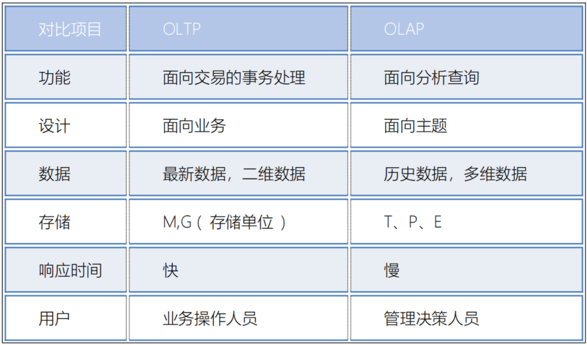

# 新零售

## 新零售的行业背景

早期基本都是一些线下店铺:

> 阶段一:  百货商店 
>
> 阶段二:  超级市场(超市)
>
> 阶段三:  连锁商店
>
> -----以上为线下的店铺------
>
> 阶段四:  电子商务(网络销售 --- 网店)     ---纯线上的销售方案
>
> 阶段五:  新零售 (线上 + 线下  + 物流)

项目真实来源:  永辉超市

## 项目的架构介绍


> 基于cloudera manager构建的大数据分析平台, 在此平台基础上, 构建有 HDFS, YARN, zookeeper, sqoop, oozie, HUE, HIVE 等相关的大数据组件, 同时为了提升分析的效率. 引入presto来进行分析处理操作, 使用FineBi实现图表展示操作, 整个分析工作是一个周而复始, 不断的干, 采用oozie完成任务的调度工作
>
> 数据流转的流程: 
> 	整个项目的数据源都是集中在MySQL中的, 通过sqoop完成数据的导入操作, 将数据导入到HDFS中, 使用HIVE构建相关的表, 建立数仓体系, 在HIVE进行分层处理, 在进行统计分析的时候, 采用presto提升分析的效率, 将分析的结果导出到Mysql中, 最后使用fineBi完成报表展示操作, 整个项目基于cloudera manager进行监控管理, 使用oozie完成工作流的调度操作

## 数据仓库的基本概念

* 1- 什么是数据仓库呢?

> 存储数据的仓库, 主要用于存储过去历史发生过的数据,面向主题, 对数据进行统计分析的操作, 从而能够对未来提供决策支持

* 2- 数据仓库最大的特点是什么呢?

> 数据仓库既不生产数据, 也不消耗数据, 数据来源于各个数据源

* 3- 数据仓库的四大特征:

> 1- 面向主题:  分析什么  什么就是我们的主题
>
> 2- 集成性: 数据从各个数据源汇聚而来, 数据的结构都不一定一样
>
> 3- 非易失性(稳定性): 存储都是过去历史的数据, 不会发送变更, 甚至某些数据仓库都不支持修改操作
>
> 4- 时变性: 随着时间推移, 将最近发生的数据也需要放置到数据仓库中, 同时分析的方案也无法满足当前需求, 需要变更分析的手段

* 4- OLAP 和 OLTP区别: 



* 5- 什么是ETL:

> ETL: 抽取 转换  加载
>
> 狭义上ETL:
>
> ​		指的数据从ODS层抽取出来, 对ODS层的数据进行清洗转换处理的操作, 将清洗转换后的数据加载到DW层过程
>
> 宽泛的ETL:
>
> ​		指的是数仓的全过程

* 6- 什么是数据仓库 和 数据集市

> 数据仓库是包含数据集市的, 在一个数据仓库中可以有多个数据集市
>
> 数据仓库: 一般指的构建集团数据中心, 基于业务形成各种业务的宽表或者统计宽表
>
> 数据集市: 基于部门或者基于主题, 形成主题或者部门相关的统计宽表

## 维度分析的基本介绍

* 维度:

> **什么是维度?** 
>
> ​		看待问题角度, 当我们对一个主题进行分析的时候, 可以从不同的角度来分析, 这些角度就是维度
> ​			   比如说: 对订单进行分析 可以从 用户, 时间, 地区, 商家, 商圈....
>
> **维度的分类:** 
>
> ​		定性维度: 一般指的统计 每个  各个 这种维度, 比如 统计每天 每小时 各个用户...
>
> ​		这种维度在编写SQL, 一般是放置在 group by
>
> ​		定量维度:  一般指的统计某个范围, 或者某个具体值的, 比如 统计年龄在18~60岁, 时间为2021年度
>
> ​		这种维度在编写 SQL, 一般是放置在 where条件
>
> **上卷 和 下钻:**   
>
> ​		比如说 我们以天作为标准,  上卷统计 周  月 年 下钻统计: 小时
>
> **分层或者分级:**  
>
> ​		比如说: 以地区为例, 将地区划分为 省份 市  县/区
>
> ​		从数仓分析的角度来看待, 指的多了分析的维度而已

* 指标:

> **什么是指标?**
>
> ​		衡量事务发展的标准，也叫度量, 简单来说: 在根据维度进行分析的时候, 必然要分析出一些结果,
>
>  这个结果就是度量常见的度量值有那些: 
>
> ​		count(), sum(), min(),max(),avg()
> ​		
>
> **指标的分类:** 
>
> 绝对指标: 指的统计计算一个具体的值, 比如说 销售额, 订单量
>
> ​		必须要对全部的数据进行统计处理
>
> ​		count(), sum(), min(),max(),avg()
>
> 相对指标: 指的统计相对的结果, 比如说 同比增长 环比增长  流失率  增长率...
>
> ​		这些指标在计算的时候, 是可以不需要对全部数据进行统计
>
> ​		可以通过抽样的方式来计算即可

例子: 

> 需求:
>
> ​		请统计在2021年度, 来自于北京 女性 未婚, 年龄在 18 ~28 之间的每天的销售总额是多少?
>
> 分析: 
>
> ​		涉及到维度:  时间维度, 地区维度, 性别, 婚姻状态, 年龄
>
> ​		定性维度:  每天
>
> ​		定量维度:  2021, 北京 女性 未婚 年龄
>
> ​		涉及指标:  销售额(绝对指标)
>
> ​		sum()
>
> SQL: 
>
> ```sql
> select day, sum(price)
> from  where  时间 = 2021 and address = '北京' and sex = '女性' and status = '未婚' and age between 18 and 28
> group by day;
> ```

## 数仓建模

何为建模: 如何在数据仓库中构建表, 是一套用于规范化建表的理论

常见的数仓建模理论:

> 三范式建模: 
>
> ​		主要是应用在传统的数据仓库中, 指的数据存储在关系型的数据库中, 要求在建表的时候, 表必须有主键 同时表中尽量的避免数据的冗余的发生, 尽可能拆分表
>
> 维度建模:
>
> ​		主要是应用于新型的数据仓库中, 指的数据存储在专门用于进行OLAP数据库中, 比如 要求建模的时候以分析为前提,  只要是利于分析的建模方案, 认为都是OK的, 在此情况下, 即使数据存在一定的冗余也是OK的


后续主要采用维度建模的思想来构建相关的表, 在维度建模中, 主要规定了两种表模型: 事实表 和 维度表

### 事实表

什么是事实表:

> 事实表: 指的主题,要统计的主题是什么, 对应事实就是什么, 而主题所对应的表, 其实是事实表
>
> ​		事实表一般是一坨主键(其他表)的聚集
>
> ​		事实表一般是反应了用户某种行为表
>
> 比如说: 
>
> ​		订单表, 收藏表, 登录表, 购物车表 ...
> ​	
>
> 事实表分类: 
>
> ​		事务事实表 : 最初始确定的事实表 其实就是事务事实表
>
> ​		累计快照事实表:  指的对数据进行提前聚合后表, 比如将事实表按照天聚合统计 结果表
>
> ​		周期快照事实表: 每一条数据, 记录了完整的事件 从开始 到结束整个流程, 一般有多个时间组成

### 维度表

什么是维度表:

> 维度表: 当对事实表进行统计分析的时候, 可能需要关联一些其他表进行辅助, 这些表其实就是维度表
>
> ​		维度表一般是由平台或者商家来构建的表, 与用户无关, 不会反应用户的行为
>
> 比如说: 地区表  商品表 时间表, 分类表...
>
> 维度表分类: 
>
> ​		高基数维度表:  如果数据量达到几万 或者几十万 甚至几百万的数据量, 一般这样维度表称为高基数维度表
>
> ​				比如:  商品表 , 用户表
>
> ​		低基数维度表: 如果数据量只有几条 或者 几十条 或者几千条, 这样称为低基数维度表
>
> ​				比如: 地区表 时间表  分类表  配置表		

### 数仓发展模型

数仓发展的三种模型:

* 星型模型:
  * 特点:  只有一个事实表, 也就意味着只有一个分析的主题, 在事实表周围围绕了多张维度表, 维度表与维度表没有任何关联
  * 数仓发展阶段: 初期
* 雪花模型:
  * 特点:  只有一个事实表, 也就意味着只有一个分析的主题, 在事实表周围围绕了多张维度表, 维度表可以接着关联其他的维度表
  * 数仓发展阶段:  异常, 出现畸形状态 在实际数仓中, 这种模型建议越少越好, 尽量避免这种模型产生
* 星座模型:
  * 特点:  有多个事实表, 也就意味着有了多个分析的主题, 在事实表周围围绕了多张维度表, 在条件吻合的情况下, 事实表之间是可以共享维度表
  * 数仓发展阶段: 中期 和 后期


### 缓慢渐变维

缓慢渐变维:

​		主要是用于解决历史变更问题, 处理历史变更的数据是否需要保留的问题


如何解决问题? 

* SCD1: 不维护历史变更行为, 直接对过去数据进行覆盖即可
  * 此种操作 仅适用于错误数据的处理
* SCD2: 维护历史变更行为, 处理方式 在表中新增两个新的字段, 一个是起始时间, 一个是结束时间, 当数据发生变更后, 将之前的数据设置为过期, 将新的变更后完整的数据添加到表中, 重新记录其起始和结束时间, 将这种方案称为 **拉链表**
  * 好处:  可以维护更多的历史版本的数据, 处理起来也是比较简单的 (利于维护)
  * 弊端: 造成数据冗余存储 大量占用磁盘空间
* SCD3:  维度历史变化,  处理方式, 当表中有字段发生变更后, 新增一列, 将变更后的数据存储到这一列中即可
  * 好处: 减少数据冗余存储
  * 弊端: 只能维护少量的历史版本, 而且维护不方便, 效率比较低
  * 适用于: 空间比较紧缺,而且只需要维护少量版本的情况

## 数仓分层介绍


> ODS层: 源数据层(临时存储层)
>
> ​		作用: 对接数据源, 用于将数据源的数据完整的导入到ODS层中, 一般ODS层的数据和数据源的数据保持一致, 类似于一种数据迁移的操作, 一般在ODS层建表的时候, 会额外增加一个 日期的分区, 用于标记何时进行数据采集
>
> DW层:  数据仓库层
>
> ​		DWD层: 明细层
>
> ​				作用: 和ODS层保持相同的粒度,不会对数据进行聚合操作, 只要进行清洗 转换工作, 保证数据质量,利于后续分析
>
> ​				清洗: 过滤掉一些无用数据
>
> ​				转换: 格式转换 或者  一个字段 转换为多个字段,  json转换....
>
> ​		DWB层: 基础数据层
>
> ​				作用: 进行维度退化的操作, 根据业务模块. 形成业务宽表
>
> ​				维度退化: 
>
> ​						以订单表为例, 在订单表中, 有用户 id , 商品id 商家id, 地区的id信息. 如果统计需要按照用户, 商品, 商家 和地区来统计操作, 此时需要关联用户表, 商品表 商家表 地区表
>
> ​				维度退化:
>
> ​						提前先将这些维度表中可能需要使用字段合并到事实表中, 让事实表变的更宽,后续在统计的时候, 只需要关联订单表即可
>
> ​		DWS层: 业务数据层
>
> ​				作用: 用于进行提前聚合操作, 形成基础主题统计宽表指标数据
>
> ​				例如: 需求要求统计 每年 每月 每日的销售额. 那么在DWS层, 可以先按照日形成统计结果数据
>
> DM层: 数据集市层
>
> ​		作用: 基于主题, 形成数据集市, 对指标进行细化统计过程
>
> ​		例如: 需要将 每年 每月 每日的销售额全部记录在DM层中, 此时我们只需要对DWS层进行上卷统计即可
>
> APP(DA|ADS | RPT |ST) :  数据应用层(数据展示层)
>
> ​		作用: 存储分析的结果信息, 用于对接相关的应用, 比如  BI图表

**新零售地图**


## 完成ODS层数据采集操作

作用:  对接数据源, 一般和数据源保持相同的粒度

ODS层: 处于在HIVE端

业务数据: MySQL

目标: 将MySQL中业务库的表数据 导入到 ODS层中

技术: sqoop 完成导入的操作

### 数据存储格式和压缩方案

**存储格式:**

> 在hive中, 数据存储格式主要分为两大类:  行式存储  和 列式存储
>
> 
>
> 行式存储(textFile):
>
> ​		优点: 可读性较好  执行 select  * 效率比较高
>
> ​		弊端:  耗费磁盘资源  执行 select 字段 效率比较低
>
> 列式存储(ORC):
>
> ​		优点: 节省磁盘空间. 执行 select 字段 效率比较高
>
> ​		弊端: 执行 select * 效率比较低 , 可读性不是特别好
>
> 
>
> ORC是兼具行式存储优势又具有列式存储优势, 数据按行分块, 每块中按列存储数据, 同时在每个块内部, 对数据构建索引, 提升查询的效率
>
> 
>
> 思考: 在hive建表中, 一般采用那种存储格式呢?  
>
> ​		在hive中, 一般我们的选择都是ORC存储格式, 除非需求对接的数据源是普通文本文件数据, 此时会让对接此文件的表构建为textFile,其余的层次结构的表依然使用ORC

**压缩方案:**

> 思考: 压缩有什么用? 能够在有限的空间下, 存储更多的数据
>
> 在进行压缩的时候, 压缩的方案其实有很多种: ZIP(GZIP), SNAPPY, LZO,ZLIB ....
>
> 
>
> 思考, 具体使用那种压缩的方案呢?  性价比比较高的 (压缩比, 解压缩的性能)
>
> ​		zlib(gzip):  具有良好的压缩比, 但是解压缩的性能一般 
>
> ​		snappy: 具有良好的解压缩的性能, 同时具有较好的压缩比, 弊端 没有zlib压缩比好, 同时hadoop默认原生是不支持snappy压缩的(CDH版本直接支持的)
>
> 
>
> 本项目采用那种方案?  主要采用snappy
>
> ​		在 ODS层, 一般会使用zlib
>
> ​		在其他层次中, 一般采用snappy
> ​	
>
> 说明: 
>
> ​		如果读取次数较少, 写入了较大, 优先保证压缩比   --- zlib(gzip)  比如说 ODS层
>
> ​		如果读取次数比较高, 优先保障解压缩性能   -- snappy  比如说 DW层相关的表
>
> 
>
> ​		如果不清楚, 建议使用snappy, 或者如果空间足够, 统一采用snappy也没有问题

**创建表的时候, 选择内部表, 还是外部表?**

> 判断标准: 对表数据是否有管理的权限
>
> 
>
> 有权限删除数据, 那么我们可以构建内部表, 当然也可以构建外部表
>
> 如果没有权限删除数据, 只能构建外部表
>
> 
>
> 内部表转换为外部表: 
>
> ​		alter table 表名 set tblproperties('EXTERNAL'='FALSE');
>
> ​	    通过true和false 来修改是否为内部表还是外部表
>
> 一般来说, 在数仓中,  除了ODS层可能会出现外部表以外, 其余的层次结构, 大多数还是内部表

**创建表的时候, 是否需要构建分区表呢?**

> 一般情况下, 都是分区表(分区的字段大多数的都是以时间为主)

### 数据同步方式

**全量覆盖同步方式**

> 适用于:  
>
> ​		表数据变更的频次并不多,不需要记录其历史数据 而且整个表数据量相对较少  这个时候可以采用全量覆盖的操作
> ​	
>
> 操作方式: 
>
> ​		每次同步数据, 都是要先将原有的数仓中表数据全部删除, 然后重新从业务端导入即可
>
> ​		建表的时候, 不需要构建分区表
> ​	
>
> 比如说: 地区表  时间表

**仅新增同步方式**

> 适用于: 
>
> ​		业务端数据只会有新增的操作, 不会有变更的时候, 数据量比较多
> ​	
>
> 操作方式: 
>
> ​		在数仓中建表的时候, 需要构建分区表, 分区字段和同步数据的周期是一致的, 比如说: 每天都需要同步数据, 分区字段 需要按天  如果每月同步一次, 分区字段按照月
>
> ​		每次进行同步的时候, 将对应周期下的新增数据放置到对应日期分区下
>
> 
>
> 比如说:  登录日志表, 访问日志表

**新增及更新同步方式**需要维护历史数据

>  比如说: 每天都需要同步数据, 分区字段 需要按天  如果每月同步一次, 分区字段按照月
>
> 适用于: 
>
> ​		业务端表数据既有更新操作, 又有新增操作的时候, 而且数据量比较多
>
> 
>
> 操作方式: 
>
> ​		在数仓中建表的时候, 需要构建分区表 , 分区字段和同步数据的周期是一致的, 比如说: 每天都需要同步数据, 分区字段 需要按天  如果每月同步一次, 分区字段按照月
>
> ​		每次进行同步的时候, 将对应这个周期的下新增数据和更新数据放置到对应日期分区下即可
>
> 
>
> 比如说:订单表, 商品表, 用户表.... 

全量同步方式**(了解)**

> 适用于:
>
> ​		业务端数据量不是特别大, 但是也存在更新和新增, 而且不需要保留太多的历史版本
>
> 
>
> 操作方式:
>
> ​		在数仓中建表的时候, 需要构建分区表, 分区字段和同步数据的周期是一致的, 比如说: 每天都需要同步数据, 分区字段 需要按天  如果每月同步一次, 分区字段按照月
>
> ​		每次导入都是导入截止当前时间的全量数据, 定期将历史的日期数据删除即可

### mysql_to_ods全量覆盖表

```properties
-- todo 目标: mysql_2_ods 全量覆盖表
-- todo 1 准备工作: 在hive中 建库 建表
-- todo 1.1 如果库 yp_ods 存在 就先删除
drop database if exists yp_ods cascade;
-- todo 1.2 如果 yp_ods 不存在, 就创建 yp_ods 库
create  database if not exists yp_ods;

-- todo 1.3 在hive中建表
-- 可以根据mysql中的建表语句进行修改
show create table yipin.t_district;

CREATE TABLE yp_ods.t_district
(
    id    string COMMENT '主键ID',
    code  string COMMENT '区域编码',
    name  string COMMENT '区域名称',
    pid   int COMMENT '父级ID',
    alias string COMMENT '别名'
)
comment '区域字典表'
row format delimited fields terminated by '\t'
stored as orc
tblproperties ('orc.compress' = 'ZLIB');

-- todo 2 加载数据1: 全量操作
select id, code, name, pid, alias from yipin.t_district
;

sqoop import \
--connect jdbc:mysql://hadoop01:3306/yipin \
--username root \
--password 123456 \
--query "select id, code, name, pid, alias from yipin.t_district where \$CONDITIONS" \
--hcatalog-database yp_ods \
--hcatalog-table t_district \
-m 1


-- todo 3 加载数据2: 增量操作
-- todo 3.0 模拟增量数据
insert into yipin.t_district value('666','888','xxxx市',555,"yyyy");

select * from yipin.t_district where id='666';


-- todo 3.1 删除目标表 再新建目标表
drop table yp_ods.t_district;

CREATE TABLE yp_ods.t_district
(
    id    string COMMENT '主键ID',
    code  string COMMENT '区域编码',
    name  string COMMENT '区域名称',
    pid   int COMMENT '父级ID',
    alias string COMMENT '别名'
)
comment '区域字典表'
row format delimited fields terminated by '\t'
stored as orc
tblproperties ('orc.compress' = 'ZLIB');


-- todo 3.2 重新加载
sqoop import \
--connect jdbc:mysql://hadoop01:3306/yipin \
--username root \
--password 123456 \
--query "select id, code, name, pid, alias from yipin.t_district where \$CONDITIONS" \
--hcatalog-database yp_ods \
--hcatalog-table t_district \
-m 1
```

### mysql_to_ods仅新增表

```properties
-- todo 目标: 仅新增表 mysql ---> ods
-- todo 1 建表
DROP TABLE if exists yp_ods.t_user_login;
CREATE TABLE yp_ods.t_user_login
(
    id          string,
    login_user  string,
    login_type  string COMMENT '登录类型（登陆时使用）',
    client_id   string COMMENT '推送标示id(登录、第三方登录、注册、支付回调、给用户推送消息时使用)',
    login_time  string,
    login_ip    string,
    logout_time string
)
COMMENT '用户登录记录表'
partitioned by (dt string)
row format delimited fields terminated by '\t' stored as orc tblproperties ('orc.compress' = 'ZLIB');

-- todo 2 全量
-- todo 2.1 在mysql中查询今天以前的所有数据
select
    id,
    login_user,
    login_type,
    client_id,
    login_time,
    login_ip,
    logout_time,
    '2023-09-03' as dt
from yipin.t_user_login
where login_time<='2023-09-03 23:59:59'
;

select id, login_user, login_type, client_id, login_time, login_ip, logout_time, '2023-09-03' as dt from yipin.t_user_login where login_time<='2023-09-03 23:59:59'
;

-- todo 2.2 使用sqoop执行导入
sqoop import \
--connect jdbc:mysql://hadoop01:3306/yipin \
--username root \
--password 123456 \
--query "select id, login_user, login_type, client_id, login_time, login_ip, logout_time, '2023-09-03' as dt from yipin.t_user_login where login_time<='2023-09-03 23:59:59' and \$CONDITIONS" \
--hcatalog-database yp_ods \
--hcatalog-table t_user_login \
-m 1

-- todo 2.3 测试
select * from yp_ods.t_user_login;

select count(1) from yp_ods.t_user_login; -- 15827

-- todo 3 增量 背景: 假设今天是 9月5日, 处理前一天 9月4日的数据
-- todo 模拟 增量数据 9月4日
-- todo 在mysql中 插入增量数据
insert into yipin.t_user_login value('111','a36d197f61ae11e998ec7cd30ad32e2e', null, null, '2023-09-04 08:35:30', '210.42.153.38', null);


-- todo 3.1 在mysql中查询9月4日的增量数据
-- todo 在mysql中 插入增量数据
insert into yipin.t_user_login value('111','a36d197f61ae11e998ec7cd30ad32e2e', null, null, '2023-09-04 08:35:30', '210.42.153.38', null);

-- todo 3.1 在mysql中查询9月4日的增量数据
select id, login_user, login_type, client_id, login_time, login_ip, logout_time, '2023-09-04' as dt from yipin.t_user_login where login_time between '2023-09-04 00:00:00' and '2023-09-04 23:59:59'

-- todo 3.2 加载增量数据
sqoop import \
--connect jdbc:mysql://hadoop01:3306/yipin \
--username root \
--password 123456 \
--query "select id, login_user, login_type, client_id, login_time, login_ip, logout_time, '2023-09-04' as dt from yipin.t_user_login where login_time between '2023-09-04 00:00:00' and '2023-09-04 23:59:59' and \$CONDITIONS" \
--hcatalog-database yp_ods \
--hcatalog-table t_user_login \
-m 1

-- todo 3.3 测试
select * from yp_ods.t_user_login where dt='2023-09-04'
```

### mysql_to_ods_有新增有修改且需要维护历史的表

```properties
-- todo 目标: 处理 mysql --> ods 既有新增又有修改 且需要维护历史数据的表
-- todo 1 建表
DROP TABLE if exists yp_ods.t_shop_order;
CREATE TABLE yp_ods.t_shop_order
(
    id               string COMMENT '根据一定规则生成的订单编号',
    order_num        string COMMENT '订单序号',
    buyer_id         string COMMENT '买家的userId',
    store_id         string COMMENT '店铺的id',
    order_from       TINYINT COMMENT '是来自于app还是小程序,或者pc 1.安卓; 2.ios; 3.小程序H5 ; 4.PC',
    order_state      INT COMMENT '订单状态:1.已下单; 2.已付款, 3. 已确认 ;4.配送; 5.已完成; 6.退款;7.已取消',
    create_date      string COMMENT '下单时间',
    finnshed_time    timestamp COMMENT '订单完成时间,当配送员点击确认送达时,进行更新订单完成时间,后期需要根据订单完成时间,进行自动收货以及自动评价',
    is_settlement    TINYINT COMMENT '是否结算;0.待结算订单; 1.已结算订单;',
    is_delete        TINYINT COMMENT '订单评价的状态:0.未删除;  1.已删除;(默认0)',
    evaluation_state TINYINT COMMENT '订单评价的状态:0.未评价;  1.已评价;(默认0)',
    way              string COMMENT '取货方式:SELF自提;SHOP店铺负责配送',
    is_stock_up      INT COMMENT '是否需要备货 0：不需要    1：需要    2:平台确认备货  3:已完成备货 4平台已经将货物送至店铺 ',
    create_user      string,
    create_time      string,
    update_user      string,
    update_time      string,
    is_valid         TINYINT COMMENT '是否有效  0: false; 1: true;   订单是否有效的标志'
)
comment '订单表'
partitioned by (dt string)
row format delimited fields terminated by '\t'
stored as orc tblproperties ('orc.compress' = 'ZLIB');


-- todo 2 全量
-- todo 2.1 在mysql中查询 今天以前的数据
101 2023-09-01 12:30:00 null 下单
101 2023-09-01 12:30:00 2023-09-01 12:30:00 下单
101 2023-09-01 12:30:00 2023-09-01 12:35:20 支付

select
    id,
    order_num,
    buyer_id,
    store_id,
    order_from,
    order_state,
    create_date,
    finnshed_time,
    is_settlement,
    is_delete,
    evaluation_state,
    way,
    is_stock_up,
    create_user,
    create_time,
    update_user,
    update_time,
    is_valid,
    '2023-09-03' as dt
from yipin.t_shop_order
# where if(update_time is not null, update_time, create_time) <= '2023-09-03 23:59:59'
where coalesce(update_time, create_time) <= '2023-09-03 23:59:59'
;

select id, order_num, buyer_id, store_id, order_from, order_state, create_date, finnshed_time, is_settlement, is_delete, evaluation_state, way, is_stock_up, create_user, create_time, update_user, update_time, is_valid, '2023-09-03' as dt from yipin.t_shop_order where coalesce(update_time, create_time) <= '2023-09-03 23:59:59'
;

-- todo 2.2 加载数据
sqoop import \
--connect jdbc:mysql://hadoop01:3306/yipin \
--username root \
--password 123456 \
--query "select id, order_num, buyer_id, store_id, order_from, order_state, create_date, finnshed_time, is_settlement, is_delete, evaluation_state, way, is_stock_up, create_user, create_time, update_user, update_time, is_valid, '2023-09-03' as dt from yipin.t_shop_order where coalesce(update_time, create_time) <= '2023-09-03 23:59:59' and \$CONDITIONS" \
--hcatalog-database yp_ods \
--hcatalog-table t_shop_order \
-m 1

-- todo 2.3 测试

-- todo 3 增量 背景: 假设今天是 2023-09-05, 处理 2023-09-04 的数据
-- todo 模拟增量数据 新增数据 修改数据
update yipin.t_shop_order set order_state=6, update_time='2023-09-04 12:12:12' where id='dd190227318021f41f';

insert into yipin.t_shop_order value('dd111111f',105,'1bdc27b55dd211e998ec7cd30ad32e2e','cc0202c13a7111e998ec7cd30ad32e2e',3,5,'2022-05-31 17:36:44', '2023-09-04 15:44:44',0,0,0,'SHOP',4,'1bdc27b55dd211e998ec7cd30ad32e2e','2023-09-04 17:36:44','1bdc27b55dd211e998ec7cd30ad32e2e','2023-09-04 15:44:44',1);


-- todo 3.1 在mysql中查询 今天以前的数据
select
id,
order_num,
buyer_id,
store_id,
order_from,
order_state,
create_date,
finnshed_time,
is_settlement,
is_delete,
evaluation_state,
way,
is_stock_up,
create_user,
create_time,
update_user,
update_time,
is_valid,
'2023-09-04' as dt
from yipin.t_shop_order
where date(coalesce(update_time, create_time)) = '2023-09-04'
;

select id, order_num, buyer_id, store_id, order_from, order_state, create_date, finnshed_time, is_settlement, is_delete, evaluation_state, way, is_stock_up, create_user, create_time, update_user, update_time, is_valid, '2023-09-04' as dt from yipin.t_shop_order where date(coalesce(update_time, create_time)) = '2023-09-04'
;
-- todo 3.2 加载数据
sqoop import \
--connect jdbc:mysql://hadoop01:3306/yipin \
--username root \
--password 123456 \
--query "select id, order_num, buyer_id, store_id, order_from, order_state, create_date, finnshed_time, is_settlement, is_delete, evaluation_state, way, is_stock_up, create_user, create_time, update_user, update_time, is_valid, '2023-09-04' as dt from yipin.t_shop_order where date(coalesce(update_time, create_time)) = '2023-09-04' and \$CONDITIONS" \
--hcatalog-database yp_ods \
--hcatalog-table t_shop_order \
-m 1


-- todo 3.3 测试
select * from yp_ods.t_shop_order where dt='2023-09-04';

```

### 全量导入shell脚本

```shell
#!/bin/bash

if [ $# -eq 1 ]; then
    dt=`date -d "$1" +'%Y-%m-%d'`
else
    dt=`date -d '-1 day' +'%Y-%m-%d'`
fi

echo '================================'
echo ${dt}
echo '================================'
HIVE_SQL="
    drop database if exists yp_ods_2 cascade;
    create  database if not exists yp_ods_2;

    CREATE TABLE yp_ods_2.t_district
    (
        id    string COMMENT '主键ID',
        code  string COMMENT '区域编码',
        name  string COMMENT '区域名称',
        pid   int COMMENT '父级ID',
        alias string COMMENT '别名'
    )
    comment '区域字典表'
    row format delimited fields terminated by '\t'
    stored as orc
    tblproperties ('orc.compress' = 'ZLIB');
    
    DROP TABLE if exists yp_ods_2.t_user_login;
    CREATE TABLE yp_ods_2.t_user_login
    (
        id          string,
        login_user  string,
        login_type  string COMMENT '登录类型（登陆时使用）',
        client_id   string COMMENT '推送标示id(登录、第三方登录、注册、支付回调、给用户推送消息时使用)',
        login_time  string,
        login_ip    string,
        logout_time string
    )
    COMMENT '用户登录记录表'
    partitioned by (dt string)
    row format delimited fields terminated by '\t' stored as orc tblproperties ('orc.compress' = 'ZLIB');

    DROP TABLE if exists yp_ods_2.t_shop_order;
    CREATE TABLE yp_ods_2.t_shop_order
    (
        id               string COMMENT '根据一定规则生成的订单编号',
        order_num        string COMMENT '订单序号',
        buyer_id         string COMMENT '买家的userId',
        store_id         string COMMENT '店铺的id',
        order_from       TINYINT COMMENT '是来自于app还是小程序,或者pc 1.安卓; 2.ios; 3.小程序H5 ; 4.PC',
        order_state      INT COMMENT '订单状态:1.已下单; 2.已付款, 3. 已确认 ;4.配送; 5.已完成; 6.退款;7.已取消',
        create_date      string COMMENT '下单时间',
        finnshed_time    timestamp COMMENT '订单完成时间,当配送员点击确认送达时,进行更新订单完成时间,后期需要根据订单完成时间,进行自动收货以及自动评价',
        is_settlement    TINYINT COMMENT '是否结算;0.待结算订单; 1.已结算订单;',
        is_delete        TINYINT COMMENT '订单评价的状态:0.未删除;  1.已删除;(默认0)',
        evaluation_state TINYINT COMMENT '订单评价的状态:0.未评价;  1.已评价;(默认0)',
        way              string COMMENT '取货方式:SELF自提;SHOP店铺负责配送',
        is_stock_up      INT COMMENT '是否需要备货 0：不需要    1：需要    2:平台确认备货  3:已完成备货 4平台已经将货物送至店铺 ',
        create_user      string,
        create_time      string,
        update_user      string,
        update_time      string,
        is_valid         TINYINT COMMENT '是否有效  0: false; 1: true;   订单是否有效的标志'
    )
    comment '订单表'
    partitioned by (dt string)
    row format delimited fields terminated by '\t'
    stored as orc tblproperties ('orc.compress' = 'ZLIB');

"


hive -S -e "${HIVE_SQL}"

wait

sqoop import \
--connect jdbc:mysql://hadoop01:3306/yipin \
--username root \
--password 123456 \
--query "select id, code, name, pid, alias from yipin.t_district where \$CONDITIONS" \
--hcatalog-database yp_ods_2 \
--hcatalog-table t_district \
-m 1

wait

sqoop import \
--connect jdbc:mysql://hadoop01:3306/yipin \
--username root \
--password 123456 \
--query "select id, login_user, login_type, client_id, login_time, login_ip, logout_time, '${dt}' as dt from yipin.t_user_login where login_time<='${dt} 23:59:59' and \$CONDITIONS" \
--hcatalog-database yp_ods_2 \
--hcatalog-table t_user_login \
-m 1

wait

sqoop import \
--connect jdbc:mysql://hadoop01:3306/yipin \
--username root \
--password 123456 \
--query "select id, order_num, buyer_id, store_id, order_from, order_state, create_date, finnshed_time, is_settlement, is_delete, evaluation_state, way, is_stock_up, create_user, create_time, update_user, update_time, is_valid, '${dt}' as dt from yipin.t_shop_order where coalesce(update_time, create_time) <= '${dt} 23:59:59' and \$CONDITIONS" \
--hcatalog-database yp_ods_2 \
--hcatalog-table t_shop_order \
-m 1

```

### 增量导入shell脚本

```properties
#!/bin/bash

if [ $# -eq 1 ]; then
    dt=`date -d "$1" +'%Y-%m-%d'`
else
    dt=`date -d '-1 day' +'%Y-%m-%d'`
fi

echo '================================'
echo ${dt}
echo '================================'

HIVE_SQL="
    drop table yp_ods_2.t_district;
    
    CREATE TABLE yp_ods_2.t_district
    (
        id    string COMMENT '主键ID',
        code  string COMMENT '区域编码',
        name  string COMMENT '区域名称',
        pid   int COMMENT '父级ID',
        alias string COMMENT '别名'
    )
    comment '区域字典表'
    row format delimited fields terminated by '\t'
    stored as orc
    tblproperties ('orc.compress' = 'ZLIB');
"

hive -S -e "${HIVE_SQL}"

wait

sqoop import \
--connect jdbc:mysql://hadoop01:3306/yipin \
--username root \
--password 123456 \
--query "select id, code, name, pid, alias from yipin.t_district where \$CONDITIONS" \
--hcatalog-database yp_ods_2 \
--hcatalog-table t_district \
-m 1

wait

sqoop import \
--connect jdbc:mysql://hadoop01:3306/yipin \
--username root \
--password 123456 \
--query "select id, login_user, login_type, client_id, login_time, login_ip, logout_time, '${dt}' as dt from yipin.t_user_login where login_time between '${dt} 00:00:00' and '${dt} 23:59:59' and \$CONDITIONS" \
--hcatalog-database yp_ods_2 \
--hcatalog-table t_user_login \
-m 1

wait

sqoop import \
--connect jdbc:mysql://hadoop01:3306/yipin \
--username root \
--password 123456 \
--query "select id, order_num, buyer_id, store_id, order_from, order_state, create_date, finnshed_time, is_settlement, is_delete, evaluation_state, way, is_stock_up, create_user, create_time, update_user, update_time, is_valid, '${dt}' as dt from yipin.t_shop_order where date(coalesce(update_time, create_time)) = '${dt}' and \$CONDITIONS" \
--hcatalog-database yp_ods_2 \
--hcatalog-table t_shop_order \
-m 1
```

