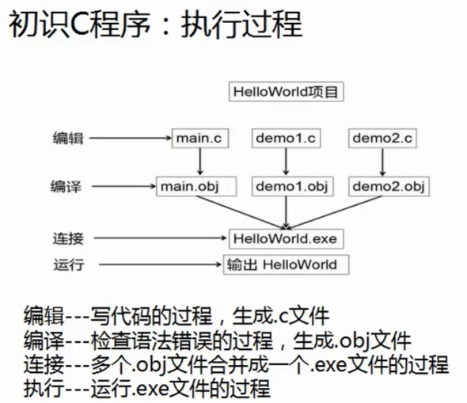
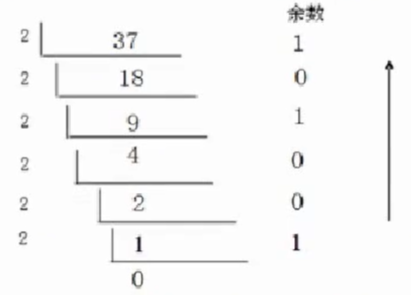
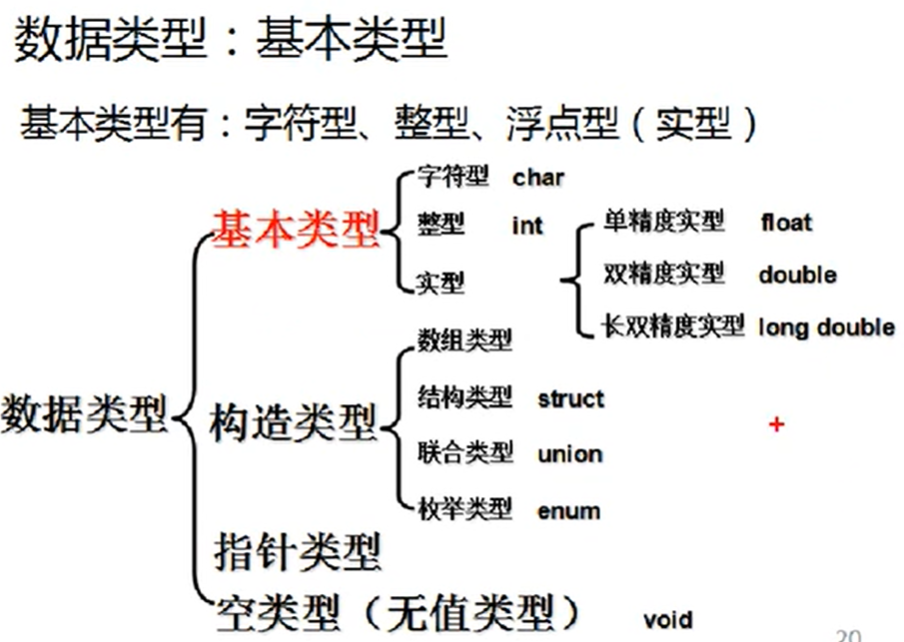
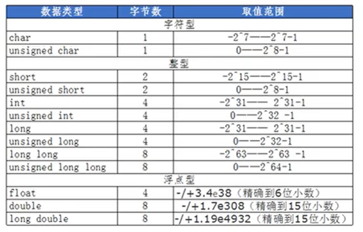

# 一、C基础知识

```c
// stdio.h 标准输入输出头文件
#include <stdio.h>  // 包含头文件 stdio.h   
int main() 
// c程序的执行入口，一个工程可以有多个源程序但有且只有一个main函数
{
	printf("%s\n","Hello World!"); // 格式化输出
	return 0;
}
```




## 进制转换

### 二进制数转十进制数:

1、先将二进制数按位权展开，再对其乘积相加，转换过程如下所示。

(10110)<sub>2</sub> = (1 \* 2<sup>4</sup> + 0 \* 2<sup>3</sup> + 1 \* 2<sup>2</sup> + 1 \* 2<sup>1</sup>  + 0 \* 2<sup>0</sup>  =  22 )<sub>10</sub>

2、8421法( 128  64  32  16  8  4  2  1 )

(1011 1101)<sub>2</sub> ---> ( 128 + 0 + 32 + 16 + 8 + 4 + 0 + 1 = 189 )<sub>10</sub>

### 十进制转二进制

二进制：0 和 1

八进制：0 ~ 7

十进制：0 ~ 9

十六进制：0 ~ 9 A B C D E F （a b c d e f 大小写均可）

1、除于2逆向取余法：除于2，逆向取余，直到商为零结束

(37)<sub>10</sub> ---> (100101)<sub>2</sub> 

  

2、逆转8421法               (128  64  32  16  8  4  2  1)

(37 = 32 + 4 + 1)<sub>10</sub>  ---> ( 0      0    1    0    0  1  0  1  )<sub>2</sub>

### 八进制转二进制

每1个八进制位转换为3个二进制位，左边不足3个则补零

( 567 )<sub>8</sub>  --->  (101  110  111)<sub>2</sub>

( 234 )<sub>8</sub>  --> ( 010   011  100 )<sub>2</sub>

### 二进制转八进制

从右向左，每3个二进制位为一组，每一组转换成一个八进制位

( 011  010  111  100  110 )<sub>2</sub>   --->    ( 3 2 7 4 6 )<sub>8</sub>

( 011  010  111  101  110 )<sub>2</sub>   --->    ( 3 2 7 5 6 )<sub>8</sub>

( 011  101  110  101  011 )<sub>2</sub>   --->    ( 3 5 6 5 3 )<sub>8</sub>

### 十六进制转二进制

每1个十六进制转成4个二进制位，左边不足4个则补0

( 109CBE )<sub>16</sub>   --->    ( 0001  0000  1001  1100  1011  1110 )<sub>2</sub>

( 5A7DF8 )<sub>16</sub>   --->    ( 0101  1010  0111  1101  1111  1000 )<sub>2</sub>

## 原码、补码、反码

数据在计算机中都是以==补码==的形式存储

- 正数的原码、反码、补码都是一样的!
- 符号位: 最左边的位即最高位，1表示负数，0表示正数。
- 负数的反码: 在原码的基础上“符号位不变，数值位取反”
- 负数的补码: 在反码的基础上“符号位不变，数值位加1”

​            原码         -->      补码     -->       反码     

17：   00010001 --> 00010001 --> 00010001

-17 ： 10010001 --> 11101110 --> 11101111

# 二、变量及数据类型

变量的概念: ==值可以发生改变的量==。

C语言的数据类型分为: ==基本类型==和==构造类型==两种



## 字符型

- 特殊的整型，占据==1个字节==(1byte---8bit)
- 有符号字符型==signed char==/==char==: 最高位（最左边）为符号位取值范围: 1000 0000(-128) ---- 0111 1111 (127 )
- 无符号字符型==unsigned char==:  没有符号位，都是数值位取值围:  0000 0000(0) --- 1111 1111(255)

## 整型

- 有符号的整型==signed  int==/==int==，占据==4byte== ( 32位)

1000 0000 0000 0000 0000 0000 0000 0000 --- 0111 1111 1111 1111 1111 1111 1111 1111

- 无符号的整型==unsigned  int==，占据==4byte==

0000 0000 0000 0000 0000 0000 0000 0000---1111 1111 1111 1111 1111 1111 1111 1111

- ==short  int==: 占据==2byte==

1000 0000 0000 0000(-32768)---0111 1111 1111 1111(32767)

- ==unsigned short int==: 占据==2byte==

00000 0000 0000 0000(0)---1111 1111 1111 1111(65535)

- ==long  int==: 占据==4byte==
- ==long long int== : 占据==8byte==

## 浮点型

没有无符号的浮点型数据

==float==: 单精度浮点型，占据==4byte==

==double==: 双精度浮点型，占据==8byte==
==long double==: 长双精度浮点型，占据8byte或16byte

## 取值范围



## 变量的定义及使用

命名规则： 变量名以字母、数字、下划线构成且第一个字符不能是数字，要符合标识符的命名规范，且不能是系统占用的单词，如关键字int、预定义标识符printf等。

变量先定义后使用

定义变量会在内存中开辟出一块该类型大小的空间。若变量未赋值时输出该变量则会输出是该空间上的原本的未知数。

# 三、运算符

<table border="1" cellpadding="0" cellspacing="0" style="width:612px;"><tbody><tr><td> <p><strong>优先级</strong></p> </td><td> <p><strong>运算符</strong></p> </td><td> <p><strong>名称或含义</strong></p> </td><td> <p><strong>使用形式</strong></p> </td><td> <p><strong>结合方向</strong></p> </td><td> <p><strong>说明</strong></p> </td></tr><tr><td rowspan="4"> <p><strong>1</strong></p> </td><td> <p><strong>[]</strong></p> </td><td> <p>数组下标</p> </td><td> <p>数组名[常量表达式]</p> </td><td rowspan="4"> <p>左到右</p> </td><td> <p>--</p> </td></tr><tr><td> <p><strong>()</strong></p> </td><td> <p>圆括号</p> </td><td> <p>(表达式）/函数名(形参表)</p> </td><td> <p>--</p> </td></tr><tr><td> <p><strong>.</strong></p> </td><td> <p>成员选择（对象）</p> </td><td> <p>对象.成员名</p> </td><td> <p>--</p> </td></tr><tr><td> <p><strong>-&gt;</strong></p> </td><td> <p>成员选择（指针）</p> </td><td> <p>对象指针-&gt;成员名</p> </td><td> <p>--</p> </td></tr><tr><td colspan="6"> <p></p> </td></tr><tr><td rowspan="9"> <p><strong>2</strong></p> </td><td> <p><strong>-</strong></p> </td><td> <p>负号<a href="https://so.csdn.net/so/search?q=%E8%BF%90%E7%AE%97%E7%AC%A6&amp;spm=1001.2101.3001.7020" title="运算符">运算符</a></p> </td><td> <p>-表达式</p> </td><td rowspan="9"> <p><strong>右到左</strong></p> </td><td rowspan="7"> <p>单目运算符</p> </td></tr><tr><td> <p><strong>~</strong></p> </td><td> <p>按位取反运算符</p> </td><td> <p>~表达式</p> </td></tr><tr><td> <p><strong>++</strong></p> </td><td> <p>自增运算符</p> </td><td> <p>++变量名/变量名++</p> </td></tr><tr><td> <p><strong>--</strong></p> </td><td> <p>自减运算符</p> </td><td> <p>--变量名/变量名--</p> </td></tr><tr><td> <p><strong>*</strong></p> </td><td> <p>取值运算符</p> </td><td> <p>*指针变量</p> </td></tr><tr><td> <p><strong>&amp;</strong></p> </td><td> <p>取地址运算符</p> </td><td> <p>&amp;变量名</p> </td></tr><tr><td> <p><strong>!</strong></p> </td><td> <p>逻辑非运算符</p> </td><td> <p>!表达式</p> </td></tr><tr><td> <p><strong>(类型)</strong></p> </td><td> <p>强制类型转换</p> </td><td> <p>(数据类型)表达式</p> </td><td> <p>--</p> </td></tr><tr><td> <p><strong>sizeof</strong></p> </td><td> <p>长度运算符</p> </td><td> <p>sizeof(表达式)</p> </td><td> <p>--</p> </td></tr><tr><td colspan="6"> <p></p> </td></tr><tr><td rowspan="3"> <p><strong>3</strong></p> </td><td> <p><strong>/</strong></p> </td><td> <p>除</p> </td><td> <p>表达式/表达式</p> </td><td rowspan="3"> <p>左到右</p> </td><td rowspan="3"> <p>双目运算符</p> </td></tr><tr><td> <p><strong>*</strong></p> </td><td> <p>乘</p> </td><td> <p>表达式*表达式</p> </td></tr><tr><td> <p><strong>%</strong></p> </td><td> <p>余数（取模）</p> </td><td> <p>整型表达式%整型表达式</p> </td></tr><tr><td rowspan="2"> <p><strong>4</strong></p> </td><td> <p><strong>+</strong></p> </td><td> <p>加</p> </td><td> <p>表达式+表达式</p> </td><td rowspan="2"> <p>左到右</p> </td><td rowspan="2"> <p>双目运算符</p> </td></tr><tr><td> <p><strong>-</strong></p> </td><td> <p>减</p> </td><td> <p>表达式-表达式</p> </td></tr><tr><td rowspan="2"> <p><strong>5</strong></p> </td><td> <p><strong>&lt;&lt;&nbsp;</strong></p> </td><td> <p>左移</p> </td><td> <p>变量&lt;&lt;表达式</p> </td><td rowspan="2"> <p>左到右</p> </td><td rowspan="2"> <p>双目运算符</p> </td></tr><tr><td> <p><strong>&gt;&gt;&nbsp;</strong></p> </td><td> <p>右移</p> </td><td> <p>变量&gt;&gt;表达式</p> </td></tr><tr><td colspan="6"> <p></p> </td></tr><tr><td rowspan="4"> <p><strong>6</strong></p> </td><td> <p><strong>&gt;&nbsp;</strong></p> </td><td> <p>大于</p> </td><td> <p>表达式&gt;表达式</p> </td><td rowspan="4"> <p>左到右</p> </td><td rowspan="4"> <p>双目运算符</p> </td></tr><tr><td> <p><strong>&gt;=</strong></p> </td><td> <p>大于等于</p> </td><td> <p>表达式&gt;=表达式</p> </td></tr><tr><td> <p><strong>&lt;&nbsp;</strong></p> </td><td> <p>小于</p> </td><td> <p>表达式&lt;表达式</p> </td></tr><tr><td> <p><strong>&lt;=</strong></p> </td><td> <p>小于等于</p> </td><td> <p>表达式&lt;=表达式</p> </td></tr><tr><td rowspan="2"> <p><strong>7</strong></p> </td><td> <p><strong>==</strong></p> </td><td> <p>等于</p> </td><td> <p>表达式==表达式</p> </td><td rowspan="2"> <p>左到右</p> </td><td rowspan="2"> <p>双目运算符</p> </td></tr><tr><td> <p><strong>！=</strong></p> </td><td> <p>不等于</p> </td><td> <p>表达式!= 表达式</p> </td></tr><tr><td colspan="6"> <p></p> </td></tr><tr><td> <p><strong>8</strong></p> </td><td> <p><strong>&amp;</strong></p> </td><td> <p>按位与</p> </td><td> <p>表达式&amp;表达式</p> </td><td> <p>左到右</p> </td><td> <p>双目运算符</p> </td></tr><tr><td> <p><strong>9</strong></p> </td><td> <p><strong>^</strong></p> </td><td> <p>按位异或</p> </td><td> <p>表达式^表达式</p> </td><td> <p>左到右</p> </td><td> <p>双目运算符</p> </td></tr><tr><td> <p><strong>10</strong></p> </td><td> <p><strong>|</strong></p> </td><td> <p>按位或</p> </td><td> <p>表达式|表达式</p> </td><td> <p>左到右</p> </td><td> <p>双目运算符</p> </td></tr><tr><td> <p><strong>11</strong></p> </td><td> <p><strong>&amp;&amp;</strong></p> </td><td> <p>逻辑与</p> </td><td> <p>表达式&amp;&amp;表达式</p> </td><td> <p>左到右</p> </td><td> <p>双目运算符</p> </td></tr><tr><td> <p><strong>12</strong></p> </td><td> <p><strong>||</strong></p> </td><td> <p>逻辑或</p> </td><td> <p>表达式||表达式</p> </td><td> <p>左到右</p> </td><td> <p>双目运算符</p> </td></tr><tr><td colspan="6"> <p></p> </td></tr><tr><td> <p><strong>13</strong></p> </td><td> <p><strong>?:</strong></p> </td><td> <p>条件运算符</p> </td><td> <p>表达式1?</p> <p>表达式2: 表达式3</p> </td><td> <p><strong>右到左</strong></p> </td><td> <p>三目运算符</p> </td></tr><tr><td colspan="6"> <p></p> </td></tr><tr><td rowspan="11"> <p><strong>14</strong></p> </td><td> <p><strong>=</strong></p> </td><td> <p>赋值运算符</p> </td><td> <p>变量=表达式</p> </td><td rowspan="11"> <p><strong>右到左</strong></p> </td><td> <p>--</p> </td></tr><tr><td> <p><strong>/=</strong></p> </td><td> <p>除后赋值</p> </td><td> <p>变量/=表达式</p> </td><td> <p>--</p> </td></tr><tr><td> <p><strong>*=</strong></p> </td><td> <p>乘后赋值</p> </td><td> <p>变量*=表达式</p> </td><td> <p>--</p> </td></tr><tr><td> <p><strong>%=</strong></p> </td><td> <p>取模后赋值</p> </td><td> <p>变量%=表达式</p> </td><td> <p>--</p> </td></tr><tr><td> <p><strong>+=</strong></p> </td><td> <p>加后赋值</p> </td><td> <p>变量+=表达式</p> </td><td> <p>--</p> </td></tr><tr><td> <p><strong>-=</strong></p> </td><td> <p>减后赋值</p> </td><td> <p>变量-=表达式</p> </td><td> <p>--</p> </td></tr><tr><td> <p><strong>&lt;&lt;=</strong></p> </td><td> <p>左移后赋值</p> </td><td> <p>变量&lt;&lt;=表达式</p> </td><td> <p>--</p> </td></tr><tr><td> <p><strong>&gt;&gt;=</strong></p> </td><td> <p>右移后赋值</p> </td><td> <p>变量&gt;&gt;=表达式</p> </td><td> <p>--</p> </td></tr><tr><td> <p><strong>&amp;=</strong></p> </td><td> <p>按位与后赋值</p> </td><td> <p>变量&amp;=表达式</p> </td><td> <p>--</p> </td></tr><tr><td> <p><strong>^=</strong></p> </td><td> <p>按位异或后赋值</p> </td><td> <p>变量^=表达式</p> </td><td> <p>--</p> </td></tr><tr><td> <p><strong>|=</strong></p> </td><td> <p>按位或后赋值</p> </td><td> <p>变量|=表达式</p> </td><td> <p>--</p> </td></tr><tr><td colspan="6"> <p></p> </td></tr><tr><td> <p><strong>15</strong></p> </td><td> <p><strong>，</strong></p> </td><td> <p>逗号运算符</p> </td><td> <p>表达式,表达式,…</p> </td><td> <p>左到右</p> </td><td> <p>--</p> </td></tr></tbody></table>

# 四、算法的基本结构

## 顺序结构

按语句书写的先后顺序依次执行的结构。

复合语句: 由大括号中的0个或多个声明和语句列表共同构成。

```c
int main()
{
	int a = 5;
	int b = 2;
	{
		int a = 10;
		printf("%d\n",a); // 10
		b++;
		printf("%d\n",b); // 3
	}
	printf("%d\n",a); // 5
	printf("%d\n",b);  // 3
	return 0;
}
```


## 选择结构（分支结构）

### if  /  else if  / else语句

```c
if(条件表达式1)
{
    语句1;
} 
else if(条件表达式2)
{
    语句2;
}
else if(条件表达式3)
{
    语句3;
}
else:
{
    语句4;
}
// 执行过程:依次判断条件表达式的值，当某个值为真时，则执行相应的语句，然后跳出整个if语句之外，继续执行后面的程序。如果所有的表达式都为假，则执行else语句。
```

### switch语句

```c
switch(表达式)
{
    case 常量表达式1: 语句1(集合);
    case 常量表达式2: 语句2(集合);
    ...
    case 常量表达式n: 语句n(集合);
    default: 语句n+1;
}
// 执行过程:首先计算表达式的值，与常量表达式i进行比较，如果与其中一个常量表达式i的值相等，就执行其后的语句直到遇到break语句才结束switch 语句，如果case后无 break语句，则继续执行随后所有的case后的语句。如果没有找到与表达式的值相匹配的常量表达式，则执行default后的语句n+1。
```

### 条件运算符和条件运算表达式

`表达式1 ? 表达式2  : 表达式3;`

求值过程: 如果表达式1的值为真，则以表达式2的值作为条件表达式的值否则以表达式3的值作为条件表达式的值.

##  循环结构

### while 语句

```c
while(循环条件表达式)
{
    循环体语句;
}
// 执行过程:只有循环条件表达式的值为真就执行循环体语句，先判断后执行。
```

### do ... while 语句

```c
do
{
    循环体语句;
}while(循环条件表达式);
// 执行过程:先执行循环体语句，再检查循环条件表达式的值是否为真，如果为真则继续执行循环体语句，否则结束循环。,
```

### for 语句

```c
for(表达式1;表达式2;表达式3)
{
    循环体语句;
}
/*
说明:
表达式1:设置初始条件，只执行一次，为0个或多个变量设置初值。
表达式2:是循环条件表达式，用来判定是否继续循环。在每次执行循环体之前要先执行表达式2，然后再决定是否继续执行循环。
表达式3:作为循环的调整，比如是循环体变量增值，它是执行循环体语句之后再执行。
*/
```

### 中断语句

break语句: 跳出本层循环，执行循环后的语句。

continue语句: 跳出本次循环，执行下一次循环。

goto语句: 跳出到指定的标号位。

# 五、函数

## 函数概念

函数是完成==一个个特定任务的语句==集合，它能完成你所想要的某种特定任务，当你要用时，只需要调用它即可，在后续的修改或是维护过程中，只需要针对这—个进行修改即可。

使用函数的好处:

1. 减少程序的代码量
2. 代码复用
3. 使程序具有良好的结构

## 函数的定义

函数的定义∶包括两个部分，分别是“函数头”和“函数体”。

```c
返回值数据 类型函数名(数据类型 形参1,数据类型 形参2...)//函数头(
	//函数体（可以有多条语句)
}
```

函数定义需要注意的问题：

1. 函数的返回值和参数可以是任意类型，包括空类型!!!当函数无返回值或无形参列表时，建议用void指明
2. 函数名是一种标识符，必须符合标识符的命名规则!建议单词首字母不大写。
3. 函数的参数可以没有，也可以有多个参数
4. ==一个项目中必须要有一个主函数且只有一个==，没有主函数，程序找不到执行的入口，代码无法运行。
5. 函数头要有头注释(功能，参数，返回值)，函数定义不可以嵌套。

6. 函数如果不被调用，就不会执行

函数的声明函数声明的好处∶

1. 函数列表更加一目了然，方便使用。
2. 便于多人合作共同开发。
3. 可以用于商业，保护知识产权(只将调用方式告诉他人，但是函数中具体的实现算法隐藏）。

声明的方式∶只保留函数头且后面加分号,通常放在包含头文件的下面。

例子：

```c
#include <stdio.h>

void fun1(); // 声明函数
int fun2(int a,int b,char c);

// 主函数
int main(void)
{
	int res;
	fun1(); // 调用函数
	fun1();
	res = fun2(3,2,'+');
	printf("res = %d\n",res);
	return 0;
}

// 定义函数
void fun1(void)
{
	printf("**********\n");
	printf("==========\n");
}

int fun2(int a,int b,char c)
{
	int res;
	switch(c)
	{
		case '+': res = a + b;break;
		case '-': res = a - b;break;
		case '*': res = a * b;break;
		case '/': res = a / b;break;
		default: printf("请从+、-、*、/中选择运算符\n");
	}
	return res;
}
```

## 递归调用

递归的概念

语言中的函数可以递归调用，即: 可以直接或者间接地自己调用自己。

递归恩想应该关注的几点：

- 找到规律
- 递归调用的条件
- 结束递归调用的条件

```c
int fac(int n);

int main()
{
	printf("%d\n",fac(5)); // 120
	return 0;
}

// 求阶乘
int fac(int n)
{
	if(n < 1)
		return -1;
	else if(n == 1)
		return 1;
	else 
		return n * fac(n - 1);
}
```

## 作用域

作用域:  一个代码空间。

分类:

- 文件作用域: 从文件头到文件尾的代码空间
- 函数作用域: 函数的参数和函数体属于函数作用域，函数的返回值和函数名属于文件作用域
- 语句块作用域
- 结构体作用域

注意：

1. 在同一个作用域内，不能出现相同的标识符，同一个作用域内，不能重复定义变量名。
2. 一个标识符不能同时属于两个作用域，使用就近原则

## 局部变量和全局变量

局部变量: 就是在函数作用域或者是语句块作用域中定义的变量。

全局变量: 就是在文件作用域中定义的变量（实际开发中尽量不要使用全局变量）。

```c
int a; // a的作用域是文件作用域，全局变量
int fun(int n); // 函数声明，扩展函数作用域（使用范围）

int main()
{
	int b = 0; // 函数作用域，局部变量
	a = 0;
	{
		int s = 1; // 代码块作用域，局部变量
	}
	return 0;
}

int fun (int b) // b也是函数作用域，局部变量
{
	return b;
}
```


全局变量和函数都属于文件作用域内的标识符，文件作用域内的标识符是可以通过extern扩展作用域的!

```c
extern int a; // 扩展作用域范围

int main()
{
	a = 100;
	return 0;
}

int a = 0;
```

## 存储类别

存储类别解决的是标识符的“生命周期”或者变量内存的开辟时间和销毁时间

### 栈变量: auto声明的变量

变量内存开辟时间:  栈变量是在执行到变量定义语句时开辟内存

变量内存销毁时间: 所在作用域结束后销毁。

==注意: 只有局部变量可以用auto修饰，全局变量不行，默认情况下是可以省略。==

### 静态区变量: 用static声明的变量

变量内存开辟时间: 编译时,

变量内存销毁时间: 主函数结束时。

==全局标识符如果用static修饰，表示该标识符只能在本文件内被扩展使用。==

# 六、数组

数组概念:

- 类型相同的数据元素的集合。
- 这个类型可以是基本的数据类型，也可以是"构造类型"
- 这些数据元素只能顺序的存放在内存的某段区域。

## 一维数组

### 数组定义

数据类型  数组名1[EXP],数组名2[EXP],...;

注意：

1. 数组的长度: EXP表示数组元素的个数即"数组的长度"
2. EXP为整型常量表达式，不能包含变量。整型常量表达式: 只能是字面值组合而成的表达式
3. 数组的长度和类型最好用宏定义的形式， ==#define==

```c
#include <stdio.h>

// 宏定义，在编译之前会将所有SIZE替换为5
// 注意：末尾没有分号
#define SIZE 5

int main()
{
	int a = 5;
	int arr1[5];
	int arr2[a + 1]; // 错误，不能包含变量 
	// 使用宏定义方便对代码的修改
	int arr3[SIZE];
	int arr4[SIZE];
	return 0;
}
```

数据类型  数组名[数组元素个数] = {第一个元素值，第二个元素的值.…};

### 数组的初始化

```c
int main()
{
	int arr1[5] = {1,2,3,4,5}; //全部赋初值
	int arr2[5] = {1,2}; // 部分赋初值，未赋值的元素默认为0
	int arr3[] = {1,2,3,4,5}; // 省略长度赋初值,数组的长度根据初值个数决定
    int arr4[5]; // 未赋初值，arr4z中的元素不是零，而是未知数
	return 0;
}
```

注意：

初值的个数不能大于数组的长度，否则会产生运行时错误。

每个初值的类型最好与数组的类型—致。

### 数组的存储

数组可以用来存储多个数据，数组占用多个连续的内存空间，这些内存空间用来存储数据。

注意：

1. 保存数组所需字节单元的个数与数组的类型和长度有关，总字节数= sizeof(数组类型)*数组长度
2. 数组长度的计算可以采用sizeof的方式完成

```c
int main()
{
	int arr[5] = {1,2,3,4,5}; 

	printf("arr占的总字节数 = %d\n",sizeof(int)*5); // 输出数组arr占据的字节数
	printf("arr占的总字节数 = %d\n",sizeof(arr));
	printf("arr的长度 = %d\n",sizeof(arr) / sizeof(int)); // 输出arr的长度
    printf("arr占的总字节数 = %d\n",sizeof(arr[0])); // 输出数组中元素所占的字节
	return 0;
}
```

### 数组的引用

引用普通变量时，直接使用变量名；而引用数组元素时，使用数组名[下标]。

注意:  如有数组int arr[N];测数组的下标为:0~N-1，即最大的下标为数组长度-1。

```c

#define SIZE 5

int main()
{
	int i;
	int arr[SIZE]; 
	for(i = 0;i < SIZE;i++)
	{
		printf("请输入数组的第%d个元素:",i+1);
		scanf("%d",&arr[i]);
	}

	for(i = 0;i < SIZE;i++)
	{
		printf("数组的第%d个元素为%d:\n",i+1,arr[i]);
	}
}
```

### 数组作为函数参数

数组作为函数参数可以理解为形参数组和实参数组共享—块内存空间，形参数组的长度可以省略,编译器不会检查。

```c
void fun(int arr[])
{
	arr[2] = 11111;
}
int main()
{
	int a[] = {1,2,3,4,5};
	printf("第三个元素: %d\n",a[2]); // 3
	fun(a);
	printf("第三个元素: %d\n",a[2]); // 11111
}
```

## 二维数组

### 二维数组的定义

`数据类型 数组名1[EXP1],[EXP2],……;`

注意：

EXP1:行数   EXP2:列数

二维数组表示多个类型相同的数据元素的集合，等于同时定义多个变量，这些变量的名字∶`数组名[行标][列标]`;

一个二维数组还可以理解为多个类型和长度相同的一维数组的集合。``int a[4][5]`` //相当于定义了4*5=20个变量，相当于定义了4个一维数组

### 二维数组的存储

二维数组占用多个连续的内存空间

`int a[2][3];` // 在内存中的结构

|    0     |    1     |    2     |    3     |    4     |    5     |
| :------: | :------: | :------: | :------: | :------: | :------: |
| a[0]\[0] | a[0]\[1] | a[0]\[2] | a[1]\[0] | a[1]\[1] | a[1]\[2] |

总字节数 =  sizeof(数组类型) * 行数 * 列数

### 二维数组的引用

方法同一维数组: 区别就是它使用的双下标。`数组名[行下标][列下标]`

### 二维数组的初始化

1、按行全部赋初值

`int a[2][3] = {{1,2,3},{4,5,6}};`

2、按存储顺序全部赋初值

`int a[2][3] = {1,2,3,4,5,6};`

3、部分赋初值（按存储顺序)

`int a[2][3] = {1,2,3};`  其它未赋值的元素为该元素类型的默认值

4、部分赋初值（按行部分赋值)

`int a[2][3] = {{1,2},{4,5}};`

5、省略行数赋初值

`int a[][3] = {{1,2,3},{4,5,6},{7,0,0}}`

`int a[][3] = {1,2,3,4,5,6,7,0,0}` // 同上

==注意： 不能省略列==

### 二维数组的遍历

```c
int main()
{
	int a[2][3] = {{1,2,3},{4,5,6}};
	int i,j;
	for(i = 0;i < 2;i++)
	{
		for(j = 0;j < 3;j++)
		{
			printf("%d\t",a[i][j]);
		}
		printf("\n");
	}
	return 0;
}
```

# 七、结构体

## 结构体的概念

C语言中，可以自己构造出自己想要的数据类型，这种类型叫做复合数据类型。

结构体: 是由一系列具有相同类型或不同类型的数据构成的数据集合。

结构体是一种可以由我们自己定义的数据类型。

## 结构体的定义

定义语法∶

```c
struct 结构体名{
	成员列表
};

//定义结构体，存放学生的序号、成绩数组、平均分
struct student
{
	int id;
	int score[2];
	float avg;
};

int main()
{
	struct student Tom = {111,{100,99},99.5}; // 赋初值
    struct student Zhang = {111,100,99.5}; // avg未赋值，默认值为0.000000
    Tom.id = 222; // 单独修改
	struct student class1[50];
	return 0;
}
```

说明：

- 定义了一个结构体类型，结构体的关键字---struct，结构体名为student。
- 这个结构体包含了多个不同的基本数据类型。

注意∶

1、结构体的类型可以多种，名字由关键字struct和结构体名组合而成。

2、访问成员的规则:

1. 结构体普通变量通过"."来访问成员，例如∶Tom.num
2. 结构体指针变量通过"->"来访问成员,例如︰p->id


```c
int main()
{
	struct student Tom = {111,100,99.5}; // 赋初值
    Tom.id = 222; // 单独修改
	struct student class1[50];
	return 0;
}
```

省略结构体名，直接定义结构体变量

```c
struct{
	数据类型 成员变量名;
    数据类型 成员变量名;
    数据类型 成员变量名;
	......;
}变量名列表;

struct
{
	int id;
	int score;
	float avg;
}Tom,ZhangSan;
```

==注意： 只能定义一次，接下来不能再定义结构体变量了。==

## typedef的使用

注意: 它不是用来创造类型的，而是给已有的类型取一个别名。

语法: ` typedef 已有的类型 别名;`

注意∶别名后面的分号;不能省略

```c
typedef int AAA;

int main()
{
	int a = 0;
	AAA b = 0; // 相当于int b
	return 0;
}
```

```c
typedef struct student
{
	int id;
	int age;
}STU; // STU是结构体struct student的别名

struct stu
{
	int id;
	int age;
}Tom; // Tom是结构体struct student的变量

int main()
{
	struct student stu1;
	struct student class1[3]; // 结构体数组
	STU stu2;
	STU class2[3];
	struct stu a;

	stu1.id = 111;
	stu2.id = 222;
	Tom.age = 20;
	a.id = 333;
		
	return 0;
}
```

# 八、指针

## 指针的概念

变量是要占据内存的，内存的大小由数据类型决定。变量名是内存的标识，用来读写内存。内存是有地址的，每个字节都有一个唯一的整数作为编号，这个整数就是地址。

==指针就是地址（常量）==

获取变量的地址: 取地址符号 ==&==

```c
int main()
{
	int a = 123; 
	printf("%d\n",a); // 输出a的值            123
	printf("%d\n",&a); // 输出a的地址（指针）   1703728
	printf("%x\n",&a); // 以十六进制的形式输出  19ff30
	printf("%p\n",&a); // 十六进制            0019FF30
    return 0;
}
```

c语言中数据类型与内存大小之间的关系

- char           绑定1byte
- int              绑定4byte
- float           绑定4byte
- double       绑定8byte

## 指针变量

```c
int main()
{
	int a;
	// 定义int型指针变量，可以存放int型变量的地址
	int *p; // int *是类型名, p是变量名
    int *b,c,*d; // b和d是指针变量，c是普通int型变量
	a = 10;// 把10存放到a的内存块中
	p = &a;// 把a的地址存放到p的内存块中
	return 0;
}
```

## 指针变量的使用

```c
int main()
{
	int a = 111;
	int *p;
	p = &a;
	printf("a的值: %d\n",a);    // a的值：111
	printf("a的地址: %d\n",&a); // a的地址：1703728
	printf("p的值：%d\n",p);    // p的值：1703728
	printf("p的地址：%d\n",&p); // p的地址：1703724
	printf("*p的值：%d\n",*p);  // *p的值: 111   间接访问指针指向的内容
	*p = 222;  // 修改指针指向的内容。相当于a = 222;
	printf("a的值: %d\n",a);    // a的值: 222
	printf("*p的值：%d\n",*p);  // *p的值：222
	return 0;
}
```

## 指针的运算

- char *---绑定1个byte
- int * ---绑定4个byte
- float *--- 绑定4个byte
- double * ---绑定8byte

```c
int main()
{
	int a = 0;
	int *p;
	char ch = 0;
	// a 为int类型占四个字节
	p = &a; // p 指向a的第一个字节
	// p 为整形的指针变量
	*p = 10; // 相当于 a = 10; *p一次性操作四个字节
	ch = 20;
	// 类型不兼容，有警告但可以运行
	p = &ch; // 指向ch的地址
	//  char 取值范围 -128 —— +127
	*p = 100; // *p一次性操作四个字节，但ch只占一个字节，另外三个字节不属于ch
	printf("%d\n",ch); // 100
	return 0;
}
```

```c
int main()
{
	char ch;
	int a;
	float b;
	double c;
	// 指针存的地址，只需要四个字节就足够了
	// 指针变量所占的字节大小个基类型无关
	char *p1;
	int *p2;
	float *p3;
	double *p4;
	printf("%d\n",sizeof(ch)); // 1
	printf("%d\n",sizeof(a)); // 4
	printf("%d\n",sizeof(b)); // 4
	printf("%d\n",sizeof(c)); // 8
	printf("%d\n",sizeof(p1)); // 4
	printf("%d\n",sizeof(p2)); // 4
	printf("%d\n",sizeof(p3)); // 4
	printf("%d\n",sizeof(p4)); // 4
	return 0;
}
```

### 指针偏移

```c
int main()
{
	char ch = 0;
	int a = 0;
	float b = 0;
	double c = 0;
	char *p1 = &ch;
	int *p2 = &a;
	float *p3 = &b;
	double *p4 = &c;
	// 偏移量和基类型有关
	printf("%d\n",&ch); // 1703728
	printf("向后偏移一个存储单元：%d\n",&ch + 1); // 向后偏移一个存储单元：1703729 （1byte）
	printf("%d\n",&a);  // 1703724
	printf("向后偏移一个存储单元：%d\n",&a + 1);  // 向后偏移一个存储单元：1703728 （4byte）
	printf("%d\n",&b);  // 1703720
	printf("向后偏移一个存储单元：%d\n",&b + 1);  // 向后偏移一个存储单元：1703724 （4byte）
	printf("%d\n",&c);  // 1703712
	printf("向后偏移一个存储单元：%d\n",&c + 1);  // 向后偏移一个存储单元：1703720 （8byte）
	return 0;
}
```

```c
int main()
{
	int a = 10;
	int *p = &a;
	printf("%d\n",(*p)++); // 10 相当于a++
	printf("%d\n",++(*p)); // 12 ++a
	// ++ 和 * 优先级一样 ，自右向左运算，先运算*p再++
	printf("%d\n",++*p); // 13
	printf("a的值：%d\n",a); // a的值：13
	printf("a的地址：%d\n",&a); // a的地址：1703728
	printf("p的值：%d\n",p); // p的值：1703728
	printf("*p的值：%d\n",*p); // *p的值：13
	// ++在后，先输出*p的值，然后再对指针p做偏移
	printf("%d\n",*p++); // 13
	printf("a的值：%d\n",a); // a的值：13
	printf("a的地址：%d\n",&a); // a的地址：1703728
	printf("p的值：%d\n",p); // p的值：1703732
	printf("*p的值：%d\n",*p); // *p的值：1703796（偏移后p指向a后面一个存储单位（野指针），未知数）
	return 0;
}
```

## 空指针和野指针

空指针常量: 不同的系统规定的不同，一般C中是 0 或者（void*）0

为了避免系统不同带来的不便，一般会把空指针常量定义成宏的形式来实现空指针常量

有的系统是这样定义的 `define NULL 0`

```c
int main()
{
	int a = 0;
	int *p = NULL;
	// *p = 20; // 错误，p为空指针，无法访问
	printf("%d\n",a); // 
	{
		int b = 0;
		p = &b;
	}
	*p = 50; //p为野指针,b已被销毁
	printf("%d\n",*p); 
	return 0;
}
```

## 数组的地址

通过数组的首地址来引用数组元素

- C语言中，在函数体中和函数外部定义的数组名可以认为是一个存放地址值的指针变量名，其中的地址值为数组第一个元素的地址，也就是数组所占一串连续存储单元的起始地址。
- 重要的是: 这个指针变量中的地址值是不可改变的，也就是说不可以给数组名重新赋值。因此可以认为数组名是一个地址常量。

```c
int main()
{
	// 数组元素的地址是连续的
	int a[5] = {1,2,3,4,5};
    int *p = a; // 相当于 p = &a[0]
	printf("a[0]的地址：%d\n",&a[0]);
	printf("a[1]的地址：%d\n",&a[1]);
	printf("a[2]的地址：%d\n",&a[2]);
	printf("a[3]的地址：%d\n",&a[3]);
	printf("a[4]的地址：%d\n",&a[4]);
	printf("a代表的地址：%d\n",a); // 数组名代表数据首元素地址,即&a[0]
	printf("a+1代表的地址：%d\n",a+1); // &a[1]
	printf("a+2代表的地址：%d\n",a+2);
	printf("a+3代表的地址：%d\n",a+3);
	printf("a+4代表的地址：%d\n",a+4);
    printf("p代表的地址：%d\n",p); 
	printf("p+1代表的地址：%d\n",p+1);
	printf("p+2代表的地址：%d\n",p+2);
	printf("p+3代表的地址：%d\n",p+3);
	printf("p+4代表的地址：%d\n",p+4);
    // a = &a[2]; // 错误，数组名代表数组首元素的地址即&a[0]，是一个常量，不可以修改
    printf("a[0]的值：%d\n",a[0]);
	printf("p[0]的值：%d\n",p[0]); // 相当于a[0]

	return 0;
}
```

总结: 通过数组的首地址来引用数组元素有两种方法:

- 数组名[下标]
- *(数组名 +下标) 

### 行指针

- &a表示二维数组地址
- a表示首行地址。
- &a[0]表示首行地址。
- a[0]表示首行首元素地址。
- a\[0][0]表示首行首元素的值。
- &a\[0][0]表示首行首元素地址。

```c
int main()
{
	int a[3][4] = {{1,3,5,7},{9,11,13,15},{17,19,21,23}};
	int *p = &a[0][0];
	int i,j;
	for(i = 0;i < 3;i++)
	{
		for(j = 0;j < 4;j++)
		{
			printf("%d\t",*(p++));
		}
		printf("\n");
	}
	return 0;
}
```

```c
int main()
{
	int a[3][4] = {
		{1,2,3,4},
		{5,6,7,8},
		{9,0,1,2}
	};
	int *p; // 绑定一个变量的地址
	// 定义了一个行指针，是指针变量，
	// 只能存放长度为N的int型数组的地址,绑定的是一行
	int (*p2)[4];
	// p = a; // 错误，a绑定的是第一行，类型级别不匹配
	p = &a[0][0];
	p = a[0]; // 相当于 p = &a[0][0];
	printf("%d\n",*p); // 1
	p2 = a;
	printf("%d\n",*p2); // 1703684

	printf("p代表的地址：%d\n",p); // p代表的地址：1703684
	printf("p2代表的地址：%d\n",p2); // p2代表的地址：1703684
	p = p + 1;
	p2 = p2 + 1;
	printf("p代表的地址：%d\n",p); // p代表的地址：1703688
	printf("p2代表的地址：%d\n",p2); // p2代表的地址：1703700
	return 0;
}
```

行指针: 存放一维数组首地址，绑定一行

`int a[3][4] = {{1,3,5,7},{9,11,13,15},{17,19,21,23}};`

<table border = '1px' align = 'center'>
    <tr align = 'center'>
    	<td colspan='2'></td>
        <td>a[0]+0</td>
        <td>a[0]+1</td>
        <td>a[0]+2</td>
        <td>a[0]+3</td>
    </tr>
    <tr align = 'center'>
    	<td rowspan = '3'>行<br>指<br>针</td>
        <td>a[0]</td>
        <td>1</td>
        <td>3</td>
        <td>5</td>
        <td>7</td>
    </tr>
    <tr align = 'center'>
        <td>a[1]</td>
        <td>9</td>
        <td>11</td>
        <td>13</td>
        <td>15</td>
    </tr>
    <tr align = 'center'>
        <td>a[2]</td>
        <td>17</td>
        <td>19</td>
        <td>21</td>
        <td>23</td>
    </tr>
    <tr align = 'center'>
        <td colspan = '2'></td>
        <td>*(a+2)+0</td>
        <td>*(a+2)+1</td>
        <td>*(a+2)+2</td>
        <td>*(a+2)+3</td>
    </tr>
</table>


```c
void output(int *a[],int row,int col)
{
	int i,j;
	for(i = 0;i < row;i++)
	{
		for(j = 0;j < col;j++)
		{
			printf("%d\t",*(*(a+i)+j));
		}
		printf("\n");
	}
}
```

output函数的函数头可以有以下三种形式:

- output(int **a)
- output(int *a[])
- output(int *a[N])

### 结构体指针

结构体指针怎么访问结构体成员变量:

结构体指针->成员变量,
(*结构体指针).成员变量

```c
typedef struct stu
{
	int num;
	int score;
	int a[5];
}STU;

int main()
{
	STU Tom = {111,100};
	STU *p; // 结构体指针变量
	p = &Tom;
	Tom.num = 222;
	p->score = 99; // 相当于Tom.score = 99;
	(*p).num = 333; // 相当于Tom.num = 333;
	p->a[0] = 10; // Tom.a[0] = 10;
	printf("请输入序号：");
	scanf("%d",&p->num); // 相当于scanf("%d",&Tom.num);
	printf("序号：%d\n",p->num);
	printf("成绩：%d\n",p->score);
	return 0;
}
```

# 九、字符串

## 字符串常量

用一对单引号引起来的一个字符，要求单引号里面有且仅有一个字符，在内存中以ASCII码的形式存储，占据一个字节。

- 普通字符常量:  注意单引号、双引号和斜杠三个特殊字符的写法 `'\\'	'\''	'\"'`即必须在前面加\字符。
- 转义字符常量:
  数值转义:  'xhh': hh表示后面跟1~2位16进制数最大为'\FF'。
                      '\ddd':ddd_跟1~3位八进制数不能超过unsigned char的最大值，因此最大为\377 。                                                                             字符转义：'\t'    '\n'

```c
int main()
{
	char c = 0; // 字符型，-128 --127，占据1个字节
	c = ' '; // 由一对单引号''括起来的一个字符，占据一个字节
	// c = ''; // 错误，不能是0个字符
	// c = 'AB'; // 错误,不能是多个字符
	// c = '啊'; // 错误，一个中文占据2个字节
	printf("%d\n",c);
	printf("%c<-空格\n",c);
	c = 'B' + 32; // 大写转小写
	printf("%d\n",c);
	printf("%c\n",c);
	c = '9' - '0'; // 数字字符转成对应的数字
	printf("%d\n",c);
	return 0;
}
```

## 字符串常量

用一对双引号包含的字符，在内存中存放时，以’\0’为结束标识（\0是数值转义字符，对应的ASCI码为数值0）。

```c
#include <stdio.h>
#include <string.h>

int main()
{
	printf("%s\n","abcDEF");
	printf("占据的字节数：%d\n",sizeof("abcDEF")); // 7   以'\0'结尾
	printf("长度：%d\n",strlen("abcDEF")); // 6 需要包含头文件<string.h>
	printf("\n");
	printf("%s\n","abc\0DEF"); // abc
	printf("占据的字节数：%d\n",sizeof("abc\0DEF")); // 8 
	printf("长度：%d\n",strlen("abc\0DEF")); // 3 strlen()从左往右遇到第一个\0截止
	printf("\n");
	// 字符串:由一对双引号括起来的0个或多个字符
	printf("占据的字节数：%d\n",sizeof("")); // 1  '\0'结尾 
	printf("长度：%d\n",strlen("")); // 0
	return 0;
}
```

## 字符数组

```c
int main()
{
	char str1[5] = {'A','B','C','D','\0'}; // 以'\0'结尾
	char str2[5] = {'a','b','c'}; // 部分赋初值，会自动在末尾加'\0'，即a[3] = '\0'
	char str3[5] = "qwer"; // 系统会自动在后面加'\0'，所以总长度不能超过数组长度
	char str4[] = "asdfghjkl"; // 长度为9
	int i = 0;
	for(i = 0;i < 5;i++)
	{
		printf("%c",str1[i]);
	}
	printf("\n");
	printf("%s\n",str1);
	printf("%s\n",str2);
	printf("%s\n",str3);
	printf("%s\n",str4);
	return 0;
}
```

## 字符串的存储结构和指针

```c
int main()
{
	char str[10] = "ABCD";
	char *p,*p1; // char型指针变量
	p = str; // p = &str[0];
	printf("%s\n",str); // ABCD
	printf("%s\n",p); // ABCD
	*(p+2) += 32; // p[2] += 32; // str[2] += 32;
	printf("%s\n",str); // ABcD
	printf("%s\n",p); // ABcD
	p1 = "HIJK"; // 指向字符串常量首地址
	// *p1 = 'R'; // 不可修改
	printf("%s\n",p1); // HIJK
	printf("%s\n",p1 + 2); // JK
	return 0;
}
```

## 字符串的输入与输出

输出：

```c
int main()
{
	char str[10] = "ABCD";
	char ch = 'a';
	printf("%s\n",str); // 字符串输出
	puts(str); // 字符的输出函数，会自动换行
	printf("%c\n",ch);//单个字符的输出
	putchar(ch);//单个字符的输出函数,不会自动换行
	return 0;
}
```

输入：

```c
int main()
{
	char str[10] = "ABCD";
	char ch = 'a';
	printf("请输入一个字符：");
	scanf("%c",&ch); // 单个字符的输入
	printf("%c\n",ch);
	getchar();
	printf("请输入一个字符：");
	ch = getchar(); // 单个字符的输入
	putchar(ch);
	printf("请输入一个字符串：");
	scanf("%s",str); // 字符串的输入
	printf("%s\n",str);
	getchar(); // 消除回车符影响后面的输入
	printf("请输入一个字符串：");
	gets(str); // 字符串的输入函数
	puts(str); // 字符串的输出函数
	return 0;
}
```

## 字符串处理函数

注意必须包含 stdio.h 和 string.h

1. 求字符串长度函数
     int strlen ( const char*pStr) //参数: 字符串指针    返回值: 长度
2. 字符串复制函数
   char* strcpy(char* pDes, const char* pSrc) // 参数：目标字符串指针  源字符串指针      返回值：目标字符串指针
3. 字符串连接函数
   char* strcat(char* pDes, const char* pSrc) // 参数：目标字符串指针  源字符串指针      返回值：目标字符串指针
4. 字符串比较                                                                                                                                                                                                                   int strcmp(const char * pDes , const char * pSrc);
   设这两个字符串为str1，str2
   若str1==str2，则返回零;
   若str1<str2，则返回负数;
   若str1>str2，则返回正数。
   比较规则: 从左向右的字符两两比较，如果相同则继续向后比较，直到遇到第一个不相同的字符就以该不同的字符作为比较的依据。

```c
#include <stdio.h>
#include <string.h>

int main()
{
	char s1[10] = "ABCDE";
	char s2[10] = "哈哈";
	char s3[10] = "QWER";
	char s4[10] = "abcd";
	char s5[10] = "abed";
	char *p;
	// 求字符串长度函数
	int len = strlen(s2); // 4
	printf("%d\n",len);
	// 字符串复制函数
	p = strcpy(s1,s2); // 注意目标地址，不要越界了
	puts(s1); // 哈哈
	puts(s2); // 哈哈
	puts(p); // 哈哈
	// 字符串连接函数
	p = strcat(s2,s3);
	puts(s2); // 哈哈QWER
	puts(s3); // QWER
	puts(p); // 哈哈QWER
	// 字符串比较
	printf("%d\n",strcmp(s4,s5)); // -1   s4 < s5
	return 0;
}
```

# 十、内存管理

一切皆占内存!
C/C++中的变量、常量、函数都是占据内存的，系统将内存划分为5个存储区，这些存储区是系统划定的，是真实存在的实事，不需要人为干预。也就是说我们写好一段程序之后，系统会自动的将常量、变量或者函数自动划分到不同的存储区中。不同的存储区内存的开辟时间和销毁时间是不同的，同时每一个存储区占据的内存是连续的!这样做的目的是为了提高程序的运行效率。这5个存储区分别为: 常量区、代码区、栈区、堆区、 全局区（静态区）

## 五大存储区（常量区   代码区   栈区   静态区   堆区)

1、常量区：

- c语言中常量是占据内存的，系统将常量集中存储在一块连续的内存空间中，常量区的内存具备“只读性”，不能改写。这块存储常量的内存空间叫做常量区。
- 存放常量
- 开辟时间:  编译时
- 释放时间:  程序结束后由系统释放。

2、代码区

- 存放函数体的二进制代码
- 开辟时间:  编译时
- 释放时间:  程序结束后由系统释放

3、栈区 auto

- 局部变量:  函数作用域或者语句块作用域内定义的变量
- 全局变量:  文件作用域内定义的变量
- 要点1:  用auto声明的变量就是栈区变量
- 要点2:  只有局部变量能声明auto，全局变量不能用auto声明
- 要点3:  形式参数只能用auto声明
- 要点4:   auto通常是省略的
- 内存开辟时间:  运行时
- 内存销毁时间:  变量所在的作用域结束后

补充知识：

- register:  寄存器变量。
- 要点1:  存储在CPU的寄存器中不占据内存，因此没有地址。
- 要点2:  寄存器变量是建议性的，是否真的为寄存器变量取决于编译器要点3:通常将使用频率较高的变量声明为寄存器变量。

4、静态区(全局区)  static 

- 开辟时间:  编译时执行，以后再也不会执行
- 销毁时间:  主函数结束后
- 要点1:  形式参数一定不能用static声明!
- 要点2:  全局变量用static声明表示文件作用域，否则表示可以在其他文件内扩展使用

补充知识点:

​			静态函数和非静态函数的区别在于,静态函数具备文件作用域，不能在其他文件扩展使用

5、堆区

用 malloc() 或者 calloc() 函数创建的变量。

区别:

1. 两者都是动态分配内存。主要的不同是malloc,不初始化分配的内存，已分配的内存中可以是任意的值。calloc初始化已分配的内存为0。
2. calloc分配的是一个数组，而malloc分配的是一个对象
3. 要点:  malloc和 calloc分配的内存在堆区，堆内存必须通过free函数回收内存，否则造成内存泄漏。

在使用这两个函数前，要先包含头文件`#include <stdlib.h>`

开辟时间:  执行到malloc或calloc函数时分配内存。

销毁时间:  执行到free函数时释放内存

```c
#include <stdlib.h>

int main()
{
	int *p;
	// void * malloc (size_t n)
	// void * 通用指针类型
	// 申请了一块 sizeof(int) = 4个字节堆内存，并强制转换为int *型
	p = (int *)malloc(sizeof(int));
	// 申请不到会返回NULL
	if(p == NULL)
		printf("无法申请到堆内存\n") ;
	else
	{
		*p = 20;
		printf("%d\n",*p);
		free(p); // 释放p指向的堆内存
	}
	return 0;
}
```

```c
#include <stdlib.h>

int main()
{
	int *p;
	// void* calloc (size_t n, size_t s)
	//               长度        大小
	// /申请了一块长度为5，每个为4个字节的堆内存
	// 里面的数据赋初值为0
	p = (int *)calloc(5,sizeof(int));
	p[0] = 10;
	free(p); // 销毁p所指向的内存
	return 0;
}
```

链表的应用：

```c
#include <stdlib.h>

typedef struct node
{
	int data;
	struct node *next;
}NODE;

int main()
{
	NODE *p;
	p = (NODE *)malloc(sizeof(NODE));
	p->data = 1;
	p->next = (NODE *)malloc(sizeof(NODE));
	p->next->data = 2;
	p->next->next = NULL;
	printf("第一块堆内存的地址：%p\n",p);
	printf("第二块堆内存的地址：%p\n",p->next);
	free(p->next); // 释放第二块堆内存
	free(p); // // 释放第一块堆内存
	return 0;
}
```

## 函数指针

C语言的函数也是要占据内存的，系统会为这些函数的内存分配地址，我们把这个地址叫做函数指针，C语言中的函数名称称为函数指针常量。(也称为函数的入口地址)

```c
void fun1(void);
int fun2(int x);

int main()
{
	// 定义了一个函数指针变量pfun1，可以存放函数的地址
	// 返回值类型为void，形参为void的函数
	void (*pfun1)(void);
	// 定义了一个函数指针变量pfun2，可以存放函数的地址
	// 返回值类型为int，有一个形参为int的函数
	int (*pfun2)(int x);
	// 定义了一个函数指针数组，相当于定义了5个函数指针变量
	void (*pf[5])(void);
	printf("fun1的地址：%d\n",fun1);
	printf("fun2的地址：%d\n",fun2);
	pfun1 = fun1; //指向函数fun1的入口地址
	pfun1(); // 相当于fun1();
	pfun2 = fun2;
	(*pfun2)(111); // 第二种调用方式
	pf[0] = fun1;
	pf[0]();
	return 0;
}

void fun1(void)
{
	printf("fun1\n");
}
int fun2(int x)
{
	printf("fun2\n");
	return 0;
}
```

# 十一、文件操作

## 打开文件

fopen() // file open

FILE *fopen(const char *path, const char *mode); 

功能:  打开文件，获得对应的流指针

参数:

- @path          要打开的文件名(可以包含路径)，是一个字符串
- @mode         打开模式(字符串)

对文本文件:

- "r"  只读方式，文件必须存在，不存在则报错
- "r+”  读写方式，文件必须存在，不存在则报错。
- "w"  只写方式，文件存在时，截短为0，不存在，则创建-->创建了一个新的空文件
- "w+"  读写方式，文件存在时，截短为0，不存在，则创建->创建了一个新的空文件
- "a"  追加(写)，文件存在时，从文件末尾开始写，文件不存在时，则新建一个文件
- "a+"  追加(读写)，文件存在时，从文件末尾开始写，文件不存在时，则新建一个文件。

对二进制文件:

-   "rb"   "rb+"   "wb"   "wb+"   "ab"   "ab+"

返回值：

- 成功           FILE指针
- 失败           NULL 

## 读写操作

### 1、按字符读写

读:  (从文件中读取一个字符）

int fgetc(FILE *stream);

- 功能:  从指定的流文件中获得字符参数
- @stream          指定的文件指针返回值:
- 成功                   返回对应字符的ascii值
- 失败                   EOF（文件结束）
                             error (错误)               都是-1

区分:    eof  还是 error

feof();          eferror();

检查对应文件的状态( eof    error )

- int feof(FILE *stream); // 如果对应的文件数据到达文件结尾(eof)，则该函数的返回值为非0值
- int ferror(FILE *stream); // 如果对应的文件数据出错，则该函数的返回值为非О值。


写:  (往指定文件中写入一个字符）

int fputc(int c,FILE *stream);

功能:

- 实现字符输出
- 参数:
            @c                    要输出的字符。
            @stream          指定的输出文件对应的文件指针
  返回值:
            成功                  写入的字符对应的ascii码
            失败                   EOF

```c
int main()
{
	FILE *fp; // 定义一个文件指针
	char ch = 0;
	// 用绝对路径的方式，以可读可写的模式打开文件
	// 文件打开成功，则返回该文件的地址，打开失败则返回NULL
	// fp = fopen("D:/learn/C/C_Base/demo8/a.txt","r+");
	// 相对路径
	fp = fopen("./a.txt","r+");
	if(fp == NULL)
		printf("打开文件失败\n");
	else
	{
		printf("打开a.txt文件成功\n");
		// int fgetc (FILE *stream)
		// ch = fgetc(fp); // 读一个字符，返回ASCII码
		// printf("读出的字符：%c\n",ch);
		// int fputc(int c,FILE *stream);
		ch = fputc('A',fp); // 写入一个字符
		if(ch == EOF)
			printf("写入失败\n");
		else
			printf("写入成功\n");
		fclose(fp); // 关闭文件
	}
	return 0;
}
```

```c
int main()
{
	FILE *fp;
	char ch = 0;
	fp = fopen("./a.txt","r+");
	if(fp == NULL)
		printf("打开文件失败\n");
	else
	{
		printf("打开a.txt文件成功\n");
		// int feof(FILE *stream); 
		// 如果对应的文件数据到达文件结尾(eof)，则该函数的返回值为非0值
		while(!feof(fp)) // 判断是否为文件结束
		{
			ch = fgetc(fp); 
			printf("读出的字符：%c\n",ch);
		}
		fclose(fp);
	}
	return 0;
}
```


### 2、 按行读写, 按字符串进行读写。

读:（从文件中读取一行字符串）

char* fgets(char * s, int size, FILE * stream);

- 功能:                获取字符(串)
- 参数:
             @s                           自己开辟的一块内存空间的首地址(用来保存获取到数据)
             @size                     一次fgets操作期望读取到的最大字符个数
             @stream                指定的输入文件的文件指针
- 返回值:
             成功                         s
             失败                        NULL      文件结尾NULL

读取结束:

(1)  EOF          (2)  '\n'                 (3)size           

对'\n'的处理:               fgets会将 '\n' 保存到 buffer中去

每次读取结束最后都会添加一个'\0",保证是一个字符串   ;   fgets 一次最多能读取 size-1 个字符

写  :

int fputs(const char * s, FILE * stream);      // 将s 指定的字符串输出到stream指定的文件中。
'
注意:

fputs不会将 '\0' 进行输出，遇到  '\0' 就输出

```c
int main()
{
	FILE *fp;
	char str[10] = "qwer";
	fp = fopen("./a.txt","r+");
	if(fp == NULL)
		printf("打开文件失败\n");
	else
	{
		printf("打开a.txt文件成功\n");
		// char* fgets(char * s, int size, FILE * stream);
		// fgets(str,5,fp); // 读一个长度为 5 - 1 的字符串。末尾会加 '\0'
		// puts(str);
		// 往文件中写入字符串
		fputs(str,fp) ;
		fclose(fp);
	}
	return 0;
}
```

### 3、按对象读写(二进制的读写)

读:    fread

写:   fwrite  // size_t --> intw

size_t fread(void  *ptr, size_t  size, size_t  nmemb, FILE  *stream);

size_t  fwrite(const  void  *r, size_t  size, size_t  nmemb,FILE  *stream);
对象:   -->可以指定按什么数据类型进行操作,
                                    (int char short结构体等)。
参数:
			@ptr                     保存数据的内存空间首地址
			@size                   单个对象的大小   sizeof(对象类型)
			@nmemb            一次期望操作的对象个数
			@stream              要操作的流文件。


返回值:
          成功              返回值成功操作的 对象个数
		 失败                0