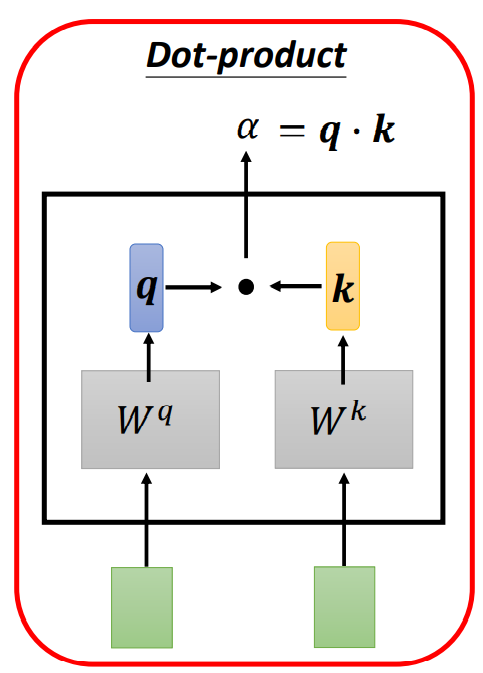

Transformer由论文《Attention is All You Need》提出，是一个利用注意力机制来提高模型训练速度的模型。关于注意力机制可以在B站上看李宏毅讲的Self-attention，transformer可以说是完全基于自注意力机制的一个深度学习模型，因为它适用于并行化计算，和它本身模型的复杂程度导致它在精度和性能上都要高于之前流行的RNN循环神经网络。

# 从宏观的视角开始

## 什么是transformer？

transformer可以简单理解为它是一个黑盒子，当在做文本翻译任务时，输入一个中文，经过黑盒子后，输出来翻译之后的英文。

## 黑盒子里面是什么？

拆开这个黑箱，它是由Encoders(编码组件)、Decoders(解码组件)和它们之间的连接组成

当输入一个文本的时候，该文本数据会先经过一个叫Encoders的模块，对该文本进行编码，然后将编码后的数据再传入一个叫Decoders的模块进行解码，解码后就得到了翻译后的文本，对应的我们称Encoders为编码器，Decoders为解码器。

## 编码组件和解码组件里面又是什么？

编码组件部分由一堆编码器（encoder）构成（论文中是将6个编码器叠在一起——数字6只是一个参数没有什么神奇之处，也可以尝试其他数字）。解码组件部分也是由相同数量（与编码器对应）的解码器（decoder）组成的。

由图可看出，在编码部分，每一个的小编码器的输入是前一个小编码器的输出，而每一个小解码器的输入不光是它的前一个解码器的输出，还包括了整个编码部分的输出。

# 编码器

所有的编码器在结构上都是相同的，但它们没有共享参数。每个解码器都可以分解成两个子层。

从编码器输入的句子首先会经过一个自注意力（self-attention）层，这层帮助编码器在对每个单词编码时关注输入句子的其他单词。

自注意力层的输出会传递到前馈（feed-forward）神经网络中。每个位置的单词对应的前馈神经网络都完全一样（译注：另一种解读就是一层窗口为一个单词的一维卷积神经网络）。

# Self  Attention

首先，self-attention的输入就是词向量，即整个模型的最初的输入是词向量的形式。那自注意力机制呢，顾名思义就是自己和自己计算一遍注意力，即对每一个输入的词向量，我们需要构建self-attention的输入，随着模型处理输入序列的每个单词，自注意力会关注整个输入序列的所有单词，帮助模型对本单词更好地进行编码。

## Word Embedding

我们将每个输入单词通过 Word Embedding（词嵌入算法）转换为词向量。

可以将Word Embedding理解为一种**映射**，其过程是：将文本空间中的某个Word，通过一定的方法，映射或者说嵌入（Embedding）到另一个数值向量空间（之所以称之为Embedding，是因为这种表示方法往往伴随着一种降维的意思）。

词嵌入过程只发生在最底层的编码器中。所有的编码器都有一个相同的特点，即它们接收一个向量列表，列表中的每个向量大小为512维。在底层（最开始）编码器中它就是词向量，但是在其他编码器中，它就是下一层编码器的输出（也是一个向量列表）。向量列表大小是我们可以设置的超参数——一般是我们训练集中最长句子的长度。

## self-attention的过程

首先我们了解一下如何使用向量来计算自注意力，然后来看它实怎样用矩阵来实现。

计算自注意力的**第一步**就是从每个编码器的输入向量（每个单词的词向量）中生成三个向量。也就是说对于每个单词，我们创造一个查询向量、一个键向量和一个值向量。这三个向量是通过词嵌入与三个权重矩阵后相乘创建的。

a1与WQ权重矩阵相乘得到q1, 就是与这个单词相关的查询向量。最终使得输入序列的每个单词的创建一个查询向量、一个键向量和一个值向量。

计算自注意力的**第二步**是计算得分。假设我们在为这个例子中的第一个词计算自注意力向量，我们需要拿输入句子中的每个单词对第一个词打分。这些分数决定了在编码第一个单词的过程中有多重视句子的其它部分。

这些分数是通过打分单词（所有输入句子的单词）的键向量与查询向量相点积来计算的。所以第一个分数是q1和k1的点积，第二个分数是q1和k2的点积。

**第三步和第四步**是将分数除以8（8是论文中使用的键向量的维数64的平方根，这会让梯度更稳定。这里也可以使用其它值，8只是默认值），然后通过softmax传递结果。softmax的作用是使所有单词的分数归一化，得到的分数都是正值且和为1。

通过Soft-max函数就可以将多分类的输出值转换为范围在[0, 1]和为1的概率分布。

这个softmax分数决定了每个单词对编码当下位置的贡献。显然，已经在这个位置上的单词将获得最高的softmax分数，但有时关注另一个与当前单词相关的单词也会有帮助。

**第五步**是将每个值向量乘以softmax分数(这是为了准备之后将它们求和)。这里的直觉是希望关注语义上相关的单词，并弱化不相关的单词(例如，让它们乘以很小的数字)。

**第六步**是对加权值向量求和（译注：自注意力的另一种解释就是在编码某个单词时，就是将所有单词的表示（值向量）进行加权求和，而权重是通过该词的表示（键向量）与被编码词表示（查询向量）的点积并通过softmax得到），然后即得到自注意力层在该位置的输出。其余位的self-attention输出也是同样的计算方式。

这样自自注意力的计算就完成了。得到的向量就可以传给前馈神经网络。然而实际中，这些计算是以矩阵形式完成的，以便算得更快。那我们接下来就看看如何用矩阵实现的。

### 矩阵实现

第一步是计算查询矩阵、键矩阵和值矩阵。为此，我们将将输入句子的词嵌入装进矩阵X中，将其乘以我们训练的权重矩阵(WQ，WK，WV)。

x矩阵中的每一行对应于输入句子中的一个单词。

最后，由于我们处理的是矩阵，我们可以将步骤2到步骤6合并为一个公式来计算自注意力层的输出

# Multi-Headed Attention

通过增加一种叫做“多头”注意力（“multi-headed” attention）的机制，论文进一步完善了自注意力层，并在两方面提高了注意力层的性能：

1.它扩展了模型专注于不同位置的能力。在上面的例子中，虽然每个编码都在z1中有或多或少的体现，但是它可能被实际的单词本身所支配。如果我们翻译一个句子，比如“The animal didn’t cross the street because it was too tired”，我们会想知道“it”指的是哪个词，这时模型的“多头”注意机制会起到作用。

2.它给出了注意力层的多个“表示子空间”（representation subspaces）。接下来我们将看到，对于“多头”注意机制，我们有多个查询/键/值权重矩阵集(Transformer使用八个注意力头，可以理解为八个互不干扰的自注意力机制运算)。这些集合中的每一个都是随机初始化的，在训练之后，每个集合都被用来将输入词嵌入(或来自较低编码器/解码器的向量)投影到不同的表示子空间中。

在“多头”注意机制下，我们为每个头保持独立的查询/键/值权重矩阵，从而产生不同的查询/键/值矩阵。和之前一样，我们拿X乘以WQ/WK/WV矩阵来产生查询/键/值矩阵。

如果我们做与上述相同的自注意力计算，只需八次不同的权重矩阵运算，我们就会得到八个不同的Z矩阵。

前馈层不需要8个矩阵，它只需要一个矩阵(由每一个单词的表示向量组成)。所以我们需要一种方法把这八个矩阵压缩成一个矩阵。我们可以直接把这些矩阵拼接在一起，然后用一个附加的权重矩阵WO与它们相乘。

最终将Z作为前馈神经网络的输入。

# 位置编码序（Positional Embedding）

到目前为止，我们对模型的描述缺少了一种理解输入单词顺序的方法。

为了解决这个问题，Transformer为每个输入的词嵌入添加了一个向量。这些向量遵循模型学习到的特定模式，这有助于确定每个单词的位置，或序列中不同单词之间的距离。这里的直觉是，将位置向量添加到词嵌入中使得它们在接下来的运算中，能够更好地表达的词与词之间的距离。

在下图中，每一行对应一个词向量的位置编码，所以第一行对应着输入序列的第一个词。每行包含512个值，每个值介于1和-1之间。对它们进行了颜色编码，所以图案是可见的。

20字(行)的位置编码实例，词嵌入大小为512(列)。你可以看到它从中间分裂成两半。这是因为左半部分的值由一个函数(使用正弦)生成，而右半部分由另一个函数(使用余弦)生成。然后将它们拼在一起而得到每一个位置编码向量。

原始论文里描述了位置编码的公式。这不是唯一可能的位置编码方法。然而，它的优点是能够扩展到未知的序列长度(例如，当我们训练出的模型需要翻译远比训练集里的句子更长的句子时)。论文给出的编码公式如下：

在上式中， pos 表示单词的位置， i 表示单词的维度。关于位置编码的实现可在Google开源的算法中`get_timing_signal_1d()`函数找到对应的代码。

作者这么设计的原因是考虑到在NLP任务中，除了单词的绝对位置，单词的相对位置也非常重要。根据公式 `sin(α+β)=sinαcosβ + cosαsinβ` 以及`cos(α+β)=cosαcosβ − sinαsinβ` ，这表明位置 k+p 的位置向量可以表示为位置 k 的特征向量的线性变化，这为模型捕捉单词之间的相对位置关系提供了非常大的便利。

# 残差模块

在继续进行下去之前，我们需要提到一个编码器架构中的细节：在每个编码器中的每个子层（自注意力、前馈网络）的周围都有一个残差连接，并且都跟随着一个层归一化操作。目的是为了防止梯度消失，加快收敛。

Residual Connection（残差连接）：

将self-attention的输出的向量再加上的输入的向量，如图所示。

layer normalization（层归一化）：

该模块的输入为一个向量，输出也是一个向量。

对同一个dimension（维度）,不同feature（特征）求mean（平均值）和standard deviation（标准差）

将每个维度减去平均值后除于标准差得到新的向量。

# Feed Forward

Feed Forward的输入是Multi-Head Attention的输出做了残差连接和Norm之后得数据，然后Feed Forward做了两次线性线性变换，目的是更加深入的提取特征。

Feed-Forward层包括两层全连接层以及一个非线性激活函数ReLu。

注意到在Mui-Head Attention的内部结构中，我们进行的主要都是矩阵乘法(scaled Dot-Product Attention)，即进行的都是线性变换，而线性变换的学习能力是不如非线性变化的强的，所以Mui-Head Attention的输出尽管利用了Attention机制，学习到了每个单词的权重，但是这种表达能力可能并不强烈，我们仍然希望可以**通过激活函数的方式，来强化每个单词的表达能力**，比如 context: The animal didn't cross the road because it was too tired，利用激活函数，我们希望使得通过Attention层计算出的权重指数中，单词 it 在整个句子的表达中，数值较大的部分进行加强，数值较小的部分则进行抑制，从而使得相关的部分表达效果更好（这也是神经网络中激活函数的作用，即进行非线性映射，加强大的部分，抑制小的部分）。我觉得这也是为什么在**Attentlon层后加了一个Layer Normallzalton层**，通过对representation进行标准化处理，将数据移动到激活函数的作用区域，可以使得RLU激活函数更好的发挥作用。

同时在Feed-Forward层中，先将数据映射到高维空间再映射到低维空间的过程，可以学习到更加抽象的特征，即该Feed-Forward层使得单词的表达能力更强，更加能够表示单词与context中其他单词之间的作用关系。

可以看出在每次线性变换都引入了非线性激活函数Relu，在Multi-Head Attention中，主要是进行矩阵乘法，即都是线性变换，而线性变换的学习能力不如非线性变换的学习能力强，Feed Forward的计算公式如下：max相当于Relu

所以Feed Forward的作用是：通过线性变换，先将数据映射到高纬度的空间再映射到低纬度的空间，提取了更深层次的特征

# 解码器

仔细观察解码器结构，其包括：带有mask的MultiHeadAttention、MultiHeadAttention和前馈神经网络层三个组件，带有mask的MultiHeadAttention和MultiHeadAttention结构和代码写法是完全相同，唯一区别是是否输入了mask。

为啥要mask？原因依然是顺序解码导致的。试想模型训练好了，开始进行翻译(测试 i am a student)，其流程就是上面写的：输入begin，解码器输出i；输入前面已经解码的begin和i，解码器输出am...，输入已经解码的begin、i、am、a和student，解码器输出解码结束标志位end,每次解码都会利用前面已经解码输出的所有单词嵌入信息，这个测试过程是没有问题，但是训练时候我肯定不想采用上述顺序解码类似rnn即一个一个目标单词嵌入向量顺序输入训练，肯定想采用类似编码器中的矩阵并行算法，一步就把所有目标单词预测出来。要实现这个功能就可以参考编码器的操作，把目标单词嵌入向量组成矩阵一次输入即可，但是在解码am时候，不能利用到后面单词a和student的目标单词嵌入向量信息，否则这就是作弊(测试时候不可能能未卜先知)。为此引入mask，目的是构成下三角矩阵，右上角全部设置为负无穷(相当于忽略)，从而实现当解码第一个字的时候，第一个字只能与第一个字计算相关性，当解出第二个字的时候，只能计算出第二个字与第一个字和第二个字的相关性。具体是：在解码器中，自注意力层只被允许处理输出序列中更靠前的那些位置，在softmax步骤前，它会把后面的位置给隐去（把它们设为-inf）。

还有个非常重要点需要知道(看图示可以发现)：解码器内部的带有mask的MultiHeadAttention的qkv向量输入来自目标单词嵌入或者前一个解码器输出，三者是相同的，但是后面的MultiHeadAttention的qkv向量中的kv来自最后一层编码器的输入，而q来自带有mask的MultiHeadAttention模块的输出

## Decoder的输入到底是什么

在train模式下和在test模式下Decoder的输入是不同的，在train模式下Decoder的输入是Ground Truth，也就是不管输出是什么，会将正确答案当做输入，这种模式叫做teacher-forcing。但是在test模式下根本没有Ground Truth去teach，那只能将已经出现的词的输出（注意这里的输出是走完整个Decoder计算得到预测结果而不是走完一层Decoder的输出）当做下一次Decoder计算的输入，我想这也是论文中shifted right的意思，一直往右移。

##  Decoder到底是不是并行计算的

在Transformer中，最被人津津乐道，也是他相较于RNN类型模型最大的优点之一就是他可以并行计算，但是这个并行计算仅限于在Encoder中，在Encoder和训练过程的Decoder中是将所有的词一起输入一起计算，但是在测试中的Decoder中不是的，在测试时，Decoder中依然是像RNN一样一个一个词输入，将已经出现的词计算得到的Q与Encoder计算得到的K,V进行计算，经过了全部Decoder层再经过FC+Softmax得到结果之后再把结果当做Decoder的输入再走一遍整个流程直到得到END标签。

**Transformer推理时是一个一个词预测，而训练时会把所有的结果一次性给到Transformer，但效果等同于一个一个词给，而之所以可以达到该效果，就是因为对矩阵进行了掩码，防止其看到后面的信息，也就是不要让前面的字具备后面字的上下文信息**。

## Encoder与Decoder之间的交互

论文中Encoder与Decoder之间的交互不是每一层一一对应的，而是Encoder 6层全部计算完得到K和V之后再将K和V传给Decoder的每一层与其计算得到的Q进行计算。但是看了李宏毅老师的视频，发现这是不一定的，可以自己发挥想象力自定义Encoder和Decoder之间的连接方式。

# Masked Multi-Head Attention

decoder输出向量是一个个产生的所以只考虑之前和自身位置的信息，如下图，计算b2的时候只考虑a1和a2。

# Autoregressive（ AT 自回归 ）

如果把decoder当成一个黑匣子，这个黑匣子先接受一个特殊符号begin，说明预测开始，第一个输出的字符为“机”，那么“机”再输入进decoder在输出"器"，以此类推。在最后的时候用另一个特殊符号end结尾。这样把输出当成输入的学习称为AT（自回归）。

end的如何产生？我认为是在训练的时候输出最后一个词的时候让机器看到“机器学习”这个语音辨识结果已经结束，不需要产生更多的词汇了，然后让产生的end对应的向量概率是最大的，从而就会输出这个end。然后在测试的时候由机器根据训练的结果自己决定。

# Non Autoregressive （NAT）

AT：输入begin开始，前一个的输出作为下一个的输入，知道输出end为止。

NAT：一次将整个句子都产生出来。

​	1、将decoder的输入放到一个预测函数中然后返回一个数字，这个数字代表decoder要输出的长度。也就是输入begin的数量。

​	2、一次将一堆的begin的标志都输给decoder然后就会产生一推的词汇，然后看什么地方输出了end，然后忽略掉右边的。

NAT的优点：

1. 并行化：相比较AT而言，NAT可以一个步骤产生完整的句子，AT只能一个个的产生。所以速度上NAT的decode要比AT的decoder跑的快。
2. 可以控制输出的长度：例如在语音合成的例子中，想要系统讲快一点，那就将预测函数的输出除于2，相当于与decoder的输出就变短了，自然说的就快了。反之乘于2，输出变长，自然就说的慢了。

NAT的缺点：NAT效果往往没有AT好。这一点我认为非常直观，缺少了时间的信息，效果当然会差一些。

# decoder与encoder的连接

实际上decoder并不是一个独立的块，它是与encoder连起来的。

可以看到，有两个箭头是来自于encoder，有一个箭头是来自于decoder自己的输入。具体细节如下。

所谓的两个箭头 + 一个箭头，实际上在原始论文中就是将六个encoder最后输出向量计算key , value （也可以尝试其它的做法，不一定非要是最后一层的输出）与带掩膜的self-attention的输出的向量计算query，然后进行相似度计算（dot-product）得到v。简单说一句带掩膜的self-attention就是每一次输入只看前面的信息不看后面的信息。

# 最终的线性变换和Softmax层

解码组件最后会输出一个实数向量。我们如何把浮点数变成一个单词？这便是线性变换层和Softmax层要做的工作。

其中线性层是一个简单的全连接神经网络（FC），它将解码器产生的向量投影到一个更高维度的向量（logits）上，假设我们模型的词汇表是10000个词，那么logits就有10000个维度，每个维度对应一个惟一的词的得分。

之后的softmax层将这些分数转换为概率（都为正数、上限1.0）。选择概率最大的维度，并对应地生成与之关联的单词作为此时间步的输出就是最终的输出。

# 前向流程

以翻译任务为例：

- 将源单词进行嵌入，组成矩阵(加上位置编码矩阵)输入到n个编码器中，输出编码向量KV
- 第一个解码器先输入一个begin单词嵌入向量，后续解码器接受该解码器输出，结合KV进行第一次解码
- 将第一次解码单词进行嵌入，联合begin单词嵌入向量构成矩阵再次输入到解码器中进行第二次解码，得到解码单词
- 不断循环，每次的第一个解码器输入都不同，其包含了前面时间步长解码出的所有单词
- 直到输出end表示解码结束或者强制设置最大时间步长即可

