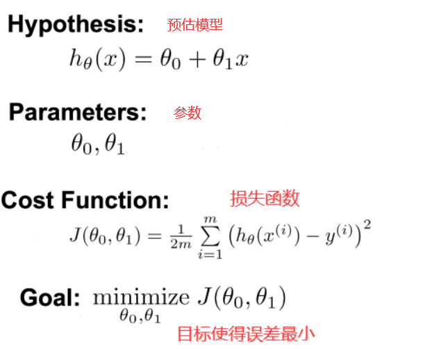
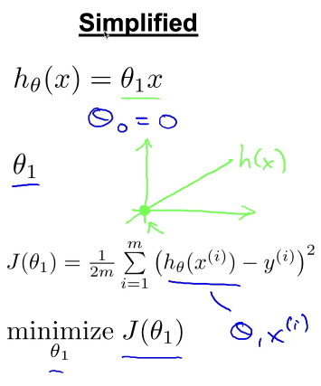
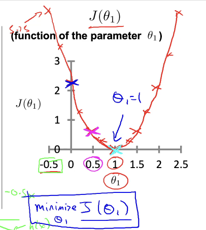
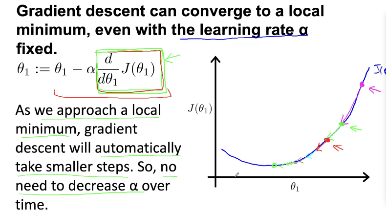
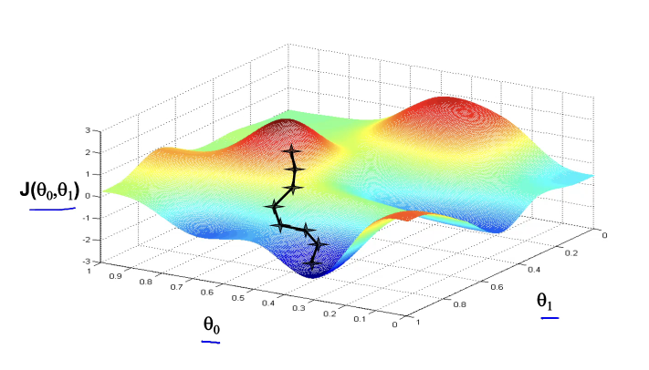
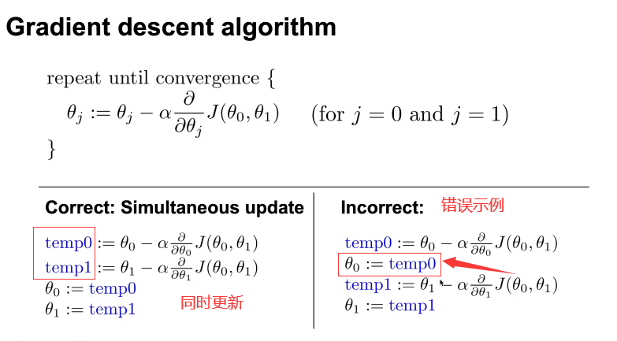
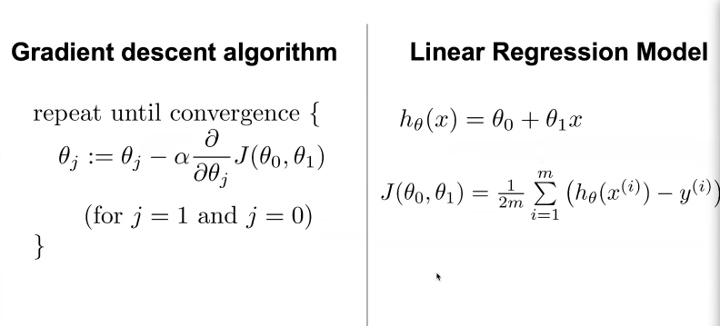

# 一元线性回归分析


一元线性回归分析预测法，是根据自变量X和因变量Y的相关关系，建立X与Y的线性回归方程进行预测的方法。

由于市场现象一般是受多种因素的影响，而并不是仅仅受一个因素的影响。只有当诸多的影响因素中，确实存在一个对因变量影响作用明显高于其他因素的变量，才能将它作为自变量，应用一元相关回归分析市场预测法进行预测。

设x.,y为两个变量，因变量y受变量x的影响。将y和x间的关系表示为:
$$
y = f(x,\theta) + \varepsilon \\
\begin{array}{l} 
f(x,\theta) & 表示预测值\hat{y}  \\
\varepsilon & 表示预测误差 \\
\theta & 通过\theta来调整\varepsilon越来越小，使得\varepsilon在误差可接受范围内
\end{array}
$$
在简单的回归模型中，回归函数是解释变量的线性函数，回归模型则称为一无线性回归模型，表达式如下：
$$
y=\theta_0+\theta_1x+\varepsilon \\
\begin{array}{l}
\hat{y}=\theta_0+\theta_1x &&
\theta_0 ：截距 & \theta_1：斜率  
\end{array}
$$
 ==最小二乘法==是用于拟合回归线最常用的方法。对于观测数据，它通过最小化每个数据点到线的垂直偏差平方和来计算最佳拟合线。因为在相加时，先将偏差平方后再求和，防止了正值和负值抵消。



图中损失函数除以2是为了后面梯度下降求导时方便运算。

为了方便理解，简化预估模型如下：


$$
\begin{array}{l}
根据损失函数，每个\theta_1都会对应一个J(\theta_1) \\
以\theta_1为横坐标，J(\theta_1)为纵坐标的关系为一个抛物线 \\
抛物线的最低点则损失函数J(\theta_1)的值最小
\end{array}
$$


所以对于损失函数来书只需要找到抛物线的最低点就能得到最小的损失值

## 梯度下降

如何找到最低点？思想如下：
$$
\begin{array}{l}
对损失函数进行求导得到J^\prime(\theta_1)，\theta_1是随机给的,将\theta_1带入到J^\prime(\theta_1)得到在该点的导数值 \\
假设损失函数的图像如上图所示，在\theta_1=1的位置是最低点，\\
\theta_1>1时，在该点的导数为一个正数，\theta_1<1时，在该点的导数为一个负数 \\
\end{array} \\
令\theta_1 = \theta_1 - J^\prime(\theta_1) \\
\begin{array}{l} 
如上图，假设现在\theta_1>1 则J^\prime(\theta_1)>0根据上面的式子，则可以将当前的\theta_1往抛物线的\\低谷方向(\theta_1=1)移动。相当于在低谷左边就往右边移动,在低谷右边就往左边移动。 \\
直到当J^\prime(\theta_1)的值收敛于0的时候，这个时候的\theta_1就是我们需要的参数，使得损失函数最\\小。\\
如果J^\prime(\theta_1)在\theta_1这点的倒数值比较大的时候会导致\theta_1移动的幅度太大可能会导致J^\prime(\theta_1)\\最终无法收敛，于是我们设置一个学习率\alpha来控制移动的幅度，防止移动幅度太大。
\end{array} \\
于是：\theta_1 = \theta_1 - \alpha J^\prime(\theta_1)
$$


给一个固定的学习率，梯度下降能将损失函数收敛于一个局部最小值

当损失函数接近一个局部最小值的时候，梯度下降会自动减小移动的步伐（因为接近局部最小值的时候，导数值也很小），因此不需要手动调整学习率 。如果移动的幅度太大的话就需要手动调整。


$$
\begin{array}{l}
对于预测模型的两个参数\theta_0和\theta_1我们采取采取梯度下降分别求偏导的方式找出使得\\损失函数最小的值。 \\
\end{array} \\
\theta_0 = \theta_0 - \alpha \frac{d}{d\theta_0}J(\theta_0) \\
\theta_1 = \theta_1 - \alpha \frac{d}{d\theta_1}J(\theta_1)
$$
对于多维的来说如上图，两个参数每次随机的位置不一样则会导致局部最小值不止一个，所以要多次实验取最优结果。

梯度下降算法：



一元线性回归算法：



```python
import pandas as pd
import numpy as np
import matplotlib.pyplot as plt
from sklearn.datasets import load_iris 
from sklearn.linear_model import LinearRegression

iris = load_iris()

data = pd.DataFrame(iris.data)
data.columns = ["sepal_length","sepal_width","petal_length","petal_width"]
data.head()

x = data["petal_length"].values
y = data["petal_width"].values
x = x.reshape(len(x),1)
y = y.reshape(len(y),1)
lmodel = LinearRegression()
lmodel.fit(x,y)
plt.scatter(x,y)
pre_y = lmodel.predict(x)
plt.plot(x,pre_y,'r-',linewidth=2)

print("coefficience（斜率）:",lmodel.coef_)
print("intercept（截距）:",lmodel.intercept_)
print("均方误差 :",np.mean(pre_y)**2)

print("predict petal_length=4.0:",lmodel.predict([[4.0]]))
```

